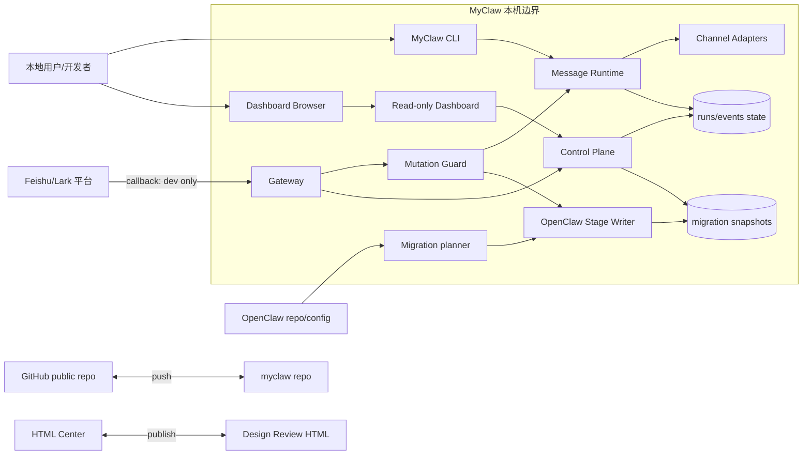
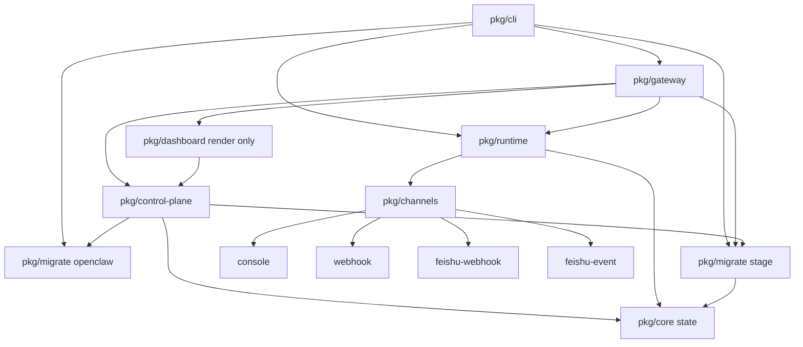
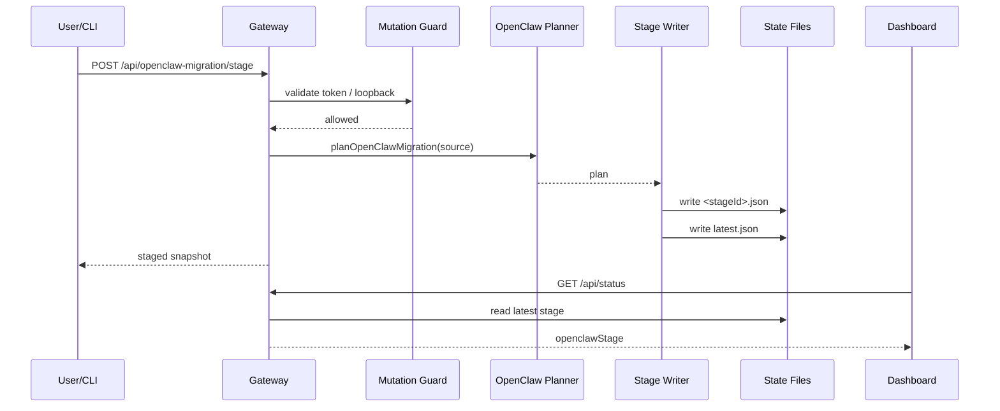
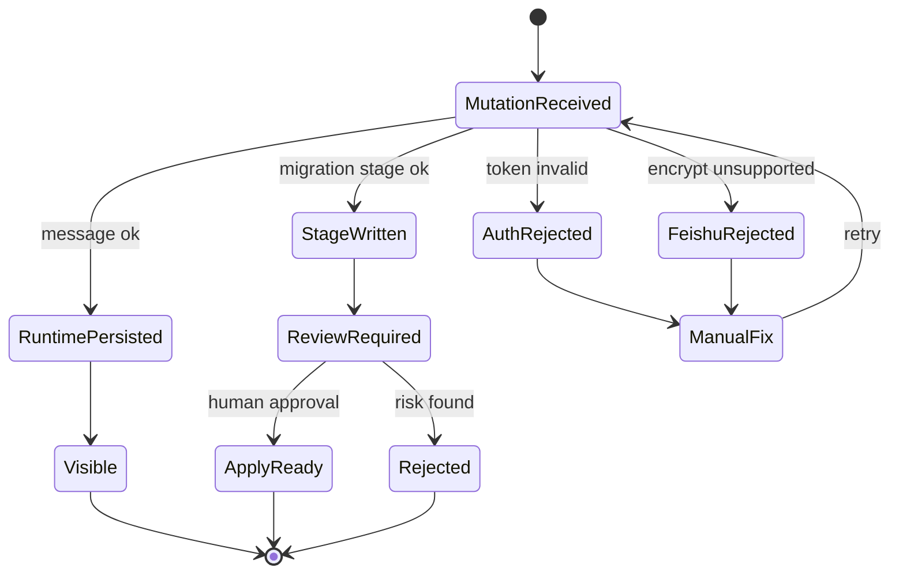
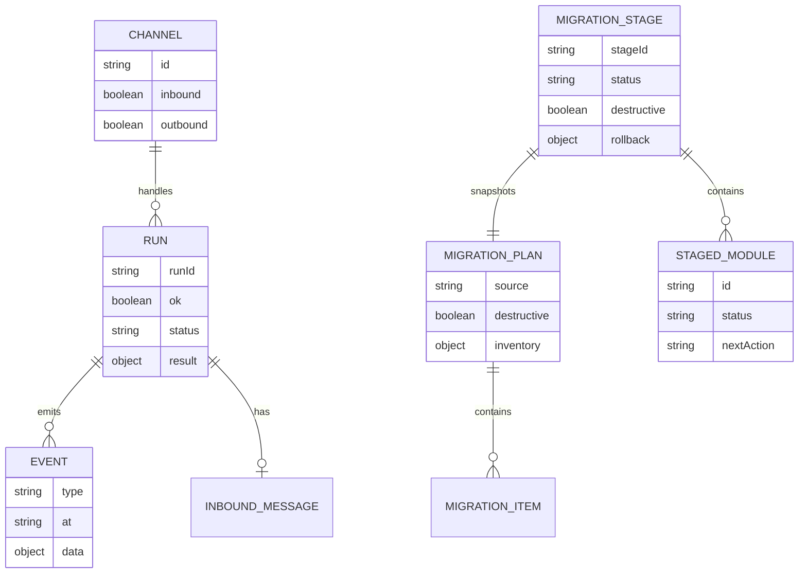
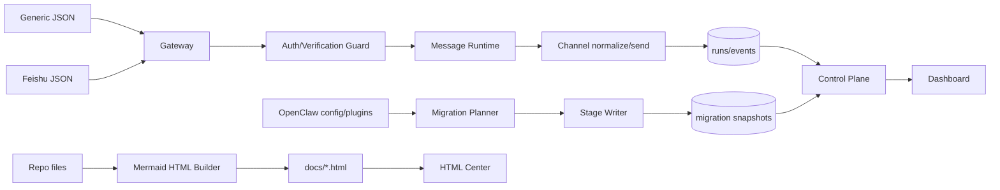
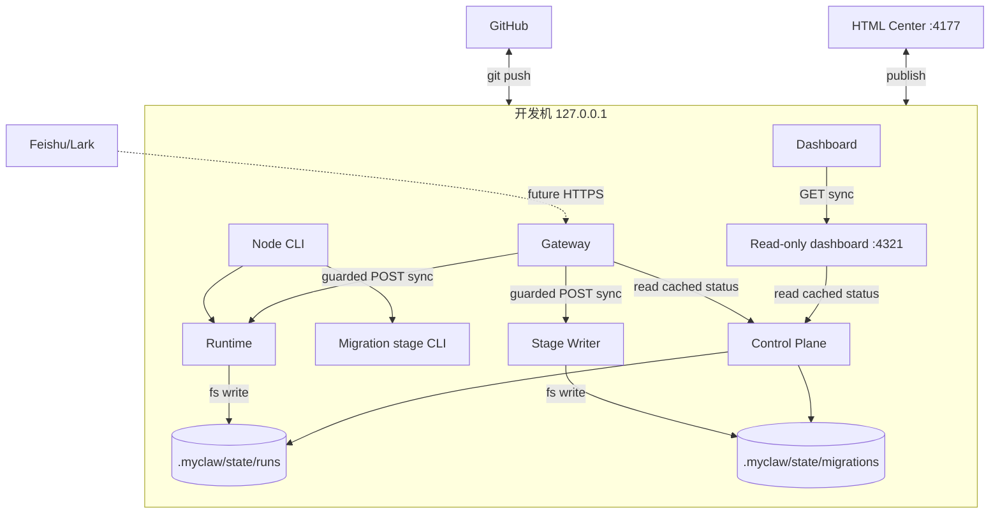
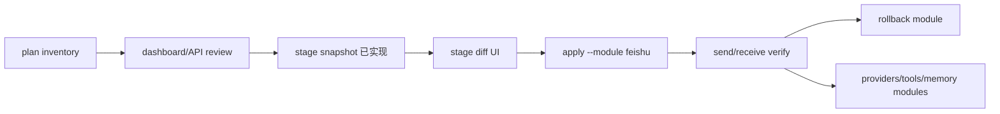

# MyClaw Phase 0.5 实现架构可视化评审

更新时间：2026-05-17

## 总诊断

Phase 0.5 把两个 Phase 0.4 暴露出的硬问题向前推进了一步：gateway mutation 已有 token guard，`dashboard` 命令回到只读 server，Feishu endpoint 已有 verify token/encrypt 拒绝边界，OpenClaw 迁移从纯 `plan` 进入可落盘 `stage snapshot`。正确方向是：所有写操作都先过显式 gateway 边界，迁移只写可审阅快照，不直接 apply runtime。

还不能美化结论：这仍不是生产安全模型。Feishu 正式签名、encrypt payload 解密、timestamp/nonce replay window、scoped token、stage diff UI 和 rollback 还没有做完。

| 评分项 | 当前分 | 判断 |
|---|---:|---|
| 设计清晰度 | 8/10 | mutation、message、migration stage 边界清楚 |
| 可扩展性 | 7/10 | adapter/stage writer 易扩展，但 rawInbound 仍粗 |
| 可靠性 | 6/10 | stage 可落盘；Feishu 幂等仍在内存 |
| 可维护性 | 7/10 | 文件低于 500 行；dashboard/report 仍需拆 |
| 安全性 | 5/10 | token guard 可用；缺正式签名、作用域和持久 replay |

## 系统上下文图

这张图回答：MyClaw 当前和用户、Feishu、OpenClaw、GitHub、HTML Center 的边界在哪里？



Review 观察：

- 优点：`myclaw dashboard` 不再隐式打开 mutation surface，写操作需要显式 gateway。
- 优点：Feishu 入站和 OpenClaw 迁移是两条独立数据线，不互相污染。
- 风险：Feishu callback 仍不能生产暴露，图中 callback 只能代表 dev/spike。
- 改进：下一阶段把 Feishu 签名校验和持久 replay window 放在 guard 之前。

## 模块架构图

这张图回答：Phase 0.5 被拆成哪些模块，哪些模块之间有依赖？



Review 观察：

- 优点：stage writer 独立在 `packages/migrate/src/stage.mjs`，没有继续撑大 planner。
- 优点：`core` 仍只管 state/envelope，不知道 Feishu 或 OpenClaw。
- 风险：gateway 文件承担路由、auth、Feishu guard、stage API，后续可能变胖。
- 改进：下一阶段可把 gateway guard 拆成 `auth.mjs`，把 Feishu verification 拆成 adapter edge。

## 核心业务流程图

这张图回答：一条写请求如何通过 token guard、Feishu guard 或 migration stage 写入 state？

```mermaid
flowchart TD
  Start[POST mutation] --> Route{入口}
  Route --> Messages[/messages]
  Route --> Feishu[/feishu/events]
  Route --> Stage[/api/openclaw-migration/stage]

  Messages --> GToken{需要 gateway token?}
  Stage --> GToken
  GToken -->|无效| Denied[401/403]
  GToken -->|有效或本机 dev| MessageRuntime[receiveMessage / stage writer]

  Feishu --> FToken{Feishu verify token / 本机 dev?}
  FToken -->|无效| Denied
  FToken -->|有效| Encrypt{encrypt payload?}
  Encrypt -->|是| Unsupported[501 not supported]
  Encrypt -->|否| Challenge{challenge?}
  Challenge -->|是| Echo[回显 challenge]
  Challenge -->|否| Duplicate{event id 已见过?}
  Duplicate -->|是| Dup[duplicate=true]
  Duplicate -->|否| MessageRuntime

  MessageRuntime --> Normalize[Channel normalize or stage snapshot]
  Normalize --> Persist[写 runs/events 或 migration snapshot]
  Persist --> Status[/api/status 可见]
  Denied --> Human[人工修正 token/配置]
  Unsupported --> Human
```

Review 观察：

- 优点：失败请求在进入 runtime/stage 前被挡住。
- 优点：OpenClaw stage 只写 snapshot，不启用 runtime 配置。
- 风险：Feishu encrypt 现在只是拒绝，不是支持。
- 风险：token 是 shared secret，无法区分 dashboard、CLI、外部 webhook。

## 关键时序图

这张图回答：一次 stage 请求如何从 gateway 写入 snapshot 并回到 dashboard？



Review 观察：

- 优点：stage 有明确写入点和 latest 指针，便于 dashboard 汇总。
- 优点：snapshot 已带 `schemaVersion`、`checksum`，并用临时文件 rename 原子写。
- 优点：planner 和 stage writer 可单独测试。
- 风险：stage diff UI 还没有，用户需要看 raw JSON。
- 改进：下一阶段在 dashboard 增加 stage detail/diff drawer。

## 状态机图

这张图回答：消息和迁移 stage 的生命周期如何流转，失败、拒绝、人工介入在哪里？



Review 观察：

- 优点：stage 和 message 都不直接进入自动执行。
- 风险：`ApplyReady` 目前只是设计状态，代码还没有 apply。
- 风险：`ManualFix` 缺 UI，只能靠 curl/JSON。
- 改进：apply 必须只允许从 staged snapshot 进入，不能从 live OpenClaw config 直接 apply。

## 数据模型 / ER 图

这张图回答：当前持久化实体有哪些，stage 和 run/event 如何关联到 state？



Review 观察：

- 优点：stage snapshot 独立于 run/event，不混用 message envelope。
- 优点：`destructive:false` 继续保留，符合 plan/stage/apply 安全路线。
- 优点：stage snapshot 已有 `schemaVersion` 和 `checksum`。
- 风险：run/event state 仍没有 schema version，未来迁移自身会困难。

## 数据流图

这张图回答：消息、Feishu event、OpenClaw config 和 HTML 报告的数据怎么流动？



Review 观察：

- 优点：runtime 数据线、migration 数据线、docs 数据线分开。
- 风险：Control Plane 汇总能力继续增加，后续要避免变成业务层。
- 风险：raw payload 仍可能进入 run state，需要脱敏策略。
- 改进：stage 写入和 run 写入都应补 schema validation。

## 部署图

这张图回答：运行时部署在哪里，哪些调用是同步，哪些后续应该异步化？



Review 观察：

- 优点：Phase 0 仍是单机同步模型，容易调试。
- 风险：同步 fs 写入无法支撑高并发 webhook。
- 风险：Feishu future HTTPS 仍必须等签名/加密/replay 后才可用。
- 改进：有真实 webhook 压力后引入队列、持久幂等表和 request id。

## 风险分级

| 等级 | 问题 | 影响 | 建议修改 |
|---|---|---|---|
| Critical | Feishu 正式签名/加密未实现 | 不能作为生产回调入口 | 实现签名校验、encrypt 解密、timestamp/nonce replay |
| High | token 只是 shared secret | 无角色、作用域和主体审计 | 引入 scoped token、mutation audit |
| High | `rawInbound` 保存面过宽 | 可能写入敏感 payload | 定义 `InboundAdapterInput`，只保存脱敏摘要 |
| Medium | stage 无 diff/approval UI | 迁移审查仍依赖 raw JSON | dashboard 增加 stage detail 和 approve/reject |
| Medium | status plan cache 仍是内存缓存 | 多进程下仍可能重复扫描 | 后续改 state-backed plan cache 和 explicit refresh |
| Medium | dashboard/report 内联增长 | 后续 UI 和报告难维护 | 拆 template、client script、markdown parser |

## 目录结构与文件行数

硬性规则：单个手写源文件或文档文件不得超过 500 行，接近 450 行必须拆。当前没有超过 500 行的手写文件，最大文件是本报告和 `docs/build-review-html.mjs`，均低于 500 行。

| 目录 | 文件 | 行数 | 职责 | 内容评价 |
|---|---|---:|---|---|
| `/` | `README.md` | 47 | 项目入口说明 | 已补 dashboard 只读、token 与 stage 命令 |
| `/` | `package.json` | 15 | workspace scripts | 简洁 |
| `scripts` | `check-file-lines.mjs` | 62 | 500 行约束检查 | 必要约束 |
| `packages/core/src` | `envelope.mjs` | 46 | envelope/event 工厂 | 边界干净 |
| `packages/core/src` | `state.mjs` | 128 | JSON/JSONL 读写 | Phase 0 可用，后续加 schema |
| `packages/channels/src` | `index.mjs` | 292 | channel registry 与 Feishu normalize | 低于 500；后续拆 Feishu adapter |
| `packages/runtime/src` | `messages.mjs` | 185 | send/receive/reply pipeline | 复用正确，rawInbound 待收窄 |
| `packages/gateway/src` | `index.mjs` | 306 | HTTP routes、token guard、Feishu guard、stage API | Phase 0.5 关键文件，后续拆 auth |
| `packages/dashboard/src` | `index.mjs` | 288 | read-only dashboard HTML/server | 已显示 latest stage，仍内联 |
| `packages/control-plane/src` | `status.mjs` | 81 | status/runs/events/migration/stage 聚合 | 已加短 TTL cache 和错误隔离 |
| `packages/cli/src` | `index.mjs` | 321 | CLI 命令编排 | dashboard 只读，gateway 显式 mutation |
| `packages/migrate/src` | `openclaw.mjs` | 348 | OpenClaw dry-run planner | 最大业务文件，apply 前应拆 parser |
| `packages/migrate/src` | `stage.mjs` | 122 | OpenClaw stage snapshot writer | schema/checksum/atomic write |
| `packages/*/test` | `*.test.mjs` | 29-193 | CLI/gateway/runtime/state/migrate 测试 | 已覆盖 token、verify、stage |
| `docs` | `build-review-html.mjs` | 408 | Markdown 到 Mermaid HTML | 接近 450 前应拆 parser/template |
| `docs` | `implementation-architecture.md` | 440 | 当前阶段可视化报告 | 需保持低于 500 |
| `docs` | `stage-status.md` | 169 | 阶段状态 | 已升级 Phase 0.5 |
| `docs/lib` | `module-meta.mjs` | 103 | 模块报告 metadata | 拆分有效 |
| `docs/modules` | `gateway.md` | 217 | gateway 模块设计 | 已补 token/stage |
| `docs/modules` | `openclaw-migration.md` | 111 | OpenClaw 迁移设计 | 已补 Phase 0.5 stage |
| `docs/modules` | 其他模块文档 | 46-315 | access/runtime/memory/tools/plugins/UI/roadmap | 粒度合适 |
| `docs/*.html` | 生成 HTML | 构建后检查 | 可浏览报告产物 | 生成物也受 500 行检查 |

## 概念解释

| 概念 | 当前定义 | 边界 |
|---|---|---|
| Gateway | 本地 HTTP 控制面，承载 dashboard 和 mutation | 不跑 agent |
| Mutation Guard | 对写操作做 token/local host 边界控制 | 不是完整 RBAC |
| Feishu Verify Token | Feishu callback 的共享校验 token | 不是签名校验 |
| Runtime | CLI/gateway 共用的 message pipeline | 不解析 HTTP |
| ChannelAdapter | 通道扩展点，负责 send 或 inbound normalize | 不写 state |
| Migration Plan | OpenClaw dry-run inventory | 不是 apply |
| Migration Stage | plan 的可审阅 snapshot | 不启用 runtime |
| Control Plane | 只读聚合 runs/events/migration/stage | 不执行 mutation |

## 相似技术比较

| 设计点 | MyClaw 当前选择 | 相似技术 | 取舍 |
|---|---|---|---|
| HTTP 服务 | 裸 `node:http` | Fastify/Express | 依赖少；auth/schema 要手补 |
| Auth | shared token + loopback guard | API key/RBAC/OAuth | 快速有效；缺主体和作用域 |
| 状态存储 | JSON/JSONL | SQLite/event store | 可读；并发和查询弱 |
| Feishu 入站 | verify token + `feishu-event` | openclaw-lark plugin | 最小可跑；正式协议不足 |
| OpenClaw 迁移 | plan + stage snapshot | Terraform plan/apply | 可审计；还没有 apply/rollback UI |
| Report | Mermaid HTML dashboard | Markdown/Docusaurus | 可视化强；生成器要拆 |

## 关键设计对比

| 选项 | 当前选择 | 原因 | 何时改变 |
|---|---|---|---|
| 同步 vs 异步 | 同步 HTTP + fs | Phase 0 易调试 | 高并发 webhook 时加队列 |
| 本地存储 vs DB | JSON/JSONL | 可审计 | 需要持久幂等和查询时上 SQLite |
| 自动执行 vs 人工确认 | 只 stage，不 apply | 防止迁移误伤 | stage diff/approval 完成后再 apply |
| shared token vs scoped token | shared token | 快速封住 mutation | 多用户/远端场景改 scoped |
| raw payload vs 标准消息 | 暂有 rawInbound | 快速接 Feishu shape | 下一阶段收窄并脱敏 |

## OpenClaw 一键迁移路线

当前只能叫“一键迁移路线”，不能叫“一键迁移能力”。Phase 0.5 已完成 `stage snapshot`，推荐继续按模块推进：



Review 观察：

- 优点：stage snapshot 让迁移结果可审计、可回滚设计可讨论。
- 风险：`openclaw-lark` 可能依赖 OpenClaw runtime facade，不能直接复制。
- 改进：下一阶段先做 stage diff UI 和审批，再做 Feishu module apply。

## Linus 视角严苛审查

独立 subagent 已按“30 年 Linux 内核维护者”视角完成审查，结论和本轮补救如下：

- 已修复：`myclaw dashboard` 不再启动 gateway，默认只读；mutation endpoints 只在显式 gateway/control mode 打开。
- 已修复：Feishu 非 loopback 不再接受 gateway token 代替 verify token，`encrypt` payload 继续明确拒绝。
- 已修复：OpenClaw stage snapshot 增加 `schemaVersion`、`checksum`、临时文件 rename 原子写；rollback 不再自称 supported。
- 部分修复：`/api/status` 增加 5 秒 plan cache 和错误隔离，GET `source` override 已从 HTTP route 移除。
- 仍需修复：Feishu 正式签名、加密解密、持久 replay window、scoped token 和 dashboard stage diff UI。
- `gateway/src/index.mjs` 已超过 300 行，继续加能力前应拆 auth/feishu/migration route。
- `rawInbound` 仍是脏接口，后续必须从 runtime 契约中收窄。

## 验收记录

本阶段需要通过：

```bash
npm run check
npm test
node docs/build-review-html.mjs
npm run myclaw -- migrate openclaw --source /Users/yanfenma/workspace/github/openclaw --stage --json
curl -sS http://127.0.0.1:4321/api/openclaw-migration/stage -H 'content-type: application/json' -d '{}'
```

测试覆盖：

- gateway `/messages` token guard。
- Feishu verify token、challenge、encrypt callback 拒绝、duplicate event id。
- OpenClaw `--stage` CLI 和 gateway stage API。
- dashboard/status 展示 4 个 channel 和 latest stage。
- line check 强制所有手写文件低于 500 行。

结论：Phase 0.5 已补上 mutation guard 和 OpenClaw stage snapshot。下一阶段必须优先做 Feishu 正式协议安全、stage diff UI 和 `apply --module feishu` 的审批/回滚，不要扩展全量自动执行。
