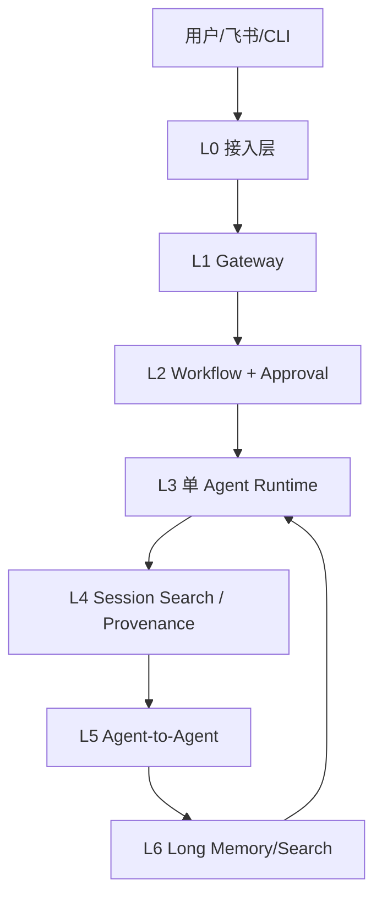
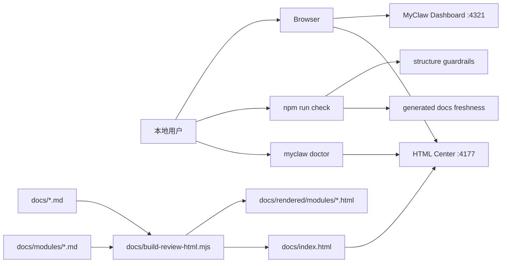
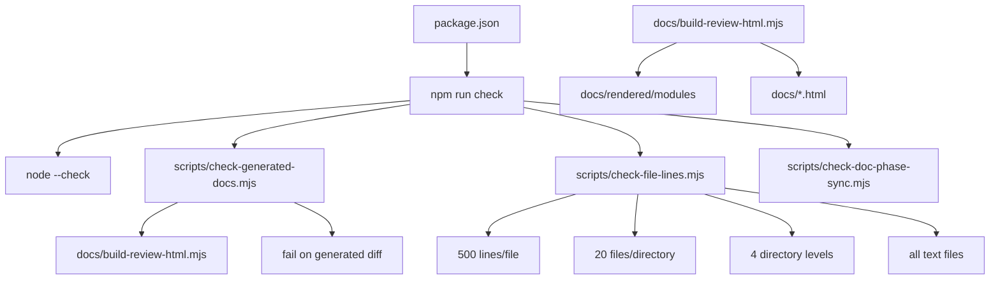
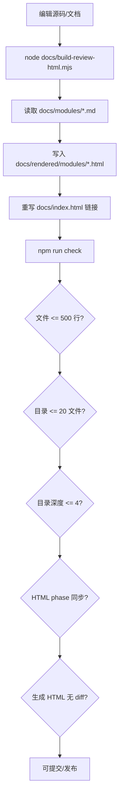
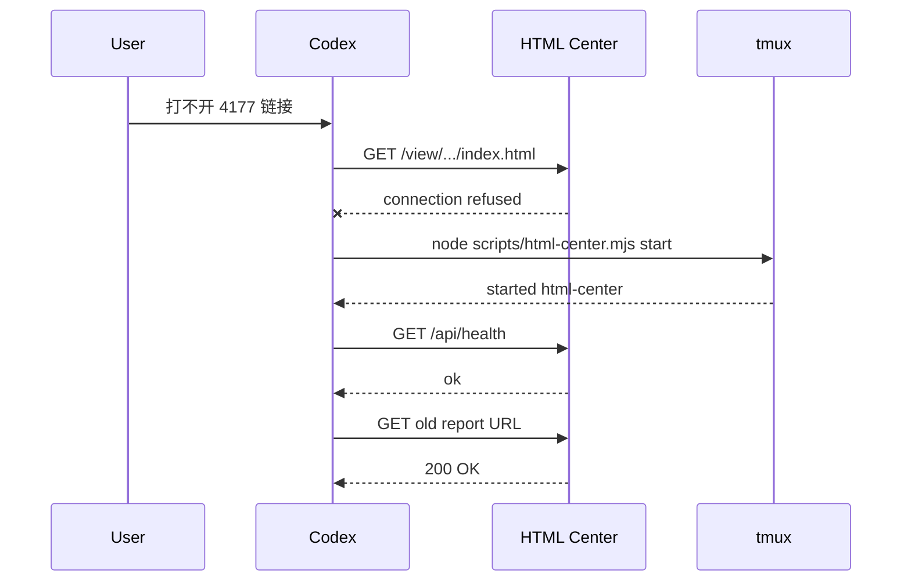
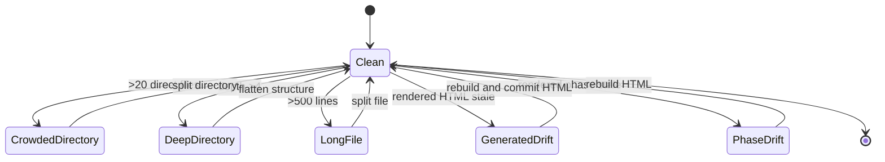
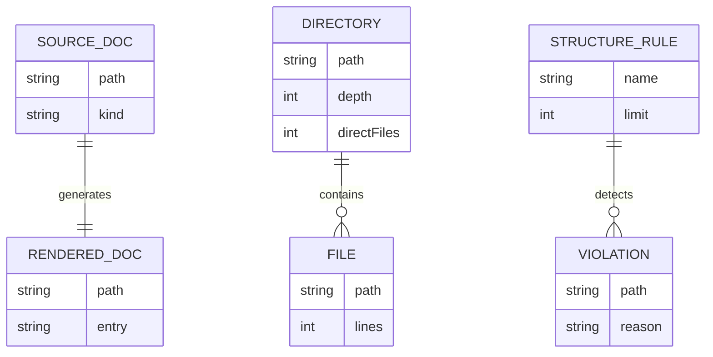
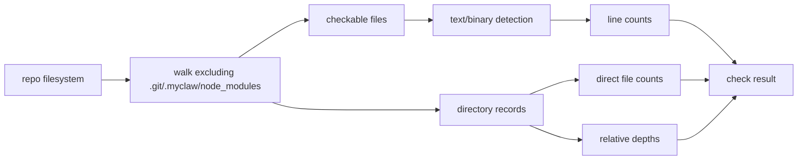
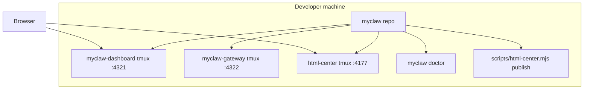

# MyClaw Phase 1.2 实现架构可视化评审

更新时间：2026-05-24

## 总诊断

Phase 1.2 继续收紧研发路线：技术债红线已经进入 `npm run check`，现在把用户可参与测试也改成分层路线。结论：MyClaw 不能一上来跳到 agent 和记忆，必须先把 L0 接入层、L1 Gateway、L2 workflow/审批打稳；L3 单 Agent 之后先补 L4 Session Search/Provenance，再进入 L5 Agent-to-Agent 和 L6 Long Memory/Search。

| 评分项 | 当前分 | 判断 |
|---|---:|---|
| 设计清晰度 | 9/10 | 路线从功能清单改成 L0-L6 分层测试 |
| 可扩展性 | 8/10 | 先接入层/Gateway，再 agent/记忆，依赖顺序更稳 |
| 可靠性 | 8/10 | HTML Center 有仓库命令和 doctor health，仍缺自动告警 |
| 可维护性 | 8/10 | 结构债务和生成物 stale 进入 `npm run check`，Dashboard client 仍要拆 |
| 安全性 | 7/10 | 本轮未扩大 mutation 面，沿用 Phase 1.1 token 审批边界 |

## 大规划图

这张图回答：当前哪些能力已经可由用户亲手测试，哪些还在后续阶段。

Review 观察：

- 优点：E7 把技术债约束变成可执行实验。
- 优点：当前可测入口已经覆盖消息、Dashboard、迁移、审批、结构约束。
- 优点：L0-L6 让“先交互基础、后 agent 智能”成为硬路线。
- 风险：L3-L6 仍未实现，不能测试 agent runtime、agent 协作 和记忆。
- 改进：下一阶段优先补 L0/L1 的 Feishu/Gateway smoke，而不是直接堆 agent。

## 分层交互架构图

这张图回答：为什么接入层和 gateway 要排在 agent、agent 协作、记忆之前。

Review 观察：

- 优点：L0/L1 先解决信息入口、回执、鉴权、状态查询，是所有 agent 能力的地基。
- 优点：L2 把高风险动作先变成 review/approval，避免 agent 直接执行危险操作。
- 风险：如果跳过 L0/L1，后续 agent 和记忆会缺少可信事件来源；如果跳过 L4，agent-to-agent 没有可追踪上下文。
- 改进：Dashboard 必须按层展示测试入口和开放条件。

## 系统上下文图

这张图回答：HTML Center、文档生成、Dashboard 和本地用户之间的边界。

Review 观察：

- 优点：旧链接打不开的根因是服务未运行，已用 `ensure_html_center.py` 恢复。
- 优点：HTML 生成物移动后，`docs/modules` 只放源文档。
- 风险：HTML Center 仍依赖 tmux 常驻，没有自动告警。
- 改进：后续把 doctor 结果显示到 Dashboard 顶部 health strip。

## 模块架构图

这张图回答：结构约束如何进入开发闭环。

Review 观察：

- 优点：约束是硬失败，不是 README 建议。
- 优点：目录文件数按直接文件计算，能防止一个目录变抽屉。
- 风险：`docs/build-review-html.mjs` 414 行，仍接近 450 预警。
- 改进：拆 Markdown parser、shell template、index rewrite。

## 核心业务流程图

这张图回答：一次文档构建和结构检查如何流动。

Review 观察：

- 优点：生成物目录也接受结构检查。
- 优点：`check-generated-docs` 会在 HTML 生成物过期时失败。
- 风险：index 仍是手写 HTML，后续也应从数据生成。
- 改进：下一步把 index metadata 抽到结构化数据。

## 关键时序图

这张图回答：旧 HTML Center 链接如何恢复。

Review 观察：

- 优点：旧链接无需重新上传即可恢复。
- 风险：如果 tmux session 再掉，链接仍会失败。
- 改进：doctor 已能报 health；下一步把 health 结果放进 Dashboard。

## 状态机图

这张图回答：结构检查从通过到失败的状态如何流转。

Review 观察：

- 优点：四类技术债都有明确失败原因。
- 风险：20 文件/目录会迫使生成物规划更谨慎。
- 改进：失败时输出修复建议和当前 top offenders。

## 数据模型 / ER 图

这张图回答：文档源文件、生成文件和结构规则的关系。

Review 观察：

- 优点：源文档和生成文档现在有不同目录职责。
- 风险：生成文件仍入仓，体积会增长。
- 改进：后续可考虑只发布生成物，不长期跟踪全部 HTML。

## 数据流图

这张图回答：检查数据从文件系统如何变成失败/通过。

Review 观察：

- 优点：检查逻辑很小，容易理解。
- 风险：二进制会跳过行数，但会计入目录文件数；文本文件默认进入行数检查。
- 改进：加白名单配置前先保持硬规则简单。

## 部署图

这张图回答：本机服务现在如何运行。

Review 观察：

- 优点：三个本地服务都回到 tmux 常驻。
- 风险：没有统一 supervisor。
- 改进：doctor 已有 HTML Center health；后续做统一 services status。

## Human Experiments

| 实验 | 状态 | 用户动作 | 成功信号 |
|---|---|---|---|
| E0 | ready | `send --text` | ok envelope，run 可见 |
| E1 | ready | 打开 Dashboard | Phase 1.2、Approvals 可见 |
| E4 | ready | `migrate openclaw --stage --json` | stage 带 approval，review-only |
| E5 | ready | GET approvals + POST decision | approval 变 approved/rejected |
| E7 | ready | `npm run check` | 输出 500 行、20 文件/目录、depth 4 |
| E2/E3 | needs_config | Feishu webhook/callback | 配置后可测 |
| E6 | planned | 单 agent run/resume/tool loop | 后续开放 |
| E8 | planned | session search + provenance | 后续开放 |
| E9 | planned | agent-to-agent review | 后续开放 |
| E10 | planned | long memory add/search/delete | 后续开放 |

## 概念解释

| 概念 | 含义 | 当前边界 |
|---|---|---|
| Structure guardrail | 机器强制的技术债红线 | 500 行、20 文件、4 层深度 |
| Direct file count | 一个目录下直接文件数 | 不递归计入子目录 |
| Rendered docs | 从 Markdown 生成的 HTML | 位于 `docs/rendered/modules` |
| HTML Center | 本机报告中心 | 依赖 4177 服务常驻 |
| Phase sync | Markdown 与 HTML 阶段一致性 | 防止 stale report |
| Generated freshness | 生成物新鲜度 | `check-generated-docs` 重建后检测 diff |
| Access layer | 接入层 | CLI/webhook/Feishu 等消息入口和出口 |
| Gateway | 控制面入口 | HTTP route、鉴权、状态和 mutation 边界 |
| Session provenance | session 来源追踪 | run、step、message、tool result 的可检索来源 |
| Agent-to-Agent | agent 协作 | 多 agent 分工、交接上下文、互相 review |

## 相似技术比较

| 维度 | MyClaw Phase 1.2 | OpenClaw | Hermes-agent | OpenHuman |
|---|---|---|---|---|
| 结构约束 | 硬性 check 脚本 | 大 repo 模块化 | 成熟工程分层 | Rust workspace 分层 |
| 文档发布 | HTML Center + rendered docs | docs/control UI | README/ops docs | UI/docs 混合 |
| 审批 | migration approval seed | 成熟 policy/approval | ops guard | risk/autonomy policy |
| Dashboard | 本地只读 console | control UI | TUI/ops | UI-first |

## 目录结构与文件行数

| 路径 | 行数/文件数 | 职责 | 评价 |
|---|---:|---|---|
| `scripts/check-file-lines.mjs` | 120 行 | 文本文件行数、目录文件数、深度检查 | 健康 |
| `scripts/check-generated-docs.mjs` | 63 行 | 重建 HTML 并检测 stale 生成物 | 健康 |
| `scripts/html-center.mjs` | 121 行 | HTML Center status/start/publish/verify，发布前校验生成物 | 健康 |
| `docs/build-review-html.mjs` | 414 行 | HTML report builder | 接近 450，下一轮拆 |
| `docs/modules` | 16 文件 | 模块 Markdown 源文档，含人类测试手册 | 已低于 20 |
| `docs/rendered/modules` | 16 文件 | 生成 HTML 模块页 | 已低于 20 |
| `docs/modules/human-testing-playbook.md` | 121 行 | 人类测试手册、本地参与流程和反馈格式 | 健康 |
| `packages/cli/src/index.mjs` | 354 行 | CLI 命令与 doctor | 健康，但继续增长要拆命令 |
| `packages/control-plane/src/experiments.mjs` | 184 行 | Human Experiments 与分层路线 payload | 健康 |
| `packages/dashboard/src/client.mjs` | 357 行 | Dashboard client，含分层路线渲染 | 仍需拆 renderer |
| `packages/core/src/approvals.mjs` | 198 行 | approval state | 健康 |

当前最大目录深度是 4，当前最大目录文件数是 16。

## 风险分级

| 等级 | 问题 | 影响 | 建议 |
|---|---|---|---|
| Medium | HTML Center 依赖 tmux 常驻 | 服务掉了链接就打不开 | doctor 已覆盖，后续纳入 Dashboard health |
| High | Dashboard client 仍在变大 | 分层展示后会继续推高行数 | 拆 section renderer registry |
| High | 跳过接入层/Gateway 直接做 agent | 后续 agent 和记忆会缺少可信事件边界 | 先完成 L0/L1 smoke，再做 L3 |
| High | 跳过 session provenance 直接做 agent-to-agent | 多 agent 交接无法审计 | L4 最小 search/provenance 必须早于 L5 |
| Medium | 人类测试手册若不维护会变成静态愿望清单 | 用户反馈无法回流到阶段计划 | 每轮开始先更新 playbook，再实现 |
| Medium | docs build script 414 行 | 接近拆分预警 | 拆 parser/template/rewrite |
| Medium | 20 文件硬限制会影响生成物布局 | 以后新增模块需规划目录 | 保持 source/rendered 分离 |
| Low | 结构检查没有配置文件 | 规则变更需改脚本 | 先保持硬规则，避免早配置化 |

## Linus 视角严苛审查

独立 subagent 结论：分层方向正确，但不能把路线定义当成能力完成。L0/L1/L2 只能标 partial，L4 必须先做最小 session provenance，再让多 agent 交接上下文。处理后结论：不要进入 Agent/A2A/Memory 实现阶段，下一步先补 Feishu/Gateway 的真实 smoke，并拆 Dashboard renderer。

| 等级 | 发现 | 处理 |
|---|---|---|
| High | HTML Center 恢复只是手工补丁 | 已加 `scripts/html-center.mjs`、`npm run html-center`、`npm run publish:review` 和 `myclaw doctor` health |
| High | 行数检查只看白名单扩展，可被 `.sh/.yaml/Dockerfile` 绕过 | 已改成默认检查所有文本文件，二进制检测排除 |
| High | HTML 生成物可能 stale，旧 sync 只看 Phase 字符串 | 已加 `scripts/check-generated-docs.mjs`，`npm run check` 重建后 fail on diff |
| High | `docs/rendered` 未跟踪会导致索引坏链 | 本轮跟踪生成 HTML，并由 generated docs check 校验缺失/多余 |
| High | L0/L1/L2 标 ready 会掩盖 E2/E3 配置和真实 tool action 缺口 | 已改为 partial，并加 invariant test |
| High | M7 done 100 容易误解为 E8-E10 能力完成 | 已改为 partial 45，只表示路线已定义 |
| High | Agent-to-Agent 需要可检索 run/step/source | 已把 L4 改成 Session Search/Provenance，排在 L5 Agent-to-Agent 之前 |
| Medium | `docs/build-review-html.mjs` 414 行接近阈值 | 记录为下一阶段拆分任务 |
| Medium | Dashboard client 仍继续增长 | 下一阶段拆 renderer registry |
| Low | 硬规则会带来目录规划成本 | 保留，作为技术债刹车 |

## Skill 规范自检

- 已按 `web-design-review` 输出可视化 design review dashboard。
- 报告覆盖系统上下文、模块架构、业务流程、时序、状态机、ER、数据流、部署图。
- 报告包含目录行数、概念解释、相似技术比较、风险分级、Linus 视角。
- 单文件 500 行、每目录 20 文件、目录深度 4 层由 `npm run check` 执行。
- 本轮已更新 `web-design-review` skill 的 500 行、20 文件/目录、4 层深度约束；按 `skill-creator` 原则保持 `SKILL.md` 247 行，未增加额外过程文档。

## 下一阶段建议

1. 拆 `packages/dashboard/src/client.mjs` 为 section renderer registry。
2. 拆 `docs/build-review-html.mjs` 为 parser/template/rewrite。
3. 把 approval queue 接到真实 tool action。
4. 做真实 OpenClaw source/target schema diff drawer。
