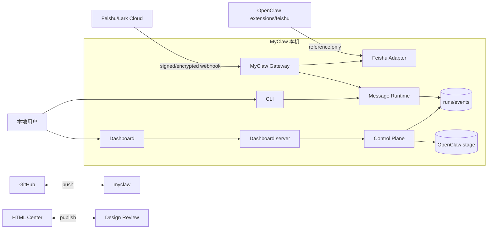
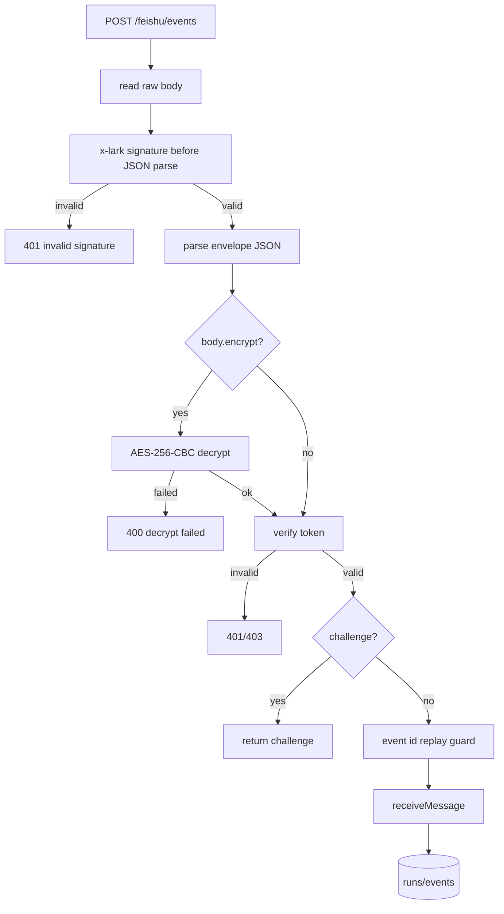
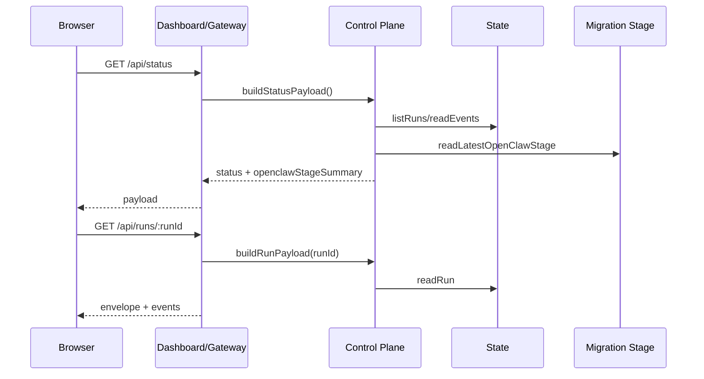
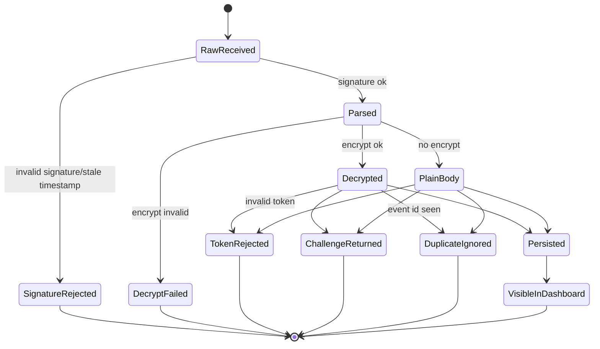
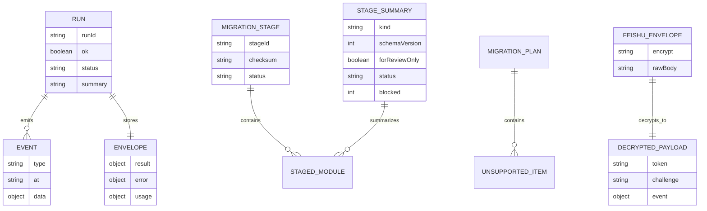
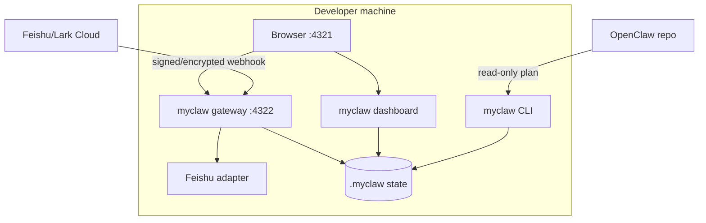

# MyClaw Phase 0.8 实现架构可视化评审

更新时间：2026-05-18

## 总诊断

Phase 0.8 补上 Feishu encrypted challenge、run detail 和 OpenClaw stage review summary。MyClaw 仍不直接加载 OpenClaw `@openclaw/feishu`，但已经把 OpenClaw Feishu 的关键 webhook 安全路径复制到自己的 adapter facade：签名先于 JSON 解析，加密 envelope 解密后再验证 token/challenge/event。

还不能把它说成生产飞书接入：encrypted message event 只具备解密入口，事件类型仍只支持 text normalize；replay guard 仍是内存 TTL；outbound rich card、WebSocket、policy 和 approval 还没做。stage summary 只用于人工审阅，不是字段级 diff，也不能作为 apply 输入。

| 评分项 | 当前分 | 判断 |
|---|---:|---|
| 设计清晰度 | 8/10 | Feishu 安全顺序、run detail、stage summary 边界清楚 |
| 可扩展性 | 8/10 | adapter 已拆 config/security/replay/normalize |
| 可靠性 | 6/10 | encrypted challenge 可用；replay 仍非持久 |
| 可维护性 | 8/10 | 所有文件低于 500 行，热点仍是 report builder |
| 安全性 | 6/10 | 签名、timestamp freshness、decrypt 已有；缺持久 replay/scoped token |

## Feishu/Lark 复用结论

| 问题 | 结论 | 理由 |
|---|---|---|
| 直接加载 OpenClaw Feishu？ | 仍不直接加载 | OpenClaw plugin-sdk/runtime/secrets/approval 仍未进入 MyClaw |
| 当前已 port 什么？ | webhook 安全子集 | x-lark signature、AES-256-CBC decrypt、verification token、event normalize |
| 下一步 | outbound facade | 先做 text/card/thread result，不接完整 OpenClaw tools |

## 参考完成度矩阵

| 模块 | MyClaw | OpenClaw | Hermes-agent | OpenHuman | 当前差距 |
|---|---:|---:|---:|---:|---|
| Gateway / 控制面 | 60 | 90 | 78 | 86 | 已拆 routes/auth，仍缺 WS/SSE、scoped token |
| Feishu/Lark 接入 | 50 | 92 | 42 | 35 | 有 encrypted challenge，缺 WebSocket/policy/outbound |
| Dashboard / 观测 | 55 | 78 | 55 | 90 | 有 run detail/stage summary，缺 approval queue、实时事件 |
| OpenClaw 迁移 | 55 | 0 | 82 | 35 | 有 plan/stage/review summary，缺 apply/rollback/字段级 diff |
| Agent Runtime | 8 | 76 | 92 | 90 | 还没有 agent turn、tool loop、subagent |
| Memory / Search | 10 | 52 | 94 | 96 | 仅 JSON/JSONL state |
| Tools / Security | 22 | 88 | 74 | 84 | 缺 tool schema、approval queue、sandbox |
| Plugins / Skills | 18 | 92 | 88 | 78 | 仅 channel registry |

## 系统上下文图

这张图回答：MyClaw 当前与 Feishu、OpenClaw、Dashboard、GitHub、HTML Center 的边界。



Review 观察：

- 优点：OpenClaw 只作为 reference，不进入运行时依赖。
- 优点：Feishu encrypted challenge 可在 MyClaw adapter 内完成。
- 风险：真实 Feishu message event 的类型覆盖仍很窄。
- 改进：下一阶段做 outbound facade 前先列清消息/卡片/线程边界。

## 模块架构图

这张图回答：Phase 0.8 的核心模块如何依赖，是否继续保持小文件。

```mermaid
flowchart TB
  Gateway[index.mjs] --> FeishuRoute[routes/feishu.mjs]
  Gateway --> ControlRoute[routes/control.mjs]
  FeishuRoute --> Security[feishu-adapter/security.mjs]
  FeishuRoute --> Replay[feishu-adapter/replay.mjs]
  FeishuRoute --> Normalize[feishu-adapter/normalize.mjs]
  ControlRoute --> Status[control-plane/status.mjs]
  Status --> State[core/state.mjs]
  Status --> Stage[Migrate stage]
  DashboardClient[dashboard/client.mjs] --> RunsApi[/api/runs/:runId]
  DashboardClient --> StageSummary[/api/status openclawStageSummary]
  RunsApi --> State
```

Review 观察：

- 优点：adapter 已拆成 config/security/replay/normalize，不再是单文件泥球。
- 优点：run detail 和 stage summary 走 control-plane，不让 dashboard 读私有文件。
- 风险：control route 仍集中 dashboard asset/status/runs/events/migration。
- 改进：后续用 controller/route registry 替代手写 if 链。

## 核心业务流程图

这张图回答：signed encrypted Feishu challenge 如何通过 MyClaw。



Review 观察：

- 优点：签名在 JSON parse 前，和 OpenClaw 的安全顺序一致。
- 优点：encrypted envelope 解密后再走 token/challenge/event。
- 风险：encrypted non-text event 仍可能在 normalize 阶段失败。
- 改进：拆出 Feishu event type matrix，不要只靠 text。

## 关键时序图

这张图回答：Dashboard 如何拿到 run detail 和 stage review summary。



Review 观察：

- 优点：run detail 有独立 API，dashboard 不再只靠摘要。
- 优点：stage summary 伴随 status 返回，首屏能看到迁移缺口。
- 风险：summary 不是字段级 config diff，不能用于 apply。
- 改进：Phase 0.9 做字段级 diff detail drawer。

## 状态机图

这张图回答：Feishu callback 生命周期中失败、解密、重复、持久化如何流转。



Review 观察：

- 优点：失败路径都在 runtime 前终止。
- 风险：缺 state-backed replay，重启后状态丢失。
- 风险：`VisibleInDashboard` 只是读视图，没有人工确认动作。
- 改进：下一阶段加入 approval queue。

## 数据模型 / ER 图

这张图回答：新增 run detail 与 stage summary 涉及哪些数据实体。



Review 观察：

- 优点：run detail 使用已有 run JSON + run JSONL，不引入新 store。
- 优点：stage summary 是派生数据，不修改 stage snapshot。
- 优点：summary 带 `kind/schemaVersion/forReviewOnly`，避免被误当 apply diff。
- 风险：真正字段级 config diff 仍未实现。

## 数据流图

这张图回答：Feishu、OpenClaw stage、run detail、HTML report 的数据如何流动。

```mermaid
flowchart LR
  Feishu[Feishu signed/encrypted body] --> Gateway
  Gateway --> Adapter[security decrypt normalize]
  Adapter --> Runtime
  Runtime --> RunState[(runs/*.json + jsonl)]
  OpenClaw[OpenClaw repo] --> Plan[Migration plan]
  Plan --> Stage[(stage snapshot)]
  RunState --> Status[/api/status]
  RunState --> RunDetail[/api/runs/:runId]
  Stage --> Summary[openclawStageSummary]
  Summary --> Dashboard
  RunDetail --> Dashboard
  Docs[Markdown review] --> Builder[build-review-html]
  Builder --> HtmlCenter[HTML Center]
```

Review 观察：

- 优点：dashboard 走 API，不读本地文件。
- 优点：summary/run detail 都是可测试 payload。
- 风险：report builder 仍手动生成。
- 改进：继续保留 phase sync check。

## 部署图

这张图回答：Phase 0.8 本地运行拓扑。



Review 观察：

- 优点：仍默认 loopback，本地调试安全。
- 风险：webhook 同步路径没有队列。
- 改进：Agent runtime 前加 run worker/event stream。

## 概念解释

| 概念 | 含义 | 当前边界 |
|---|---|---|
| encrypted challenge | Feishu URL verification 加密 envelope | 已支持 AES-256-CBC decrypt |
| run detail | 单个 run 的 envelope 与事件 | `GET /api/runs/:runId` |
| stage summary | stage 与 plan 的模块级审阅摘要 | `forReviewOnly: true`，非字段级 diff |
| replay guard | event id 去重 | 当前内存 TTL，缺 id 拒绝 |
| freshness window | x-lark timestamp 重放窗口 | 10 分钟 |

## 相似技术比较

| 维度 | MyClaw Phase 0.8 | OpenClaw | Hermes-agent | OpenHuman |
|---|---|---|---|---|
| Feishu/Lark | signed + encrypted challenge | 完整 Feishu plugin | 有平台 adapter 方向 | 非核心 |
| Dashboard | run detail + stage summary | Control UI/schema | CLI/TUI/ops | UI-first |
| Gateway | routes/auth/http 拆分 | 成熟 gateway/channel 安全 | 多平台 gateway | JSON-RPC/SSE |
| 迁移 | plan/stage/review summary | 被迁移源 | 有迁移经验 | controller 思想 |
| 记忆 | JSON/JSONL state | session/config | SQLite/FTS | memory tree |

## 目录结构与文件行数

| 路径 | 行数 | 职责 | 评价 |
|---|---:|---|---|
| `packages/feishu-adapter/src/security.mjs` | 101 | signature/decrypt/token | 健康 |
| `packages/gateway/src/routes/feishu.mjs` | 92 | Feishu HTTP route | 健康 |
| `packages/dashboard/src/client.mjs` | 238 | dashboard render logic | 可接受；approval 前拆 renderer |
| `packages/control-plane/src/status.mjs` | 178 | status/run/detail/summary payload | 可接受 |
| `packages/core/src/state.mjs` | 189 | state read/write/run detail/id guard | 健康 |
| `docs/build-review-html.mjs` | 408 | HTML report builder | 接近 450，下一轮拆 |

没有手写文件超过 500 行。

## 风险分级

| 等级 | 问题 | 影响 | 建议 |
|---|---|---|---|
| High | replay guard 仍在内存 | 重启后不能防 replay | state-backed replay guard |
| High | encrypted event 类型覆盖不足 | 飞书非 text event 会失败 | 建 event type matrix |
| Medium | stage summary 不是字段级 diff | 不能审字段级迁移 | 做 diff drawer |
| Medium | dashboard client 继续增长 | approval/run detail 后会变胖 | 拆 renderer |
| Low | report builder 408 行 | 接近预警 | 拆 parser/template |

## Linus 视角严苛审查

独立 subagent 已按 30 年 Linux 内核维护者视角审查当前 diff，结论是“方向可以接受，但接口边界不能继续糊”。

| 等级 | 发现 | 处理 |
|---|---|---|
| High | `GET /api/runs/:runId` 原先是未校验路径拼接 | 已在 `core/state.mjs` 加 runId 白名单；gateway/dashboard 非法 id 返回 400，缺失 run 返回 404 |
| High | Feishu token-only webhook 不能包装成 OpenClaw 级别安全 | 已把缺 `encryptKey` 的 webhook readiness 从 partial 可用改为 blocked |
| High | `openclawStageDiff` 名字会让 apply 误用摘要 | 已新增 `openclawStageSummary`，payload 带 `kind/schemaVersion/forReviewOnly`；旧字段只作为兼容别名 |
| Medium | gateway 和 dashboard route 仍在复制控制面 if 链 | 本轮先保持；Phase 0.9 必须引入 controller/route adapter |
| Medium | migration POST 文档说返回 diff，但代码只返回 stage | 已让 `POST /api/openclaw-migration/stage` 返回 `stageSummary`，并把文档改成 review summary |
| Medium | GET 只读接口未来会吐 prompt/tool output | Phase 0.9 加 scoped token 与 redaction policy |

## Skill 规范自检

- 使用 `web-design-review` 规则生成可视化 design review dashboard。
- 覆盖系统上下文、模块架构、核心流程、时序、状态机、ER、数据流、部署图。
- 报告包含目录行数、概念解释、相似技术比较、风险分级、Linus 视角。
- 单文件 500 行硬限制由 `npm run check` 执行。

## 下一阶段建议

1. Phase 0.9：Feishu outbound facade，text/card/thread result normalization。
2. Replay guard 持久化。
3. Dashboard 字段级 diff detail drawer 和 approval queue。
4. Gateway scoped token 和 mutation audit。
