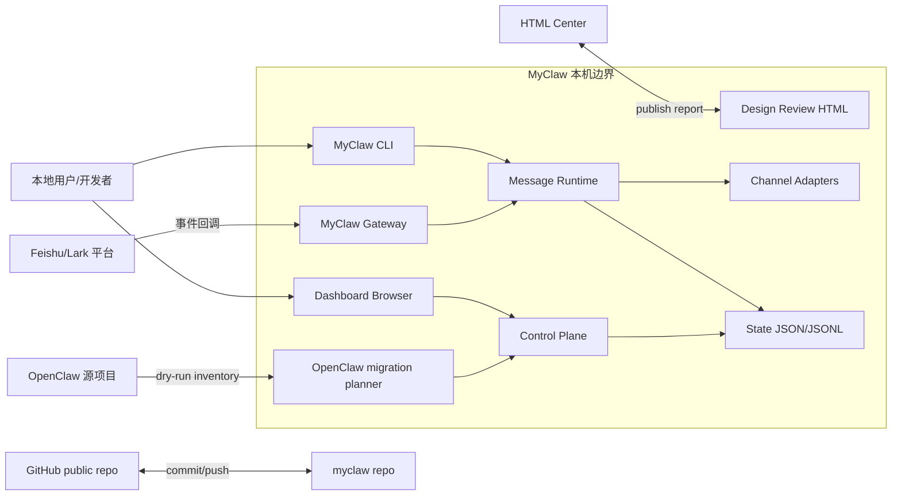
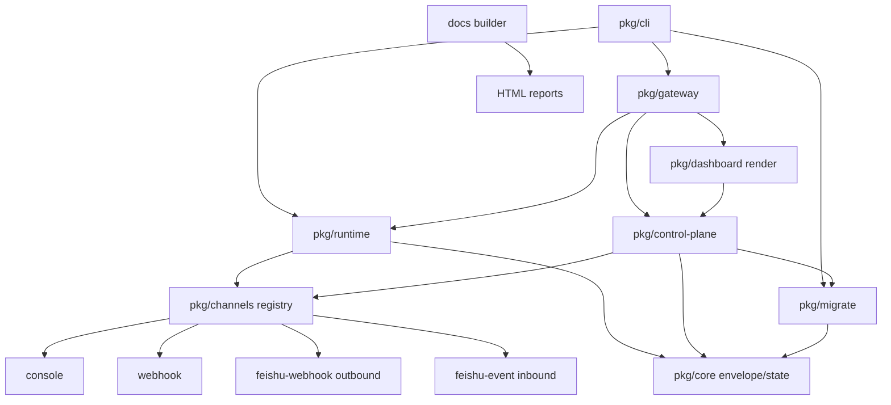
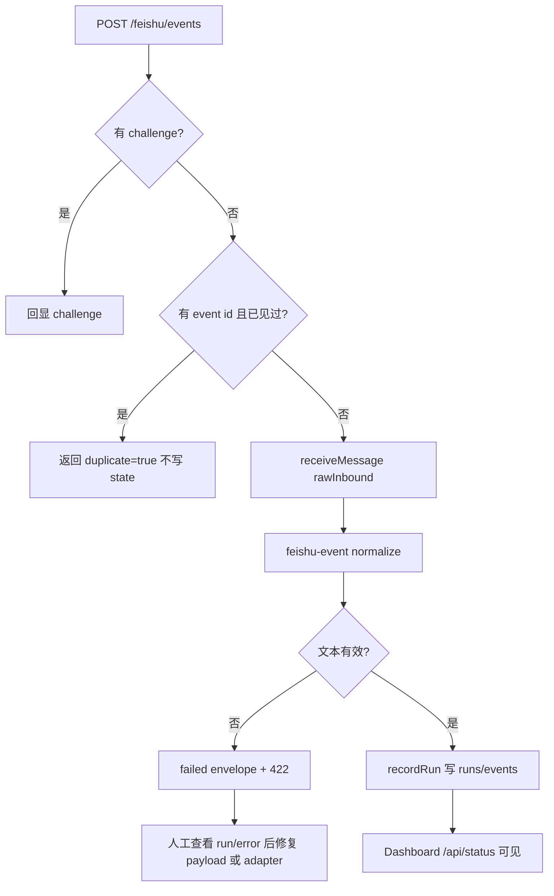
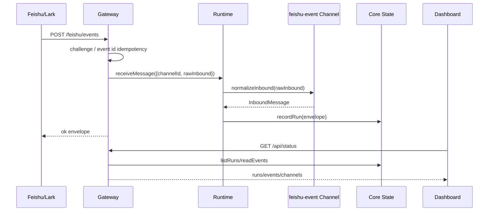
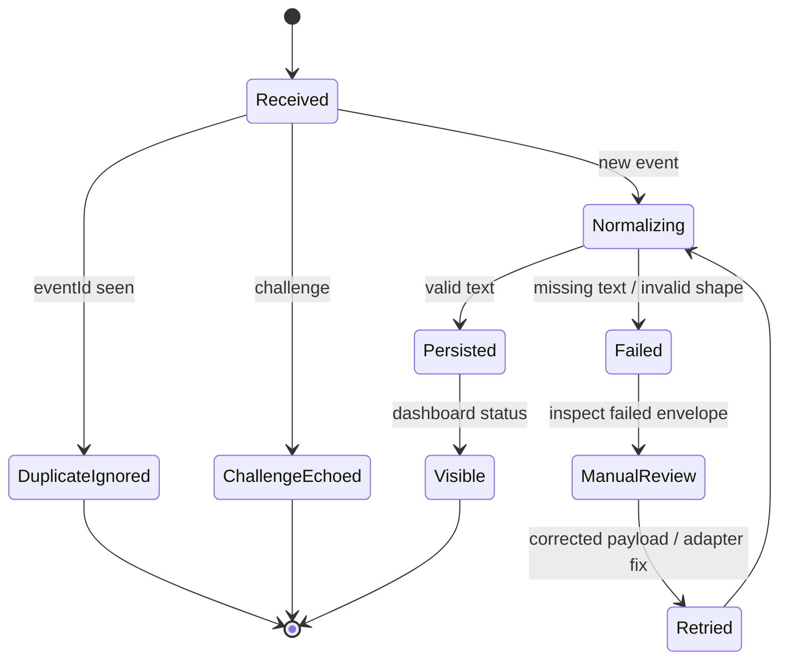
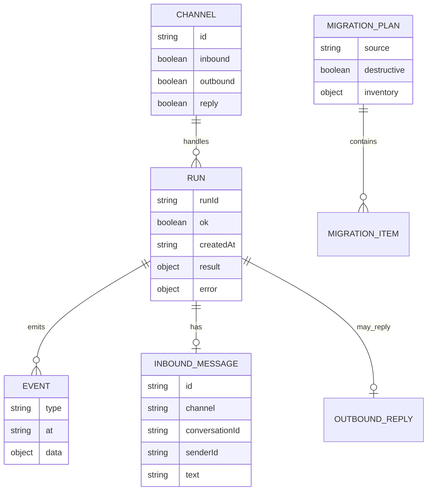
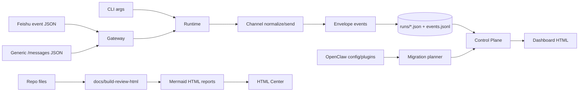
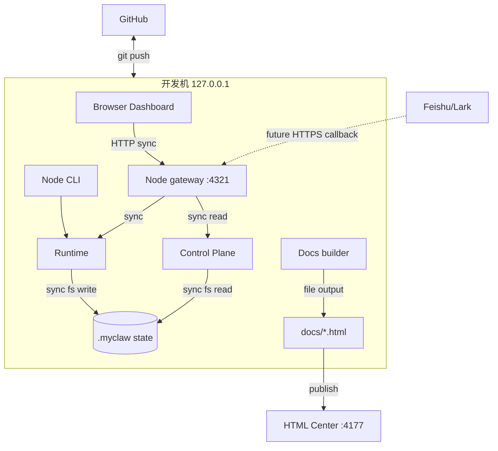
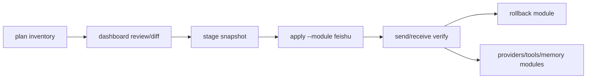

# MyClaw Phase 0.4 实现架构可视化评审

更新时间：2026-05-17

## 总诊断

Phase 0.4 已把 Feishu/Lark 事件回调接入到 gateway，并把 design review 报告升级为 Mermaid 可视化 dashboard。正确方向是：Feishu 格式留在 `feishu-event` adapter，CLI/gateway 继续复用 runtime，state 仍只记录 envelope/run/event。

最大问题也必须说清楚：当前 gateway 仍只是本机开发入口，不是可公网暴露的飞书正式回调服务。缺 token、签名校验、encrypt payload 解密和持久幂等之前，不能把它当生产入口。

| 评分项 | 当前分 | 判断 |
|---|---:|---|
| 设计清晰度 | 8/10 | channel/runtime/gateway 边界基本清楚 |
| 可扩展性 | 7/10 | adapter registry 可扩展，但 rawInbound 契约还粗 |
| 可靠性 | 5/10 | event id 仅内存去重，缺签名和持久 replay window |
| 可维护性 | 7/10 | 文件低于 500 行，dashboard/report generator 后续需拆 |
| 安全性 | 4/10 | 当前仅适合 loopback 开发 |

## 系统上下文图

这张图回答：MyClaw 的系统边界在哪里，当前和哪些用户、外部系统、参考项目交互？



Review 观察：

- 优点：外部系统只通过 gateway、migration planner、Git remote、HTML Center 进入，边界可解释。
- 风险：Feishu 回调目前没有签名/加密校验，图中的 Feishu 箭头仍只能代表本机模拟。
- 改进：下一阶段把 gateway mutation 入口加 token，并把 Feishu 验证失败挡在 runtime 外。
- 假设：HTML Center 仍运行在 `127.0.0.1:4177`，只承载报告展示，不参与 MyClaw runtime。

## 模块架构图

这张图回答：系统拆成了哪些模块，每部分负责什么，依赖是否合理？



Review 观察：

- 优点：`core` 不知道 HTTP/Feishu/UI，底层边界干净。
- 优点：`feishu-webhook` outbound 与 `feishu-event` inbound 分开，避免方向混淆。
- 风险：gateway 直接引用 dashboard render，Phase 0 可接受，复杂 UI 后要拆 host/view。
- 风险：runtime 的 `rawInbound` 让协议原始对象进入核心 pipeline，后续要收窄成稳定 adapter contract。

## 核心业务流程图

这张图回答：一条 Feishu 文本事件从进入到记录完成，happy path、重复、失败、人工介入分别怎么走？



Review 观察：

- 优点：challenge、重复事件、文本缺失都已有路径，便于飞书接入 spike。
- 风险：duplicate 只在内存 Map，进程重启后不能防重放。
- 风险：失败 envelope 可能保存完整 raw payload，后续要做脱敏。
- 改进：增加 Feishu event type allowlist，只处理 message 事件。

## 关键时序图

这张图回答：一次事件请求中 gateway、runtime、channel、state、dashboard 如何协作？



Review 观察：

- 优点：gateway 没有直接写 state，仍通过 runtime 形成统一 envelope。
- 风险：协议验证和 normalize 的分工还不够硬，签名校验应在 gateway，shape normalize 在 channel。
- 风险：dashboard 只轮询状态，没有 run detail 或失败修复入口。
- 改进：引入 `InboundAdapterInput` 类型契约，禁止 runtime 存完整原始 body。

## 状态机图

这张图回答：message run 的生命周期有哪些状态，失败、重复、重试、人工介入如何处理？



Review 观察：

- 优点：当前最小状态流可解释，重复事件不会产生第二个 run。
- 风险：没有 cancel/timeout，因为当前还不是长任务 agent run。
- 风险：人工介入只靠查看 JSON/JSONL，没有 dashboard 操作面。
- 改进：Phase 1 把 message run 和 workflow run 状态分开，避免未来状态爆炸。

## 数据模型 / ER 图

这张图回答：当前持久化数据有哪些核心实体，实体之间是什么关系？



Review 观察：

- 优点：run/event 是统一审计线，CLI、gateway、Feishu 都复用。
- 风险：当前 state 是 JSON/JSONL，关系只存在约定里，没有数据库约束。
- 风险：`raw` 可能包含外部 payload，隐私和体积都要控制。
- 改进：迁移到 SQLite 前先定义稳定 schema 和脱敏策略。

## 数据流图

这张图回答：消息、迁移计划、评审报告的数据从哪里来，经过哪些处理，最终到哪里去？



Review 观察：

- 优点：runtime 数据线和 docs 数据线分开，不会把评审生成器放入运行时。
- 风险：Control Plane 当前同时聚合 channels/migration/state，后续可能变胖。
- 风险：Dashboard 仍以内联 HTML/JS 管理，复杂状态后测试成本会上升。
- 改进：把 docs builder 的 Markdown parser 和 shell template 拆成小模块。

## 部署图

这张图回答：系统运行时部署在哪里，哪些同步调用，哪些后续应异步化？



Review 观察：

- 优点：当前全部本机同步调用，调试和回滚简单。
- 风险：Feishu future callback 不能直接开放，必须先补 auth/signature。
- 风险：同步 fs 写入适合 Phase 0，小并发下可用，正式多事件需要队列或锁。
- 改进：Phase 1 引入 mutation guard、持久幂等表、可观测 request id。

## 风险分级

| 等级 | 问题 | 影响 | 建议修改 |
|---|---|---|---|
| Critical | gateway 无 token/签名 | 绑定非本机时可被任意写 run | 默认 loopback；非 loopback 必须 token；Feishu 必须签名校验 |
| High | `feishu-event` 只是 shape parser | 不能处理 encrypt、tenant、event type、replay | 增加 Feishu verify 层和 allowlist |
| High | `rawInbound` 写入路径过宽 | 外部协议和敏感 raw payload 进入 runtime/state | 定义 `InboundAdapterInput`，保存脱敏 raw 摘要 |
| Medium | dashboard/report 内联字符串增长 | 后续 UI 和报告复杂后难测 | 拆 template、client script、markdown parser |
| Medium | OpenClaw 迁移仍是 inventory | 不能直接“一键迁移运行” | 坚持 plan -> stage -> apply module -> rollback |

## 目录结构与文件行数

硬性规则：单个手写源文件或文档文件不得超过 500 行，接近 450 行必须拆。当前没有超过 500 行的手写文件，最大文件是 `docs/build-review-html.mjs` 408 行。

| 目录 | 文件 | 行数 | 职责 | 内容评价 |
|---|---|---:|---|---|
| `/` | `README.md` | 44 | 项目入口说明 | 简洁，已补 Feishu event smoke test |
| `/` | `package.json` | 15 | workspace scripts | 够用，暂不引入构建链 |
| `scripts` | `check-file-lines.mjs` | 62 | 500 行约束检查 | 必要约束，保持简单 |
| `packages/core` | `package.json` | 9 | 包元数据 | 正常 |
| `packages/core/src` | `envelope.mjs` | 46 | run/event/envelope 工厂 | 边界干净 |
| `packages/core/src` | `state.mjs` | 128 | JSON/JSONL state 读写 | Phase 0 合适，后续加索引 |
| `packages/core/test` | `state.test.mjs` | 30 | state reader 测试 | 覆盖基础路径 |
| `packages/channels` | `package.json` | 8 | 包元数据 | 正常 |
| `packages/channels/src` | `index.mjs` | 292 | channel registry、webhook、Feishu normalize | 仍低于 500；后续可拆 feishu adapter |
| `packages/channels/test` | `channels.test.mjs` | 85 | channel/Feishu normalize 测试 | 已覆盖 inbound/outbound 列表 |
| `packages/runtime` | `package.json` | 8 | 包元数据 | 正常 |
| `packages/runtime/src` | `messages.mjs` | 185 | send/receive/reply pipeline | 复用正确，rawInbound 契约需收窄 |
| `packages/runtime/test` | `messages.test.mjs` | 29 | runtime 状态测试 | 基础覆盖够 |
| `packages/gateway` | `package.json` | 8 | 包元数据 | 正常 |
| `packages/gateway/src` | `index.mjs` | 222 | HTTP routes、Feishu challenge、idempotency | Phase 0 清楚，缺 auth/signature |
| `packages/gateway/test` | `gateway.test.mjs` | 90 | gateway message/Feishu 测试 | 已覆盖 challenge、duplicate |
| `packages/dashboard` | `package.json` | 8 | 包元数据 | 正常 |
| `packages/dashboard/src` | `index.mjs` | 287 | dashboard HTML/server | 可用但内联较多 |
| `packages/dashboard/test` | `dashboard.test.mjs` | 45 | dashboard/status 测试 | 已同步 4 个 channel |
| `packages/control-plane` | `package.json` | 8 | 包元数据 | 正常 |
| `packages/control-plane/src` | `status.mjs` | 42 | status/runs/events/migration 聚合 | 抽离正确 |
| `packages/cli` | `package.json` | 8 | 包元数据 | 正常 |
| `packages/cli/src` | `index.mjs` | 298 | CLI 命令编排 | 接近 300，可继续保留 |
| `packages/cli/test` | `send.test.mjs` | 33 | send CLI 测试 | 基础覆盖 |
| `packages/cli/test` | `receive.test.mjs` | 49 | receive CLI 测试 | 基础覆盖 |
| `packages/migrate` | `package.json` | 8 | 包元数据 | 正常 |
| `packages/migrate/src` | `openclaw.mjs` | 348 | OpenClaw dry-run planner | 逻辑偏多但未超限；stage/apply 前要拆 |
| `packages/migrate/test` | `openclaw.test.mjs` | 44 | migration planner 测试 | 覆盖 dry-run |
| `docs` | `build-review-html.mjs` | 408 | Markdown 到 HTML/Mermaid 报告生成 | 低于 450，下一轮拆 parser/template |
| `docs` | `design-review.md` | 345 | 初始总体设计评审 | 可继续作为历史基线 |
| `docs` | `implementation-architecture.md` | 429 | 当前阶段可视化报告 | 符合 Mermaid dashboard 要求 |
| `docs` | `stage-status.md` | 141 | 阶段状态 | 已升级 Phase 0.4 |
| `docs/lib` | `module-meta.mjs` | 103 | 模块报告 metadata | 拆分有效 |
| `docs/modules` | `README.md` | 46 | 模块索引 | 简洁 |
| `docs/modules` | `access-layer.md` | 95 | 接入层设计 | 需后续补真实远端入口 |
| `docs/modules` | `agent-runtime.md` | 128 | Agent runtime 设计 | Phase 1 重点 |
| `docs/modules` | `config-state-storage.md` | 109 | 配置与状态存储 | 后续连接 SQLite |
| `docs/modules` | `gateway.md` | 189 | gateway 模块设计 | 已补 Feishu event |
| `docs/modules` | `initial-mvp-plan.md` | 315 | 分阶段 MVP | 仍是主路线文件 |
| `docs/modules` | `memory-session-search.md` | 163 | 记忆/session/search | 后续 Phase 1 细化 |
| `docs/modules` | `openclaw-migration.md` | 98 | OpenClaw 迁移 | 仍是 plan/stage/apply 路线 |
| `docs/modules` | `openhuman-analysis.md` | 137 | OpenHuman 参考分析 | 用于边界参考 |
| `docs/modules` | `plugins-skills.md` | 110 | 插件/skills 设计 | 后续接 openclaw-lark |
| `docs/modules` | `reference-comparison.md` | 96 | 参考项目比较 | 需随实现更新 |
| `docs/modules` | `roadmap-acceptance.md` | 177 | 路线和验收 | 阶段验收清楚 |
| `docs/modules` | `tools-approval-security.md` | 123 | 工具/审批/安全 | 下一阶段要落地 mutation guard |
| `docs/modules` | `ui-observability-ops.md` | 102 | UI/观测/运维 | dashboard 后续主线 |
| `docs/modules` | `workflow-core.md` | 107 | workflow core | 等 message ingress 稳定后进入 |
| `docs/*.html` | 生成 HTML | 构建后检查 | 可浏览报告产物 | 生成物也受 500 行检查 |

## 概念解释

| 概念 | 当前定义 | 边界 |
|---|---|---|
| Gateway | 本地 HTTP 控制面，承载 dashboard、`/messages`、`/feishu/events` | 不跑 agent，不做业务决策 |
| Runtime | CLI 和 gateway 共用的 send/receive/reply pipeline | 不解析 HTTP，不知道 dashboard |
| ChannelAdapter | 通道扩展点，负责 send 或 inbound normalize | 不写 state，不调 workflow |
| `feishu-event` | Feishu/Lark 入站事件 normalizer | 不是完整协议校验器 |
| `feishu-webhook` | Feishu/Lark 自定义机器人 outbound webhook | 不处理 event callback |
| Control Plane | 聚合 status/runs/events/migration 的只读层 | 不渲染 UI，不执行 mutation |
| Migration Plan | OpenClaw dry-run inventory 和映射草案 | 不是 apply，也不读取 secret 实值 |
| Design Review Dashboard | 带 Mermaid、风险分级、目录行数的 HTML 报告 | 不是普通 Markdown 总结 |

## 相似技术比较

| 设计点 | MyClaw 当前选择 | 相似技术 | 取舍 |
|---|---|---|---|
| HTTP 服务 | 裸 `node:http` | Express/Fastify | 依赖少；schema/middleware 要手补 |
| 通道接入 | Channel registry | Bot Framework adapter / OpenClaw plugins | 边界轻；隔离和 manifest 尚弱 |
| 状态存储 | JSON + JSONL | SQLite/event store | 容易审计；查询、幂等和并发弱 |
| Feishu 入站 | gateway + `feishu-event` | openclaw-lark plugin | 先打通最小链路；正式协议能力不足 |
| OpenClaw 迁移 | plan/stage/apply 路线 | Terraform plan/apply | 可审计；短期不是一键全量运行 |
| Report | Mermaid HTML dashboard | Markdown 文档 / Docusaurus | 快速可视化；生成器后续要拆 |

## 关键设计对比

| 选项 | 当前选择 | 原因 | 何时改变 |
|---|---|---|---|
| 同步 vs 异步 | 同步 HTTP + fs 写入 | Phase 0 易调试 | 多并发 Feishu 事件后引入队列/锁 |
| 单体包 vs 服务拆分 | monorepo 小包 | 边界清楚但部署简单 | 多进程 worker 出现后拆服务 |
| 本地存储 vs DB | JSON/JSONL | 可读、可审计 | 需要查询、幂等表、索引时上 SQLite |
| 自动执行 vs 人工确认 | 当前只记录消息 | 避免早期自动副作用 | tools/workflow apply 前加审批 |
| raw payload vs 标准消息 | 暂有 `rawInbound` | 快速接 Feishu shape | 下一阶段收窄并脱敏 |

## OpenClaw 一键迁移路线

当前只能叫“一键迁移路线”，不能叫“一键迁移能力”。推荐继续按模块推进：



Review 观察：

- 优点：plan/stage/apply 和 Terraform 类似，能避免直接全量污染。
- 风险：`openclaw-lark` 可能依赖 OpenClaw plugin runtime，需要 facade，不能直接复制。
- 改进：下一阶段先做 stage snapshot 和只读 diff，再接 Feishu module apply。

## Linus 视角严苛审查

独立 subagent 已完成审查，结论摘要如下：

- 最严重：gateway 没有 token、签名、timestamp、nonce、来源校验，当前不是可暴露入口，只是本机开发入口。
- 最严重：Feishu adapter 只是 shape parser，不是协议适配器；challenge 任意回显，内存幂等重启失效。
- 最严重：`rawInbound` 绕开 runtime 正常输入契约，并可能把完整 raw payload 写入 state。
- 已做对：`core` 仍只管 envelope/state；runtime 统一 CLI/gateway；`feishu-webhook` 和 `feishu-event` 没混在一起；行数约束有效。
- 必须修：先加 gateway mutation guard 和 Feishu 验证，再做 stage snapshot，不要把 OpenClaw 全量 runtime 直接 apply。

## 验收记录

本阶段需要通过：

```bash
npm run check
npm test
node docs/build-review-html.mjs
curl -sS http://127.0.0.1:4321/feishu/events -H 'content-type: application/json' -d '{"challenge":"plain_challenge"}'
curl -sS http://127.0.0.1:4321/api/feishu/events -H 'content-type: application/json' -d '{"header":{"event_id":"evt_demo"},"event":{"sender":{"sender_id":{"open_id":"ou_user"}},"message":{"message_id":"om_demo","chat_id":"oc_group","content":"{\"text\":\"hello from feishu\"}"}}}'
```

测试覆盖：

- channel registry 和 `feishu-event` normalize。
- runtime send/receive/reply 共享 envelope。
- gateway `/messages`、`/feishu/events` challenge、event normalize、duplicate event id。
- dashboard/status 能看到 4 个 channel。
- OpenClaw migration planner 仍是 dry-run。

结论：Phase 0.4 已跑通 Feishu 入站最小链路和可视化设计评审规范。下一阶段必须优先补安全边界和迁移 stage snapshot，而不是扩展更多自动执行能力。
