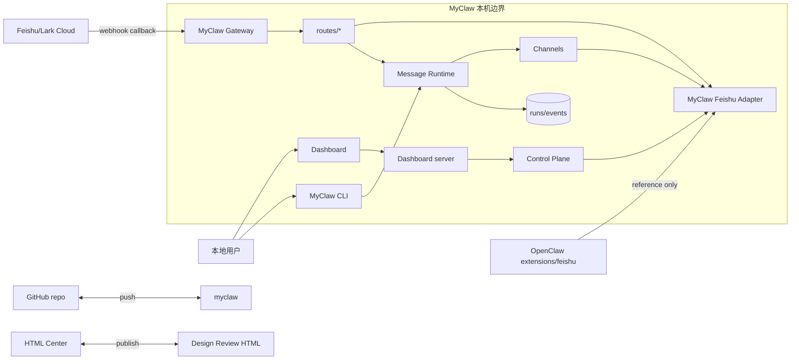
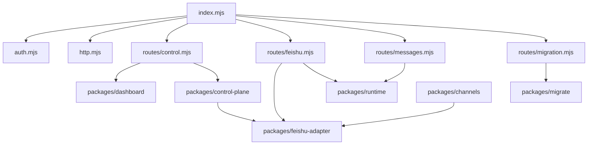
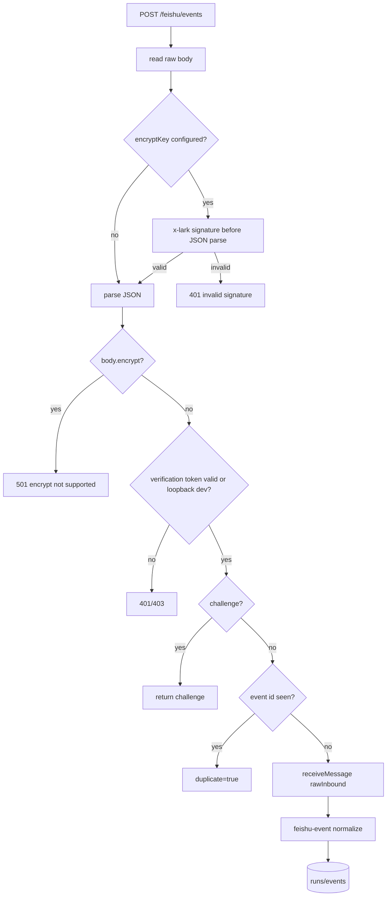
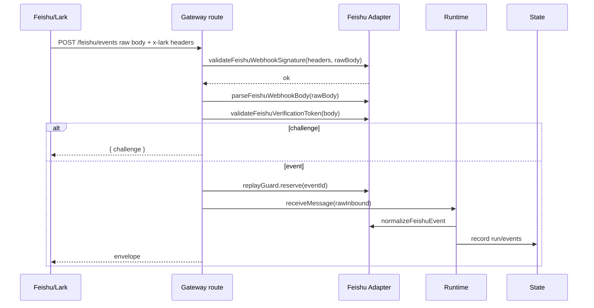
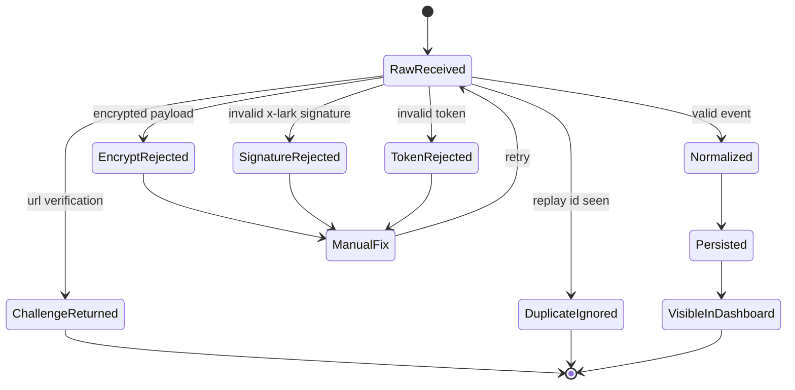
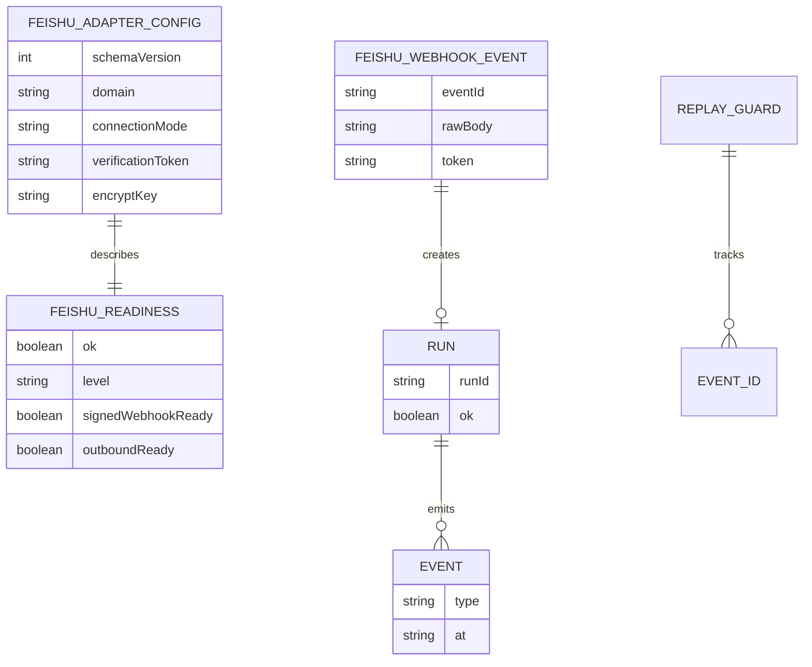
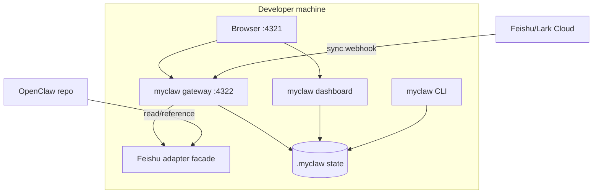

# MyClaw Phase 0.7 实现架构可视化评审

更新时间：2026-05-17

## 总诊断

Phase 0.7 把上一轮“参考 OpenClaw Feishu 但不直接加载”的判断落到代码里：新增 `packages/feishu-adapter`，承接 config readiness、x-lark signature、verification token、replay guard 和 event normalization。Gateway 也从 321 行热点文件拆成 `auth/http/routes/*`，主入口降到 90 行。

这仍然不是生产级 Feishu 接入。encrypt payload 解密、WebSocket mode、access policy、outbound rich card、scoped token 和持久 replay window 还没有完成。

| 评分项 | 当前分 | 判断 |
|---|---:|---|
| 设计清晰度 | 8/10 | Feishu adapter facade 和 gateway route 边界清楚 |
| 可扩展性 | 8/10 | 后续可继续 port OpenClaw 安全/outbound 逻辑 |
| 可靠性 | 6/10 | 签名和 replay 有基础，replay 仍是内存 |
| 可维护性 | 8/10 | gateway 主文件已拆，所有文件低于 500 行 |
| 安全性 | 6/10 | 有 x-lark signature；缺 encrypt、scoped token、持久 replay |

## Feishu/Lark 复用结论

| 问题 | 结论 | 理由 |
|---|---|---|
| 能不能直接用 OpenClaw Feishu？ | 仍不直接加载 | `@openclaw/feishu` 依赖 OpenClaw plugin-sdk/runtime/secrets/approval |
| 当前参考了什么？ | 安全和 schema 子集 | config 字段、签名公式、token 边界、event id 去重 |
| MyClaw 新边界 | `packages/feishu-adapter` | gateway 只依赖 facade，不直接耦合 OpenClaw runtime |

## 参考完成度矩阵

| 模块 | MyClaw | OpenClaw | Hermes-agent | OpenHuman | 当前差距 |
|---|---:|---:|---:|---:|---|
| Gateway / 控制面 | 60 | 90 | 78 | 86 | 已拆 routes/auth，仍缺 WS/SSE、scoped token |
| Feishu/Lark 接入 | 45 | 92 | 42 | 35 | 有 adapter/signature，缺 encrypt/WebSocket/policy/outbound |
| Dashboard / 观测 | 47 | 78 | 55 | 90 | 缺 run detail、stage diff、approval queue、实时事件 |
| OpenClaw 迁移 | 50 | 0 | 82 | 35 | 已有 plan/stage，缺 apply/rollback/diff UI |
| Agent Runtime | 8 | 76 | 92 | 90 | 还没有 agent turn、tool loop、subagent |
| Memory / Search | 10 | 52 | 94 | 96 | 仅 JSON/JSONL state |
| Tools / Security | 22 | 88 | 74 | 84 | 缺 tool schema、approval queue、sandbox |
| Plugins / Skills | 18 | 92 | 88 | 78 | 仅 channel registry |

## 系统上下文图

这张图回答：MyClaw、OpenClaw Feishu、用户和外部 Feishu 平台之间的边界在哪里？



Review 观察：

- 优点：OpenClaw 只作为 reference，不进入运行时依赖。
- 优点：Gateway route 和 Feishu adapter 有明确边界。
- 风险：Feishu Cloud 到 gateway 的生产路径仍缺 encrypt decrypt。
- 改进：下一轮先补 encrypted challenge，再考虑 outbound。

## 模块架构图

这张图回答：Phase 0.7 代码被拆成哪些模块，耦合是否下降？



Review 观察：

- 优点：`gateway/src/index.mjs` 从 321 行降到 90 行。
- 优点：Feishu normalize 从 channels 移到 adapter，后续 outbound 也能复用。
- 风险：`control-plane` 仍直接 import adapter readiness，后续配置来源要统一。
- 改进：引入 config registry 后由 registry 注入 adapter config。

## 核心业务流程图

这张图回答：Feishu webhook 如何通过签名、token、replay、normalize 进入 runtime？



Review 观察：

- 优点：有 encryptKey 时签名在 JSON parse 前完成，边界更硬。
- 优点：encrypted envelope 会先走 encrypt 分支，不会在 token 阶段误判。
- 优点：event id replay guard 从 route 内部状态抽成 adapter 工具。
- 风险：没有 encryptKey 时仍可 token-only dev，生产必须配置 readiness。
- 改进：非 loopback webhook mode 应逐步强制 encryptKey。

## 关键时序图

这张图回答：一次签名 Feishu challenge 如何从 gateway 到 adapter？



Review 观察：

- 优点：challenge 不进入 runtime，event 才进入 runtime。
- 优点：adapter 函数可单测，不依赖 HTTP server。
- 风险：signature test 只覆盖 hex sha256，未覆盖 encrypted challenge。
- 改进：补 AES-256-CBC decrypt 和 malformed encrypted payload 测试。

## 状态机图

这张图回答：Feishu callback 和 migration/apply 的关键状态如何流转？



Review 观察：

- 优点：失败状态在 runtime 前终止。
- 风险：`ManualFix` 还不是 UI 操作，只能靠日志/API。
- 风险：replay state 重启丢失。
- 改进：replay guard 应写 state 或 SQLite。

## 数据模型 / ER 图

这张图回答：新增 Feishu adapter facade 带来了哪些结构化状态？



Review 观察：

- 优点：readiness 是 API 数据，不只是文档结论。
- 风险：config 现在主要来自 env/CLI option，没有统一 config file。
- 改进：Phase 1 引入 config registry 后让 adapter 从同一来源解析。

## 数据流图

这张图回答：OpenClaw 参考、Feishu webhook、dashboard 和报告数据如何流动？

```mermaid
flowchart LR
  OpenClawFeishu[OpenClaw extensions/feishu] -->|schema/security reference| FeishuAdapter
  FeishuCloud[Feishu Cloud] --> Gateway
  Gateway --> FeishuAdapter
  FeishuAdapter --> Runtime
  Runtime --> State[(runs/events)]
  State --> Control[/api/status]
  FeishuAdapter --> Adoption[/api/feishu-adoption]
  Adoption --> Dashboard
  Control --> Dashboard
  Docs[Markdown review] --> Builder[docs/build-review-html.mjs]
  Builder --> Html[HTML dashboard report]
  Html --> HtmlCenter
```

Review 观察：

- 优点：运行数据和设计评审数据都有 API 面。
- 风险：HTML 报告仍需手动运行 builder。
- 改进：commit 前可加阶段号一致性检查。

## 部署图

这张图回答：本地服务如何部署，哪些路径同步执行？



Review 观察：

- 优点：本地默认 loopback，适合 Phase 0。
- 风险：同步 webhook 仍直接进 runtime，没有队列。
- 改进：长任务进入 Agent runtime 前要加 run worker/event stream。

## 概念解释

| 概念 | 含义 | 当前边界 |
|---|---|---|
| adapter facade | MyClaw 自己拥有的 Feishu 契约层 | 不直接加载 OpenClaw plugin runtime |
| x-lark signature | Feishu webhook 签名 | `sha256(timestamp + nonce + encryptKey + rawBody)` |
| readiness | adapter 可用性诊断 | `ready/partial/blocked` |
| replay guard | event id 去重 | 当前内存 TTL，缺 id 直接拒绝，后续持久化 |
| route split | gateway 入口拆分 | index 只分发，route 文件处理业务 |

## 相似技术比较

| 维度 | MyClaw Phase 0.7 | OpenClaw | Hermes-agent | OpenHuman |
|---|---|---|---|---|
| Feishu/Lark | adapter facade + signed webhook | 完整 Feishu plugin | 有平台 adapter 方向 | 非核心 |
| Gateway | routes/auth/http 拆分 | 成熟 gateway/channel 安全 | 多平台 gateway | JSON-RPC/SSE 控制层 |
| Dashboard | readiness + reference matrix | Control UI/schema | CLI/TUI/ops | UI-first |
| 记忆 | JSON/JSONL state | session/config | SQLite/FTS/memory | memory tree |
| 插件 | 不加载 OpenClaw runtime | plugin SDK | skills/tools | controller/skills |

## 目录结构与文件行数

| 路径 | 行数 | 职责 | 评价 |
|---|---:|---|---|
| `packages/gateway/src/index.mjs` | 90 | gateway request 分发 | 从热点文件拆出，健康 |
| `packages/gateway/src/auth.mjs` | 36 | mutation auth | 小而清楚 |
| `packages/gateway/src/http.mjs` | 48 | body/read/write helpers | 小而清楚 |
| `packages/gateway/src/routes/feishu.mjs` | 89 | Feishu callback route | 健康，encrypt 前还能承载 |
| `packages/gateway/src/routes/control.mjs` | 51 | dashboard/status routes | 健康 |
| `packages/feishu-adapter/src/config.mjs` | 63 | Feishu config/readiness | 已从 facade index 拆出 |
| `packages/feishu-adapter/src/security.mjs` | 88 | signature/token/body security | 已拆出，含 10 分钟 freshness |
| `packages/feishu-adapter/src/replay.mjs` | 28 | replay guard | 小而清楚，后续换 state-backed |
| `packages/feishu-adapter/src/normalize.mjs` | 63 | event normalize | 小而清楚 |
| `packages/control-plane/src/status.mjs` | 102 | status/reference/adoption payload | 健康 |
| `packages/dashboard/src/client.mjs` | 193 | dashboard render logic | 可接受；run detail 前拆 renderer |
| `packages/cli/src/index.mjs` | 322 | CLI commands | 后续 command registry |
| `docs/build-review-html.mjs` | 408 | HTML report builder | 接近 450，继续加能力前拆 |

没有手写文件超过 500 行。`docs/build-review-html.mjs` 是最接近预警线的文件。

## 风险分级

| 等级 | 问题 | 影响 | 建议 |
|---|---|---|---|
| High | Feishu encrypt payload 仍 501 | 无法生产接入加密回调 | Phase 0.8 实现 AES-256-CBC decrypt |
| High | replay guard 仍在内存 | 重启后不能防 replay | 写入 state 或 SQLite |
| Medium | Feishu encrypted payload 顺序已修正但未解密 | 真实 encrypted event 仍不能进入 runtime | Phase 0.8 实现 decrypt 后再 token/challenge/event |
| Medium | Dashboard 仍没有 stage diff/run detail | 操作性不足 | Phase 0.8 补 detail/diff |
| Low | Gateway 仍直接 serve dashboard asset | 读写边界可接受但不完美 | 后续抽 dashboard-static |

## Linus 视角严苛审查

独立 subagent 已完成只读审查。结论：Phase 0.7 的代码方向正确，但不能把 facade 当成生产 Feishu 接入。

| 等级 | 发现 | 处理 |
|---|---|---|
| High | HTML 仍是旧 Phase 0.6 | 本轮新增阶段同步检查，并重新生成 HTML 后再发布 |
| High | Linus 段落不能留占位 | 已把审查发现写入本节 |
| High | encrypted callback 顺序不对 | 已改为先识别 `body.encrypt` 并 501；Phase 0.8 做 decrypt |
| High | replay guard 只是内存 Map | 已要求缺 event id 直接 400；持久 replay 留到下一阶段 |
| Medium | gateway route split 仍硬编码 dashboard/control | 后续引入 route/controller registry |
| Medium | adapter facade 有变泥球风险 | 已拆成 `config/security/replay/normalize` |
| Medium | dashboard readiness 不够操作化 | 已补 readiness checklist；run detail/stage diff 留到 Phase 0.8 |
| Medium | report builder 408 行接近预警 | 已记录为下一轮拆分项 |

## Skill 规范自检

- 使用 `web-design-review` 规则生成可视化 design review dashboard。
- 覆盖系统上下文、模块架构、核心流程、时序、状态机、ER、数据流、部署图。
- 报告包含目录行数、概念解释、相似技术比较、风险分级、Linus 视角。
- 单文件 500 行硬限制由 `npm run check` 执行。

## 下一阶段建议

1. Phase 0.8：Feishu encrypted challenge decrypt。
2. Dashboard：run detail drawer 和 OpenClaw stage diff。
3. Gateway：scoped token 和 mutation audit。
4. Feishu outbound facade：text/card/threading result normalization。
