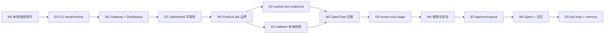
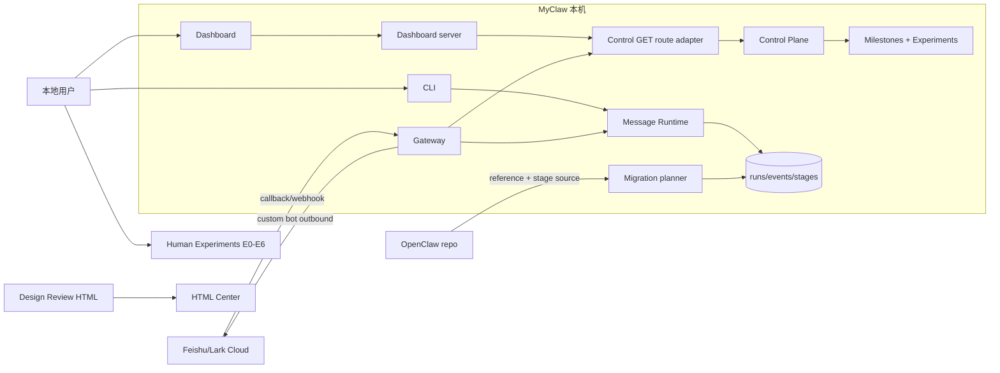
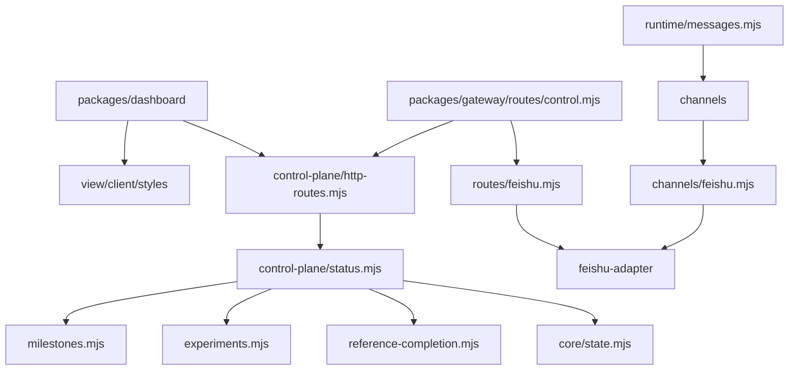
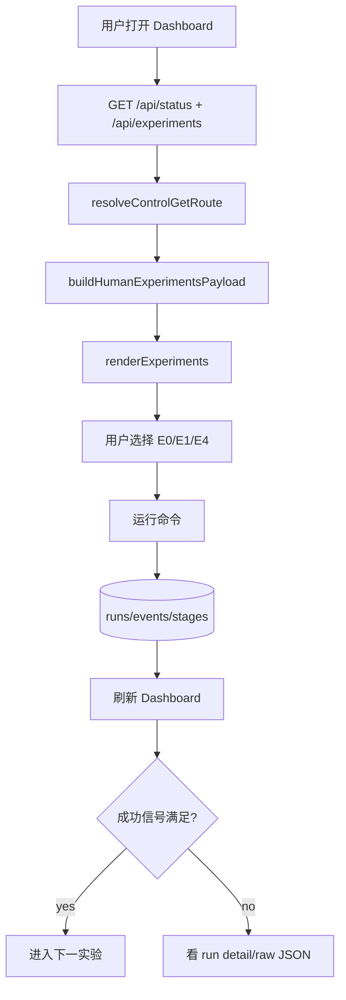
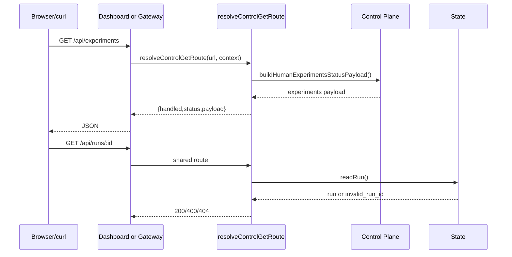
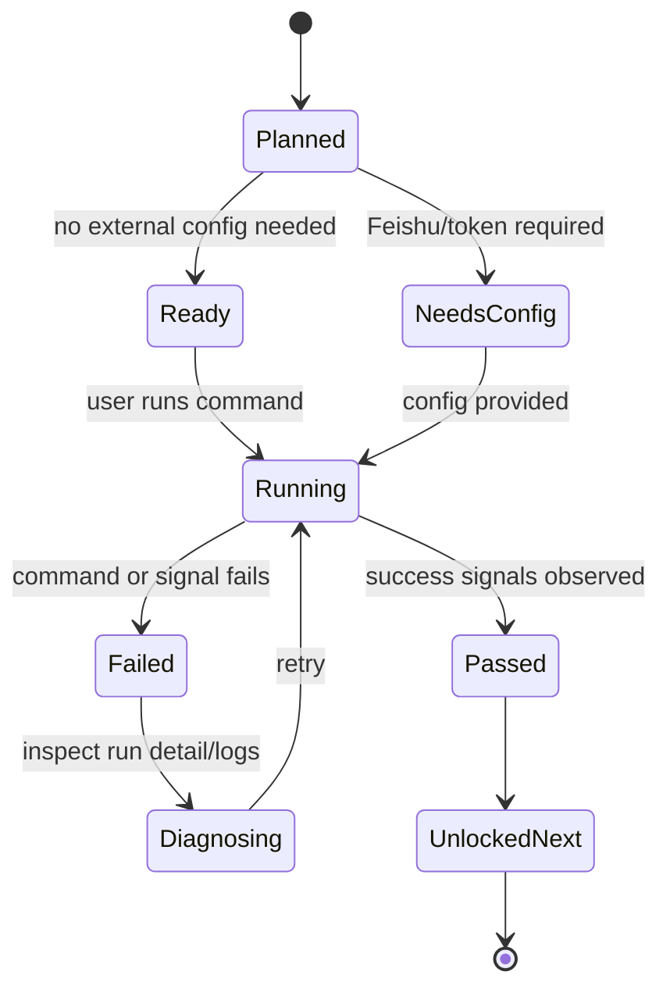
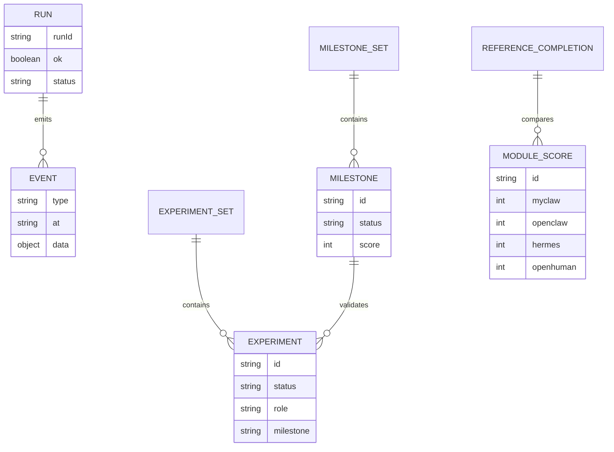
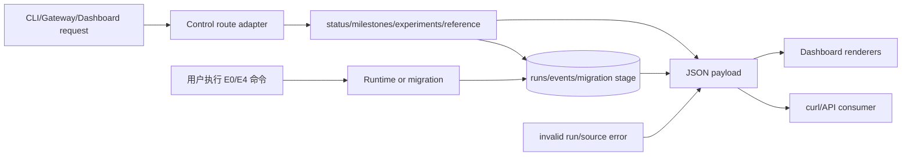
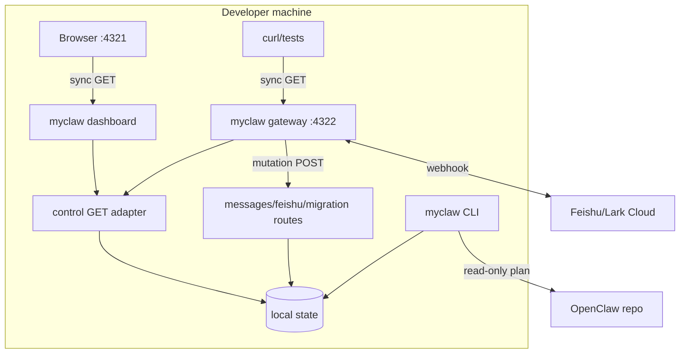

# MyClaw Phase 1.0 实现架构可视化评审

更新时间：2026-05-21

## 总诊断

Phase 1.0 把路线从“agent 自评”改成“人可以亲自跑的实验”，并用 `control-plane/src/http-routes.mjs` 收敛 Dashboard 与 Gateway 的只读控制面 API。结论：方向正确，耦合下降明显；但 Human Experiments 仍是静态路线，不能冒充自动验收，下一步必须把实验结果和真实 test/check/Feishu smoke 绑定。

| 评分项 | 当前分 | 判断 |
|---|---:|---|
| 设计清晰度 | 8/10 | M0-M5 与 E0-E6 形成大路线图，用户知道每阶段怎么测 |
| 可扩展性 | 8/10 | 共享 route adapter 降低 dashboard/gateway 漂移 |
| 可靠性 | 7/10 | 新增 adapter 直接测试，仍缺真实 Feishu e2e |
| 可维护性 | 8/10 | 文件低于 500 行，dashboard client 仍需防止继续膨胀 |
| 安全性 | 6/10 | mutation guard 和 Feishu signature 有基础，缺 scoped token/redaction |

## 大规划图

这张图回答：用户从现在到完整 MyClaw 可以按哪些 milestone 亲自参与测试。

Review 观察：

- 优点：路线从功能列表变成用户可执行实验。
- 优点：E0/E1/E4 现在不依赖外部账号，可马上跑。
- 风险：E2/E3 仍依赖飞书配置和测试 fixture，不能算自动验收。
- 改进：后续把每个 E 实验映射到机器可读 gate。

## 当前 Milestones

| Milestone | 状态 | 完成度 | 用户实验 |
|---|---|---:|---|
| M0 本地消息闭环 | done | 100 | E0 |
| M1 Gateway 与 Dashboard | partial | 78 | E1 |
| M2 Feishu/Lark 边界 | partial | 60 | E2/E3 |
| M3 OpenClaw 迁移 | partial | 58 | E4 |
| M4 Agent Runtime 与审批 | planned | 10 | E5 |
| M5 记忆、搜索与插件 | planned | 8 | E6 |

## 系统上下文图

这张图回答：MyClaw Phase 1.0 和用户、Feishu、OpenClaw、HTML Center 的边界。

Review 观察：

- 优点：OpenClaw 仍是 reference/stage source，不进入运行时依赖。
- 优点：用户实验是控制面数据，不只是文档表格。
- 风险：Dashboard raw JSON 未来可能暴露敏感信息。
- 改进：加入 redaction policy 和 scoped token。

## 模块架构图

这张图回答：当前系统被拆成哪些模块，依赖是否合理。

Review 观察：

- 优点：route adapter 返回 `{handled,status,payload}`，没有泄漏 Node response。
- 优点：experiments 和 milestones 都在 control-plane，Dashboard 只渲染。
- 风险：`dashboard/src/client.mjs` 已到 305 行，approval/diff 前应拆 renderer。
- 改进：为每个 dashboard section 做独立 renderer 或轻量 registry。

## 核心业务流程图

这张图回答：用户如何从路线图进入一次可验证实验。

Review 观察：

- 优点：实验有命令、角色、成功信号和解锁关系。
- 风险：ready 状态目前仍是人工语义，不是 test result。
- 改进：增加 `experiment.statusSource` 或 `lastVerifiedAt`。
- 改进：Dashboard 里显示“静态路线，不代表已通过”。

## 关键时序图

这张图回答：Dashboard 和 Gateway 如何复用同一个只读 API route。

Review 观察：

- 优点：Dashboard/Gateway 不再各自维护同一批 GET if 链。
- 优点：invalid run id 状态在 adapter 层统一。
- 风险：route adapter 仍是路径 if 链，后续多 API 时要 registry 化。
- 改进：下一步加 route schema、permission 和 redaction。

## 状态机图

这张图回答：一次用户实验的生命周期如何包含失败、重试、人工判断。

Review 观察：

- 优点：把人工判断作为正式状态，而不是隐藏在文档后面。
- 风险：当前没有持久化 experiment result。
- 改进：后续把实验结果写入 state，支持 `lastRunId` 和 `evidence`。

## 数据模型 / ER 图

这张图回答：run、event、milestone、experiment 和 reference completion 的关系。

Review 观察：

- 优点：experiment 是 roadmap/control data，不污染 core state。
- 风险：没有 experiment run result 实体，无法自动聚合完成度。
- 改进：新增 `EXPERIMENT_RUN`，记录命令、runId、通过/失败、证据。

## 数据流图

这张图回答：数据从输入、处理、状态写入到 Dashboard 展示如何流动。

Review 观察：

- 优点：route adapter 只读，side effect 仍留在 gateway mutation routes。
- 风险：status payload 会触发 OpenClaw plan cache，错误隔离仍需加强。
- 改进：为 migration plan 加显式 refresh 和 stale marker。

## 部署图

这张图回答：Phase 1.0 在本机如何运行，哪些是同步调用。

Review 观察：

- 优点：默认 loopback，本地实验成本低。
- 风险：curl/open 命令假设服务已启动，E1 已补启动命令。
- 改进：Dashboard 顶部显示服务启动命令和当前 stateDir。

## Human Experiments

| 实验 | 状态 | 用户动作 | 成功信号 |
|---|---|---|---|
| E0 | ready | `npm run myclaw -- send --text "hello from human" --json` | ok envelope，run 可见 |
| E1 | ready | 启动 dashboard 后打开 `http://127.0.0.1:4321` | Phase 1.0 与实验路线可见 |
| E2 | needs_config | 用 `MYCLAW_FEISHU_WEBHOOK_URL` 发送 custom-bot 消息 | 飞书群收到消息 |
| E3 | needs_config | gateway callback challenge + gateway test fixture | challenge 回显，签名/encrypted fixture 通过 |
| E4 | ready | `migrate openclaw --stage --json` | `forReviewOnly=true` |
| E5 | planned | approval queue | 危险动作暂停 |
| E6 | planned | agent run + memory search | step/tool/memory 可追踪 |

## 概念解释

| 概念 | 含义 | 当前边界 |
|---|---|---|
| Human Experiment | 用户可执行的阶段验收动作 | 静态路线，不等于自动通过 |
| Control GET route adapter | Dashboard/Gateway 共用只读 API 分发器 | 不处理 mutation，不持有 Node response |
| Milestone | 阶段能力目标 | 静态 score，后续应由实验和测试计算 |
| review-only stage | OpenClaw 迁移快照 | 只审阅，不 apply |
| custom-bot outbound | 飞书 webhook 发送子集 | 不是 app-token rich card/thread reply |

## 相似技术比较

| 维度 | MyClaw Phase 1.0 | OpenClaw | Hermes-agent | OpenHuman |
|---|---|---|---|---|
| 控制面 | 本机 Gateway/Dashboard + shared route adapter | 成熟 gateway/control UI | 多入口 agent ops | controller registry/RPC |
| 人类验收 | E0-E6 静态实验路线 | 文档和插件配置为主 | CLI/TUI 操作反馈 | UI-first 操作面 |
| Feishu/Lark | custom-bot + callback 安全子集 | 完整 Feishu plugin | 不是核心强项 | 非核心 |
| 迁移 | plan/stage/review-only | 被迁移源 | 有运行经验可借鉴 | controller 思想可借鉴 |
| 记忆 | 尚未做 | session/config | SQLite/FTS 强 | memory tree 强 |

## 目录结构与文件行数

| 路径 | 行数 | 职责 | 评价 |
|---|---:|---|---|
| `packages/control-plane/src/experiments.mjs` | 119 | E0-E6 人类实验路线 | 健康；后续绑定结果 |
| `packages/control-plane/src/http-routes.mjs` | 62 | 共享只读 route adapter | 健康；后续 registry 化 |
| `packages/control-plane/src/status.mjs` | 196 | status/runs/events/migration 聚合 | 健康 |
| `packages/control-plane/src/reference-completion.mjs` | 174 | 参考项目完成度矩阵 | 健康 |
| `packages/control-plane/test/http-routes.test.mjs` | 49 | adapter 直接测试 | 健康 |
| `packages/dashboard/src/client.mjs` | 305 | Dashboard 渲染逻辑 | 可接受；approval 前拆 |
| `packages/dashboard/src/view.mjs` | 163 | Dashboard HTML shell | 健康 |
| `packages/dashboard/src/styles.mjs` | 218 | Dashboard 样式 | 健康 |
| `packages/dashboard/src/index.mjs` | 81 | Dashboard HTTP server | 健康，route 已收敛 |
| `packages/gateway/src/routes/control.mjs` | 21 | Gateway dashboard/read API route | 健康 |
| `docs/build-review-html.mjs` | 408 | Markdown 到 HTML 报告构建 | 接近 450，下一轮拆 |

没有手写文件超过 500 行；`docs/build-review-html.mjs` 是唯一需要提前拆分的接近项。

## 风险分级

| 等级 | 问题 | 影响 | 建议 |
|---|---|---|---|
| High | Human Experiments 仍是静态路线 | 可能被误读成已自动验收 | 加 `lastVerifiedAt/statusSource/evidence` |
| High | GET 状态未来可能暴露 prompt/tool/secret | Dashboard/Gateway 安全风险 | scoped token + redaction policy |
| Medium | route adapter 仍是 if 链 | API 增长后维护性下降 | registry + schema + permission |
| Medium | Dashboard client 继续增长 | approval/diff 加入后难维护 | 拆 renderer modules |
| Low | report builder 408 行 | 接近 450 预警 | 拆 parser/shell/index writer |

## Linus 视角严苛审查

独立 subagent 已按 30 年 Linux 内核维护者式视角审查 Phase 1.0 diff。核心结论：route adapter 方向正确，没有把 Node response 泄漏进 control-plane；但“人类可测试路线”必须诚实，不能给一个冷启动会失败的命令，也不能把单测冒充人工实验。

| 等级 | 发现 | 处理 |
|---|---|---|
| High | 渲染 HTML 仍是旧 Phase 会导致 check 失败 | 本轮重新生成全部 HTML 后再提交 |
| Medium | E1 缺 dashboard 启动命令 | 已补 `npm run myclaw -- dashboard --port 4321 ...` |
| Medium | E3 文案把 signed/encrypted 与普通 curl 混在一起 | 已改成 callback smoke + gateway fixture test |
| Medium | route adapter 缺直接单测 | 已新增 `packages/control-plane/test/http-routes.test.mjs` |
| Low | Dashboard client 305 行，趋势不好 | 记录为 approval/diff 前的拆分门槛 |

## Skill 规范自检

- 已按 `web-design-review` 输出可视化 HTML design review dashboard。
- 报告覆盖系统上下文、模块架构、业务流程、时序、状态机、ER、数据流、部署图。
- 报告包含目录行数、概念解释、相似技术比较、风险分级、Linus 视角。
- 单文件 500 行硬限制由 `npm run check` 执行。
- 本轮未修改 skill；按 `skill-creator` 原则保持 skill 本身精简。

## 下一阶段建议

1. 把 E0-E6 变成可持久化 `experimentRuns`，记录运行时间、证据和失败原因。
2. Dashboard approval queue 和 OpenClaw 字段级 diff drawer。
3. Gateway scoped token、redaction、mutation idempotency。
4. Feishu app-token outbound client 与 access policy。
