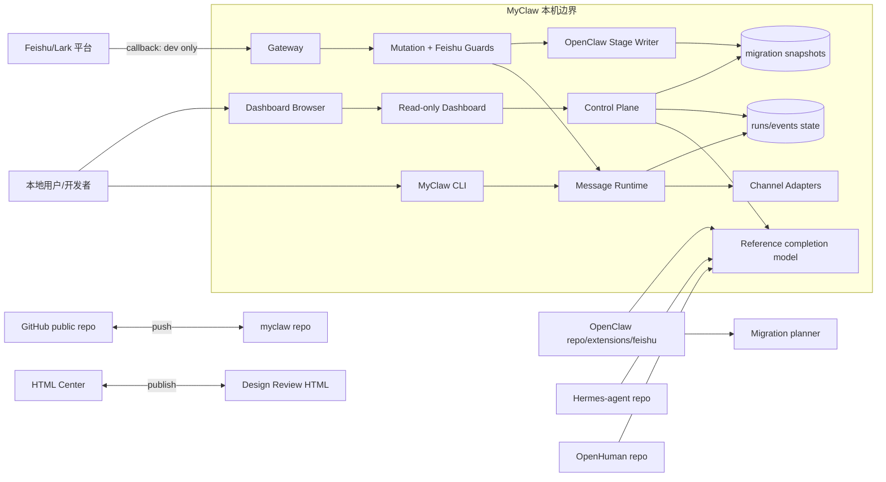
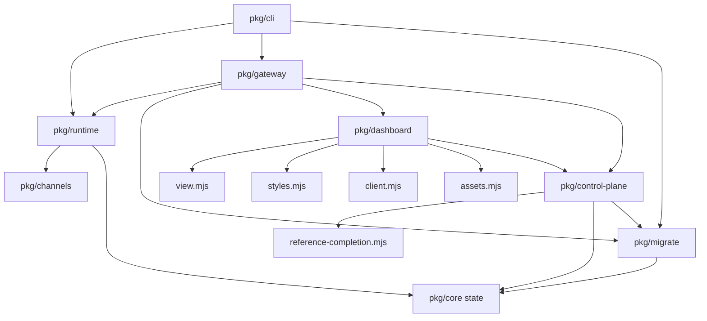
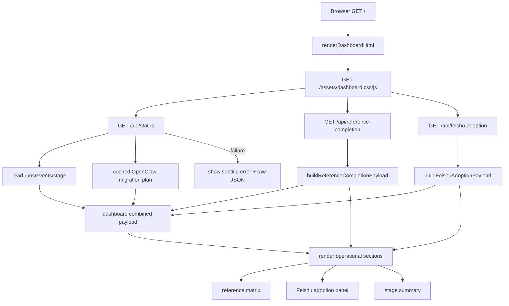
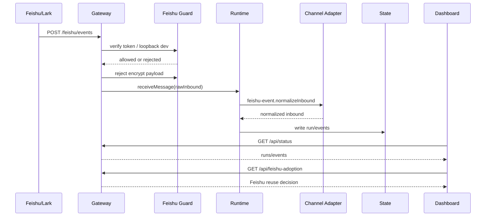
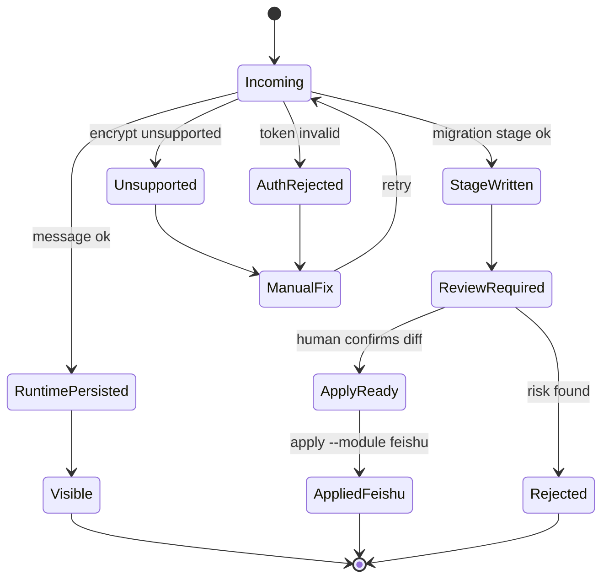
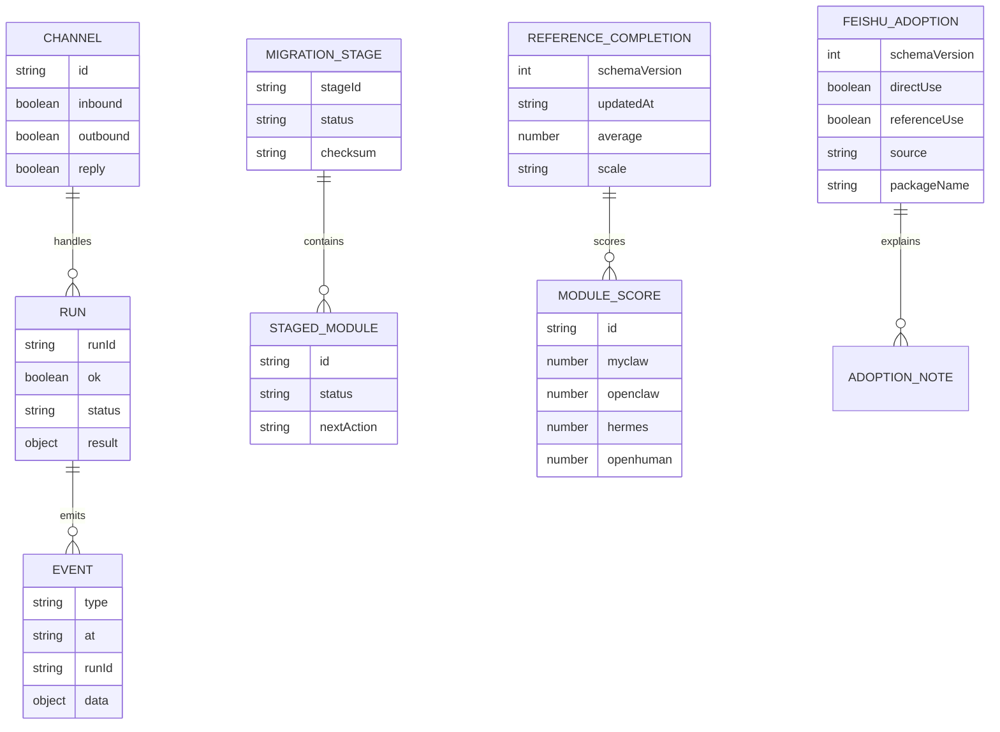
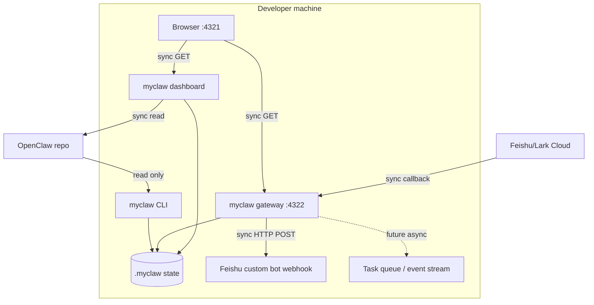

# MyClaw Phase 0.6 实现架构可视化评审

更新时间：2026-05-17

## 总诊断

Phase 0.6 的核心变化是 dashboard 从“粗糙状态页”变成“参考完成度工作台”：同一页展示 runs/events/channels、OpenClaw migration stage、Feishu/Lark 复用决策，以及 MyClaw 与 OpenClaw、Hermes-agent、OpenHuman 的模块完成度对比。

Feishu/Lark 的结论也更清楚：OpenClaw 仓库中可参考的是 `extensions/feishu`，它支持 Feishu/Lark 域和 `@openclaw/feishu` 插件能力。MyClaw 当前必须参考它的 schema、安全、event/outbound/policy 设计，但 Phase 0.6 不直接加载插件 runtime。

| 评分项 | 当前分 | 判断 |
|---|---:|---|
| 设计清晰度 | 8/10 | dashboard、gateway、migration、Feishu 决策边界清楚 |
| 可扩展性 | 7/10 | status payload 可继续挂载阶段验收数据 |
| 可靠性 | 6/10 | stage/state 可审计；dashboard 还没有实时 stream |
| 可维护性 | 8/10 | dashboard 已拆分，所有手写文件低于 500 行 |
| 安全性 | 5/10 | token/verify guard 可用；Feishu 签名、encrypt、持久 replay 仍缺 |

## OpenClaw Feishu/Lark 复用结论

| 问题 | 结论 | 理由 |
|---|---|---|
| 能不能直接用现成的 openclaw-lark？ | 暂不直接加载 | 本仓库里对应为 OpenClaw `extensions/feishu`，依赖 OpenClaw plugin-sdk/runtime/config/secrets/approval |
| 能不能参考？ | 必须参考 | 它的 config schema、安全测试、webhook/WebSocket、policy、event/outbound normalization 很成熟 |
| MyClaw 下一步 | 先做 adapter facade | 先拥有自己的 contract，再选择性 port OpenClaw Feishu 逻辑 |

## 参考完成度矩阵

| 模块 | MyClaw | OpenClaw | Hermes-agent | OpenHuman | 当前差距 |
|---|---:|---:|---:|---:|---|
| Gateway / 控制面 | 58 | 90 | 78 | 86 | 缺 WS/event stream、scoped token、route schema |
| Feishu/Lark 接入 | 28 | 92 | 42 | 35 | 缺签名、encrypt、WebSocket、policy、outbound rich card |
| Dashboard / 观测 | 45 | 78 | 55 | 90 | 缺 run detail、stage diff、approval queue、实时事件 |
| OpenClaw 迁移 | 50 | 0 | 82 | 35 | 已有 plan/stage，缺 apply/rollback/diff UI |
| Agent Runtime | 8 | 76 | 92 | 90 | 还没有 agent turn、tool loop、subagent、context budget |
| Memory / Search | 10 | 52 | 94 | 96 | 仅 JSON/JSONL state，没有 SQLite/FTS/long-term memory |
| Tools / Security | 22 | 88 | 74 | 84 | 缺 tool schema、approval queue、policy snapshot、sandbox |
| Plugins / Skills | 18 | 92 | 88 | 78 | 仅 channel registry，没有 plugin manifest/skill loader |

## 系统上下文图

这张图回答：MyClaw 当前和用户、Feishu、OpenClaw、参考项目、GitHub、HTML Center 的边界在哪里？



Review 观察：

- 优点：dashboard 只读，写操作仍必须走显式 gateway。
- 优点：参考完成度由 control-plane 独立 API 提供，不再塞进 operational status。
- 风险：Feishu callback 仍只能代表 dev/spike，不能生产暴露。
- 改进：把 Feishu 签名、encrypt、持久 replay 放到 adapter facade 第一批。

## 模块架构图

这张图回答：Phase 0.6 被拆成哪些模块，dashboard 如何避免继续变成大文件？



Review 观察：

- 优点：dashboard 从 288 行单文件拆为 view/styles/client/assets。
- 优点：gateway 只复用 dashboard HTML/assets，不知道 dashboard 渲染细节。
- 风险：`packages/gateway/src/index.mjs` 已 321 行，后续应拆 route/auth/feishu。
- 改进：Phase 0.7 把 gateway route handler 分文件，保留统一 `handleGatewayRequest`。

## 核心业务流程图

这张图回答：打开 dashboard 后如何拿到状态、参考对比和 Feishu 决策？



Review 观察：

- 优点：dashboard 数据全部来自 API，不读私有文件。
- 优点：参考矩阵和 Feishu 决策拆成独立 API，`/api/status` 不再变成杂物桶。
- 风险：completion 分数目前是工程判断，不是自动验收计算。
- 改进：把每个模块完成度拆成 measurable acceptance items。

## 关键时序图

这张图回答：一次 Feishu event 在当前阶段如何进入 MyClaw，并在哪里被挡住？



Review 观察：

- 优点：encrypted callback 不会被误当成明文 event。
- 优点：event id duplicate guard 已有基本内存去重。
- 风险：内存去重重启丢失，缺 timestamp/nonce 签名窗口。
- 改进：移植 OpenClaw Feishu webhook security test 的持久 replay 思路。

## 状态机图

这张图回答：核心对象 message run、migration stage、Feishu adapter 的生命周期如何推进？



Review 观察：

- 优点：stage 和 Feishu adapter 都保留人工确认节点。
- 风险：`ApplyReady` 和 `AppliedFeishu` 仍是设计状态，代码未实现。
- 风险：没有 approval queue，人工确认还不能在 UI 中完成。
- 改进：先实现 stage diff，再加 apply。

## 数据模型 / ER 图

这张图回答：当前 status payload 中有哪些核心实体，以及参考完成度如何挂在控制面？



Review 观察：

- 优点：Feishu 决策是结构化数据，不只是文档段落。
- 优点：reference matrix 可以被 dashboard、报告、未来 API 复用。
- 风险：分数已有 schema version，但还没有验收项 id。
- 改进：给 reference payload 增加可验证的 acceptance items。

## 数据流图

这张图回答：消息、OpenClaw config、参考项目观察和 HTML 报告的数据怎么流动？

```mermaid
flowchart LR
  Msg[Generic/Feishu JSON] --> Gateway
  Gateway --> Runtime
  Runtime --> Events[(runs/events)]
  OpenClawConfig[OpenClaw config/manifests] --> Planner
  Planner --> Stage[(migration snapshots)]
  Repos[OpenClaw/Hermes/OpenHuman observations] --> RefModel[reference-completion.mjs]
  Events --> Status[/api/status]
  Stage --> Status
  RefModel --> ReferenceApi[/api/reference-completion]
  Status --> Dashboard
  ReferenceApi --> Dashboard
  RefModel --> FeishuApi[/api/feishu-adoption]
  FeishuApi --> Dashboard
  Docs[Markdown design review] --> Build[docs/build-review-html.mjs]
  Build --> Html[HTML review dashboard]
  Html --> HtmlCenter[HTML Center]
```

Review 观察：

- 优点：运行数据和评审数据分开，但在 status 汇总。
- 优点：HTML review 仍由 markdown 生成，便于审阅 diff。
- 风险：参考项目观察是手动维护，可能和 repo 演进偏离。
- 改进：后续用脚本扫描 reference repo manifest/schema/test 生成部分指标。

## 部署图

这张图回答：本地运行时部署在哪里，同步/异步边界如何区分？



Review 观察：

- 优点：默认本机 loopback，适合 Phase 0。
- 优点：dashboard 与 gateway 可以分端口，读写边界明确。
- 风险：没有 queue/worker，长任务会卡同步请求。
- 改进：Agent runtime 前先加 run worker 或 event stream。

## 概念解释

| 概念 | 含义 | 当前边界 |
|---|---|---|
| adapter facade | MyClaw 自己拥有的 Feishu 接口层 | 先定义契约，再 port OpenClaw 逻辑 |
| reference completion | 模块相对参考项目的完成度 | 当前是工程判断，后续变成验收项 |
| stage snapshot | OpenClaw 迁移的可审阅快照 | 不直接启用 runtime |
| mutation guard | gateway 写操作入口保护 | token/loopback 可用，scoped token 未做 |
| replay window | 防重复/重放攻击窗口 | 当前 Feishu 去重在内存中，需持久化 |

## 相似技术比较

| 维度 | MyClaw Phase 0.6 | OpenClaw | Hermes-agent | OpenHuman |
|---|---|---|---|---|
| 技术栈 | Node.js ESM workspace | Node/TS plugin runtime | Python agent platform | Rust/Tauri + UI-first |
| Gateway | 本地 HTTP，token guard | 成熟 gateway/channel 安全 | 多平台 gateway | JSON-RPC/SSE 控制层 |
| Feishu/Lark | event normalize spike | 完整 Feishu plugin | 有平台 adapter 方向 | 非核心 |
| Dashboard | 状态 + 参考矩阵 | Control UI/schema | CLI/TUI/ops | 强 UI/Memory tree |
| 迁移 | plan/stage，不 apply | 被迁移源 | 有 OpenClaw migration 经验 | 可借 controller 思想 |

## 目录结构与文件行数

| 路径 | 行数 | 职责 | 评价 |
|---|---:|---|---|
| `packages/dashboard/src/index.mjs` | 103 | dashboard server/router | 已拆出 view/assets，健康 |
| `packages/dashboard/src/view.mjs` | 127 | HTML shell | 小而清楚 |
| `packages/dashboard/src/styles.mjs` | 196 | dashboard CSS | 可接受，后续组件化前不再堆太多 |
| `packages/dashboard/src/client.mjs` | 171 | browser render logic | 可接受，run detail 前应拆 renderer |
| `packages/control-plane/src/reference-completion.mjs` | 173 | 参考完成度与 Feishu 决策数据 | 已有 criteria 证据项，后续自动化 |
| `packages/control-plane/src/status.mjs` | 96 | status/reference/Feishu API payload 聚合 | 健康；评审态已拆独立 endpoint |
| `packages/gateway/src/index.mjs` | 321 | HTTP gateway/routes/auth/Feishu | 接近变胖，下一轮拆路由 |
| `packages/migrate/src/openclaw.mjs` | 348 | OpenClaw migration planner | 可接受，apply 前需拆 parser/inventory |
| `packages/cli/src/index.mjs` | 321 | CLI commands | 可接受，后续 command registry |
| `docs/build-review-html.mjs` | 408 | markdown 到 HTML builder | 接近 450，继续加能力前必须拆 |

没有手写源文件超过 500 行。`docs/implementation-architecture.md` 属于阶段报告，仍需保持低于 500 行；如果接近 450 行，下一阶段拆为模块页。

## 风险分级

| 等级 | 问题 | 影响 | 建议 |
|---|---|---|---|
| High | Feishu 缺正式签名、encrypt、持久 replay | 不能生产暴露 callback | Phase 0.7 port OpenClaw security tests |
| High | Gateway index 承担太多职责 | 后续 route/auth/adapter 回归风险高 | 拆 `routes/`、`auth.mjs`、`feishu-edge.mjs` |
| Medium | completion 分数仍需更多证据 | 已从裸百分比升级为验收项，但仍是手动维护 | 增加自动扫描和 source links |
| Medium | dashboard 无 run detail/stage diff | 用户仍需看 raw JSON | 增加 drawer 和 diff panel |
| Low | asset cache 很短 | 本地体验无大影响 | 后续加 version/hash |

## Linus 视角严苛审查

独立 subagent 已完成只读审查，结论是 Phase 0.6 方向正确，但不要把“跑通”和“架构成熟”混为一谈。

| 等级 | 发现 | 处理 |
|---|---|---|
| High | HTML 报告仍是旧 Phase 0.5 会误导用户 | 本轮重新运行 `node docs/build-review-html.mjs` 后再发布 |
| High | Linus 段落不能留占位 | 已把 subagent 发现写入本节 |
| High | OpenClaw Feishu 插件不应直接加载 | 保持“参考不加载”，下一步做 MyClaw adapter facade |
| High | gateway/status/dashboard 有反向耦合 | 已把 reference/Feishu 从 `/api/status` 拆成独立 API；gateway 文件仍需拆路由 |
| Medium | dashboard 仍不像成熟操作台 | 本轮补列头和验收项；Phase 0.7 做 run detail、stage diff、approval queue |
| Medium | reference completion 有自嗨风险 | 本轮从裸分数升级为 `criteria[]`，后续改为自动验收 |
| Medium | 热点文件已形成 | `docs/build-review-html.mjs` 408 行、gateway 约 300 行，继续加能力前拆 |

## Skill 规范自检

- `web-design-review` skill 已重新加载并要求 HTML dashboard、Mermaid、目录行数、风险分级、概念解释、相似技术比较。
- 本报告覆盖系统上下文图、模块架构图、核心流程、时序图、状态机、ER、数据流、部署图。
- 单文件限制继续由 `npm run check` 执行，500 行为硬阈值，450 行为预警。
- 本阶段继续发布 HTML Center，并保留 GitHub commit。

## 下一阶段建议

1. Phase 0.7：MyClaw Feishu adapter facade，包含 config schema、verification、encrypt/replay contract。
2. Dashboard 增加 stage diff、run detail drawer、`apply --module feishu` 人工确认入口。
3. Gateway 拆路由和 auth，避免单文件继续膨胀。
4. reference completion 改成模块验收项驱动，而不是纯手动百分比。
