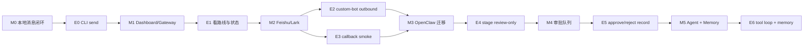
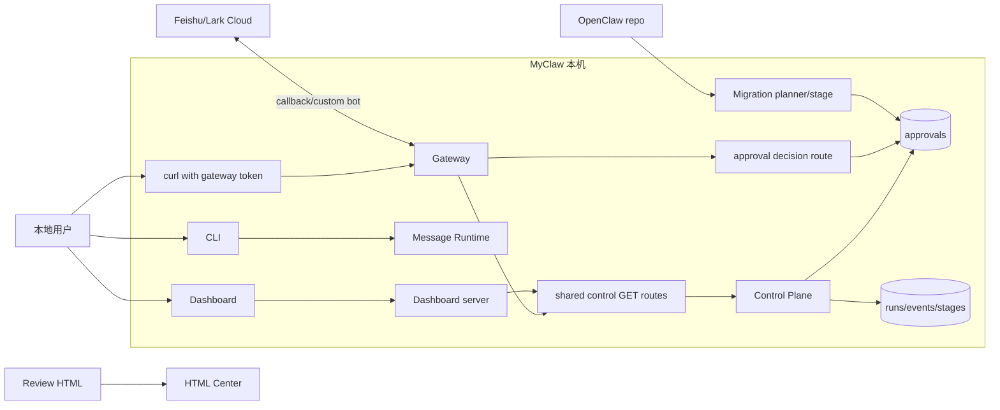
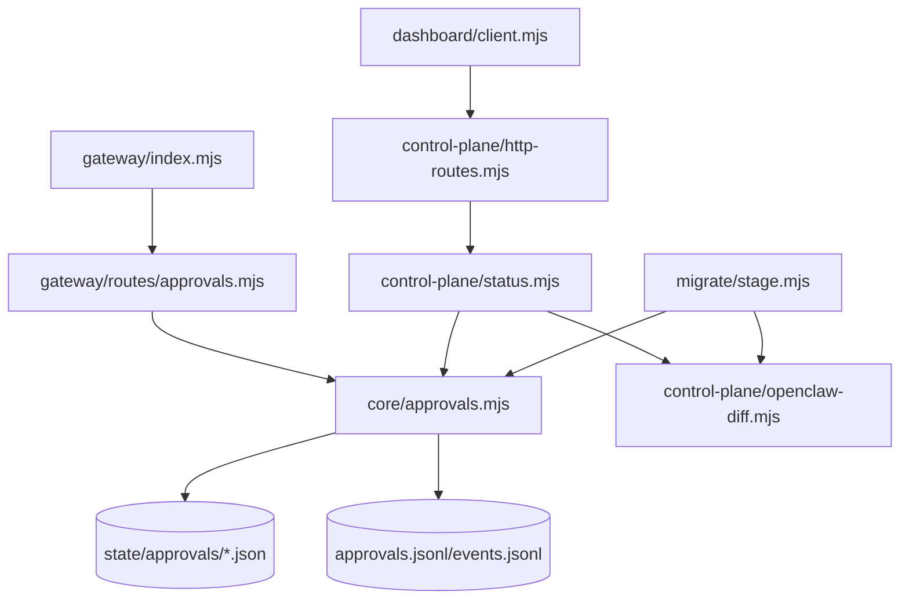
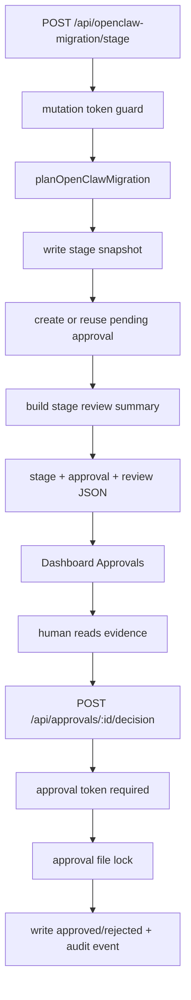
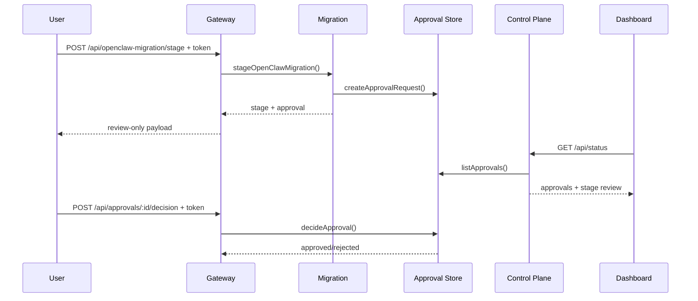
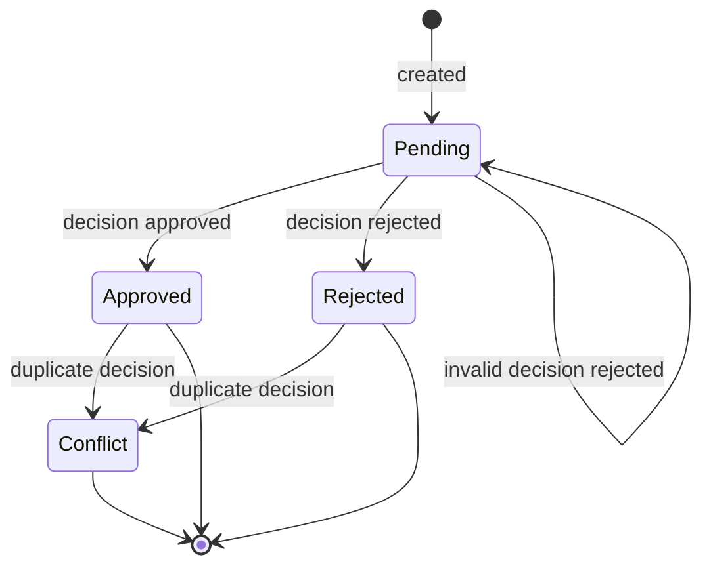
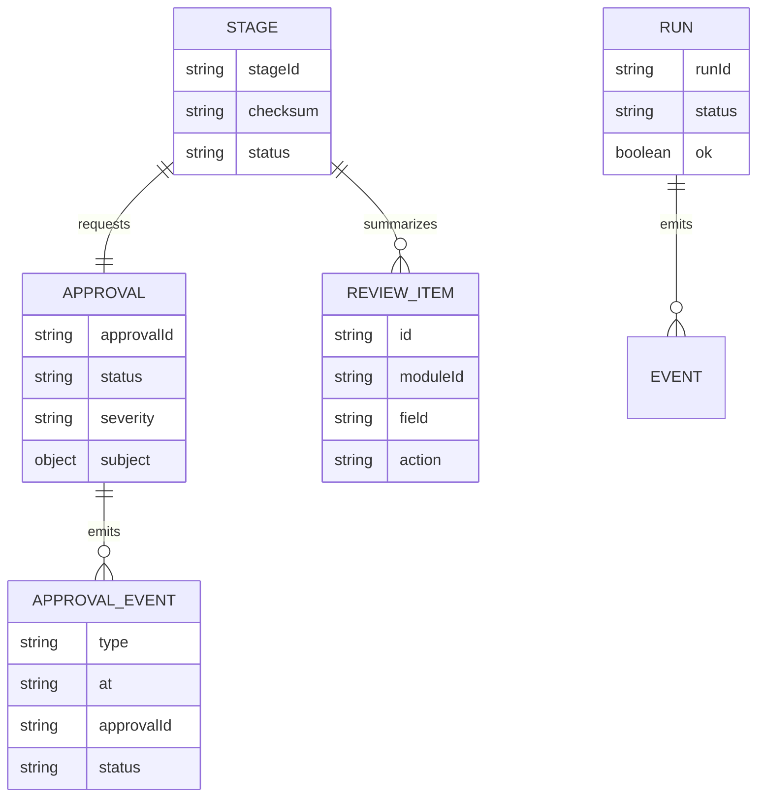
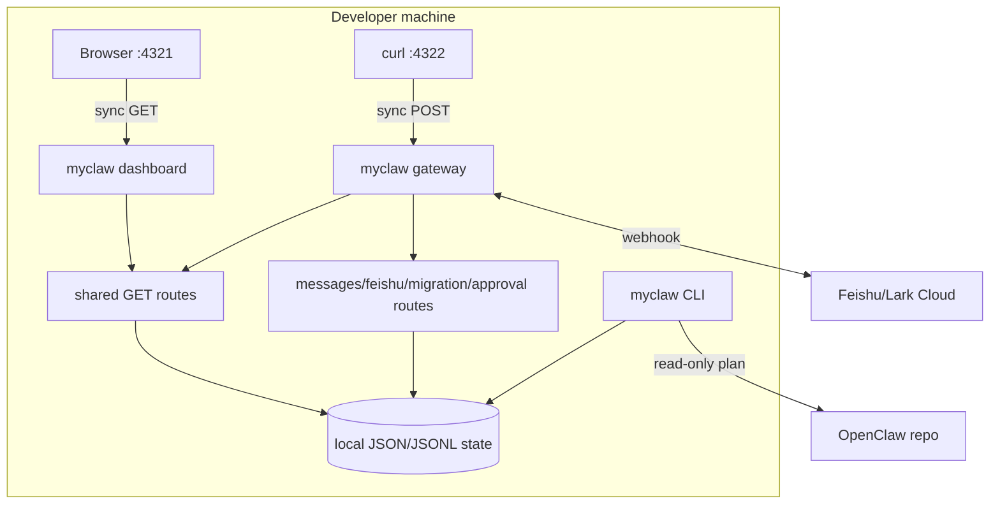

# MyClaw Phase 1.1 实现架构可视化评审

更新时间：2026-05-22

## 总诊断

Phase 1.1 把“人能参与测试”推进到“人能记录决定”：OpenClaw stage 会生成 pending approval，Gateway 可以在强 token 下记录 approve/reject，Dashboard 显示审批队列和 review-only stage review。结论：这是正确的小步，但它还不是安全执行边界，也不是字段级 schema diff；当前只能承载 review record，不能承载真实 apply/execute。

| 评分项 | 当前分 | 判断 |
|---|---:|---|
| 设计清晰度 | 8/10 | E5 已可亲测，approval/review-only/apply 边界写清楚 |
| 可扩展性 | 8/10 | approval store 独立，Gateway mutation route 独立 |
| 可靠性 | 7/10 | decision 有锁与并发测试，仍缺真正幂等请求 ID |
| 可维护性 | 7/10 | 所有文件低于 500 行，Dashboard client 347 行开始变重 |
| 安全性 | 7/10 | approval decision 强制 token，仍缺 scoped token、actor provenance |

## 大规划图

这张图回答：用户从消息闭环到人工审批再到 agent runtime，在哪些节点可以亲自参与。



Review 观察：

- 优点：E5 从 planned 变成 ready，可以用 Gateway token 亲自做 decision。
- 优点：approval 只记录决定，不执行 apply，避免误操作。
- 风险：approval 还不是 tool/workflow approval，只是 migration stage 的种子。
- 改进：下一阶段接 tool action 和 scoped token。

## 当前 Milestones

| Milestone | 状态 | 完成度 | 用户实验 |
|---|---|---:|---|
| M0 本地消息闭环 | done | 100 | E0 |
| M1 Gateway 与 Dashboard | partial | 82 | E1 |
| M2 Feishu/Lark 边界 | partial | 60 | E2/E3 |
| M3 OpenClaw 迁移 | partial | 65 | E4 |
| M4 Agent Runtime 与审批 | partial | 25 | E5 |
| M5 记忆、搜索与插件 | planned | 8 | E6 |

## 系统上下文图

这张图回答：Phase 1.1 的审批、迁移、Dashboard 和外部系统边界在哪里。



Review 观察：

- 优点：approval decision mutation 在 Gateway，Dashboard 仍只读。
- 优点：approval 写入独立 state 和 events timeline。
- 风险：actor 目前只是 body 字段，缺强身份来源。
- 改进：引入 scoped token 和 actor provenance。

## 模块架构图

这张图回答：新增 approval/review 模块如何接入，是否有抽象泄漏。



Review 观察：

- 优点：approval core 不依赖 HTTP 或 Dashboard。
- 优点：decision route 没有漏 Node response 到 control-plane。
- 风险：stage 自动创建 approval，迁移与 policy 仍有轻耦合。
- 改进：后续把 approval request 创建移到 workflow/control-plane policy 层。

## 核心业务流程图

这张图回答：一次 OpenClaw stage 如何变成可人工确认的 record。



Review 观察：

- 优点：decision 使用强 token，不再继承 loopback 免 token。
- 优点：decision 使用 lock 降低并发 last-writer-wins。
- 风险：lock 是本地文件锁，适合单机，不适合多节点。
- 改进：后续 SQLite/CAS 或 append-only event reducer。

## 关键时序图

这张图回答：前端、Gateway、control-plane、state 如何协作。



Review 观察：

- 优点：读面和写面分离清楚。
- 优点：Dashboard 可以展示审批，但不能绕过 Gateway token 修改。
- 风险：当前没有 request id，重试 decision 只能靠状态机阻止。
- 改进：加入 `Idempotency-Key`。

## 状态机图

这张图回答：approval 的生命周期如何处理失败、重复、并发和人工介入。



Review 观察：

- 优点：sequential duplicate 会返回 `already_decided`。
- 优点：concurrent conflicting decision 有 lock 测试。
- 风险：没有 expiry/cancelled 状态。
- 改进：加 transition table 和 expiry policy。

## 数据模型 / ER 图

这张图回答：stage、approval、event、review item 之间如何关联。



Review 观察：

- 优点：approval 可以独立于 run 存在，适合未来 tool approval。
- 风险：subject type 目前是自由对象，缺白名单。
- 改进：为 `openclaw-migration-stage`、`tool-call` 定 schema。

## 数据流图

这张图回答：数据从 OpenClaw source 到 Dashboard 审批展示如何流动。

```mermaid
flowchart LR
  Source[OpenClaw source] --> Plan[Migration plan]
  Plan --> Stage[Stage snapshot]
  Stage --> Approval[(approval record)]
  Stage --> ReviewItems[review summary items]
  Approval --> Status[/api/status]
  ReviewItems --> Status
  Status --> Dashboard[Approvals panel]
  Decision[POST decision] --> Lock[file lock]
  Lock --> Approval
  Approval --> Events[(events.jsonl)]
```

Review 观察：

- 优点：review summary 和 decision 都可从本地 state 复原。
- 风险：review summary 不比较 MyClaw 目标 schema 字段。
- 改进：下一步做真实 source/target field diff。

## 部署图

这张图回答：Phase 1.1 本地运行拓扑和同步/异步边界。



Review 观察：

- 优点：仍默认 loopback，本地验证快。
- 风险：approval decision 必须配置 token；服务启动命令要带 `MYCLAW_GATEWAY_TOKEN`。
- 改进：Dashboard 显示 decision curl 模板和 token 状态。

## Human Experiments

| 实验 | 状态 | 用户动作 | 成功信号 |
|---|---|---|---|
| E0 | ready | `send --text` | ok envelope，run 可见 |
| E1 | ready | 打开 Dashboard | Phase 1.1、Approvals 可见 |
| E2 | needs_config | Feishu custom-bot send | 群里收到消息 |
| E3 | needs_config | callback smoke + gateway tests | challenge/fixture 通过 |
| E4 | ready | `migrate openclaw --stage --json` | stage 带 approval，review-only |
| E5 | ready | GET approvals + POST decision | approval 变 approved/rejected，event 写入 |
| E6 | planned | agent run + memory search | 后续开放 |

## 概念解释

| 概念 | 含义 | 当前边界 |
|---|---|---|
| Approval queue | 需要人确认的 review record | 目前只覆盖 migration stage |
| Approval decision | approved/rejected 的审计决定 | 不触发 apply/execute |
| Stage review summary | 从 stage 派生的 review items | 不是字段级 schema diff |
| Strict token mutation | approval decision 必须有 token | 仍不是 scoped RBAC |
| File lock | 本机文件锁防并发覆盖 | 不适合多节点 |

## 相似技术比较

| 维度 | MyClaw Phase 1.1 | OpenClaw | Hermes-agent | OpenHuman |
|---|---|---|---|---|
| 审批 | migration approval record | 成熟 policy/approval | ops guard 方向 | risk/autonomy policy |
| Gateway | local HTTP + token mutation | 完整 gateway/control UI | 多入口 agent ops | JSON-RPC/controller |
| Review | stage review summary | config schema/UI | migration/ops 经验 | controller 边界 |
| 记忆 | 尚未做 | session/config | SQLite/FTS 强 | memory tree 强 |
| Agent | 尚未做 | Lobster/workflow 可借鉴 | agent loop 强 | harness/tool loop 强 |

## 目录结构与文件行数

| 路径 | 行数 | 职责 | 评价 |
|---|---:|---|---|
| `packages/core/src/approvals.mjs` | 198 | approval create/list/read/decide + lock | 健康；后续拆 transition policy |
| `packages/control-plane/src/openclaw-diff.mjs` | 101 | stage review summary builder | 文件名历史包袱，语义已降级为 review |
| `packages/control-plane/src/status.mjs` | 226 | status 聚合 approvals/review | 健康 |
| `packages/control-plane/src/http-routes.mjs` | 79 | 共享只读 route adapter | 健康 |
| `packages/dashboard/src/client.mjs` | 347 | Dashboard 渲染逻辑 | 继续增长，下一轮必须拆 section renderer |
| `packages/dashboard/src/styles.mjs` | 229 | Dashboard 样式 | 健康 |
| `packages/dashboard/src/view.mjs` | 176 | Dashboard HTML shell | 健康 |
| `packages/gateway/src/index.mjs` | 111 | Gateway route 分发 | 健康 |
| `packages/gateway/src/auth.mjs` | 61 | mutation/token auth | 健康 |
| `packages/gateway/src/routes/approvals.mjs` | 45 | approval decision mutation | 健康 |
| `packages/migrate/src/stage.mjs` | 155 | stage snapshot + approval seed | 可接受；后续解耦 policy |
| `docs/build-review-html.mjs` | 408 | HTML report builder | 接近 450，下一轮拆 |

没有手写文件超过 500 行；`docs/build-review-html.mjs` 是唯一接近预警项。

## 风险分级

| 等级 | 问题 | 影响 | 建议 |
|---|---|---|---|
| High | approval 仍不是安全执行边界 | 误以为 approve 会安全 apply | 文档和 UI 保持 review-only；接 scoped token |
| High | review summary 不是字段级 diff | 用户可能误判迁移精度 | UI 使用 review summary 命名，后续做真实 schema diff |
| Medium | stage 自动创建 approval | migration 与 policy 有耦合 | 后续移到 control-plane/workflow policy |
| Medium | Dashboard client 347 行 | 后续 review/schema diff drawer 会变维护坑 | 下一阶段拆 renderer registry |
| Low | checksum 仍是弱 trace marker | 不能当完整完整性证明 | 后续 content-address full snapshot |

## Linus 视角严苛审查

独立 subagent 已按 30 年 Linux 内核维护者式视角审查 Phase 1.1 diff。核心结论：approval queue 可以作为 review record，但不能被吹成安全边界；decision mutation 必须强认证，状态迁移必须原子，所谓 diff 必须降级成 review summary。

| 等级 | 发现 | 处理 |
|---|---|---|
| High | approval decision 沿用 loopback 免 token太弱 | 已改为 `authorizeGatewayToken`，无 token 配置时返回 `approval_token_required` |
| High | read-modify-write 可能并发覆盖 | 已加本地 lock，并补并发 conflicting decision 测试 |
| Medium | stage 默认创建 approval 会产生队列噪音 | 已用 checksum 派生稳定 approval id，重复相同 stage 不新增 approval；后续仍要解耦 |
| Medium | “diff”名不副实 | API 增加 `openclawStageReview/review`，UI 改为 stage review |
| Low | Dashboard client 继续增长 | 记录为下一阶段拆分门槛 |

## Skill 规范自检

- 已按 `web-design-review` 输出可视化 design review dashboard。
- 报告覆盖系统上下文、模块架构、业务流程、时序、状态机、ER、数据流、部署图。
- 报告包含目录行数、概念解释、相似技术比较、风险分级、Linus 视角。
- 单文件 500 行硬限制由 `npm run check` 执行。
- 本轮未修改 skill；按 `skill-creator` 原则保持 skill 本身精简。

## 下一阶段建议

1. 把 approval queue 接到真实 tool action，加入 scoped token 和 actor provenance。
2. 拆 `dashboard/src/client.mjs` 为 section renderer registry。
3. 做真实 OpenClaw source/target schema diff drawer。
4. Agent runtime 最小 run/resume/tool loop。
