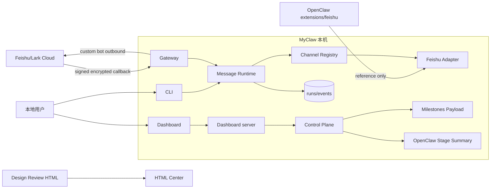
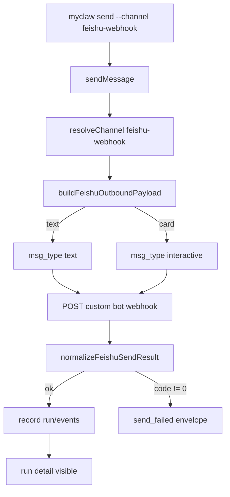
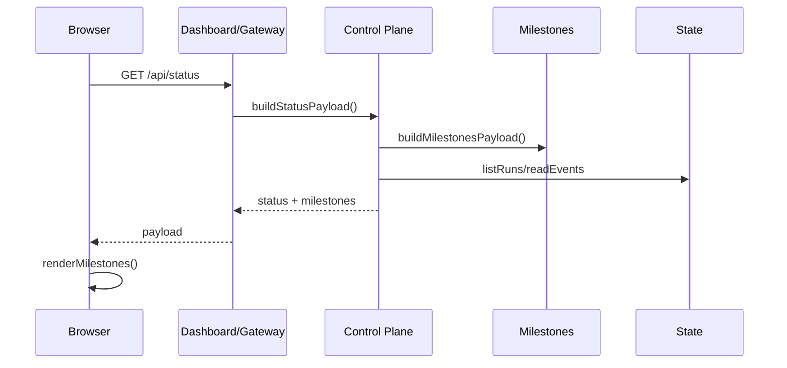
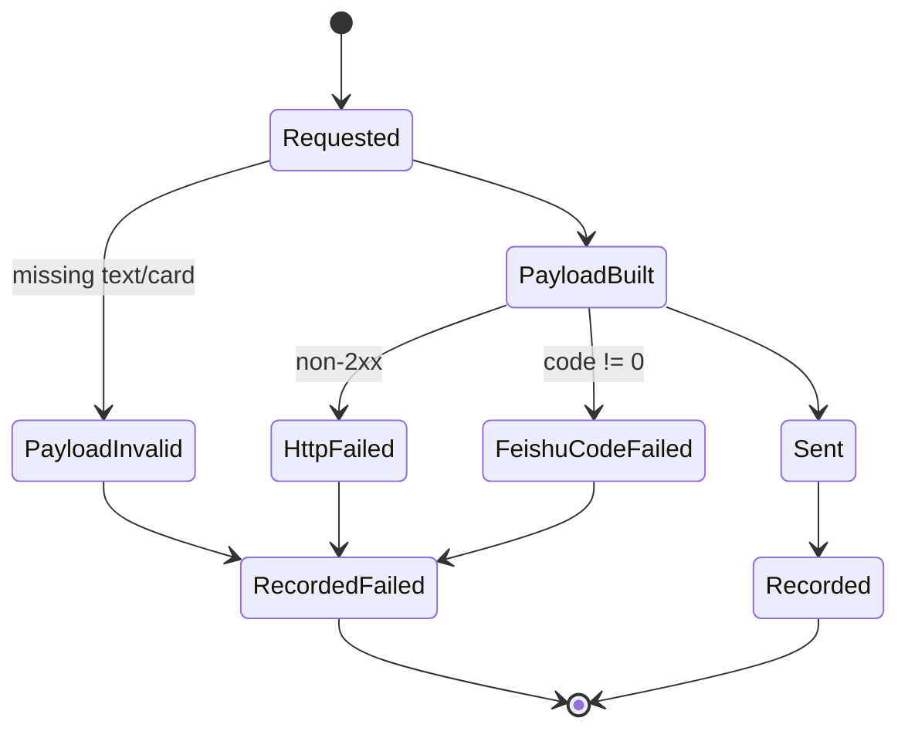
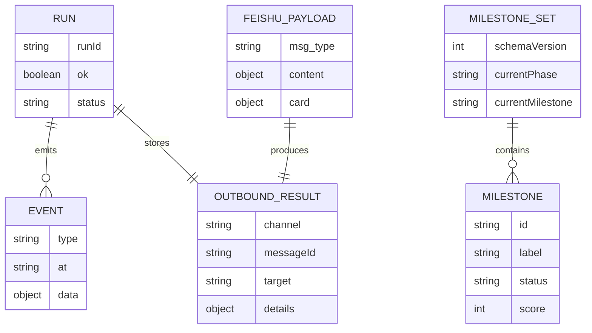
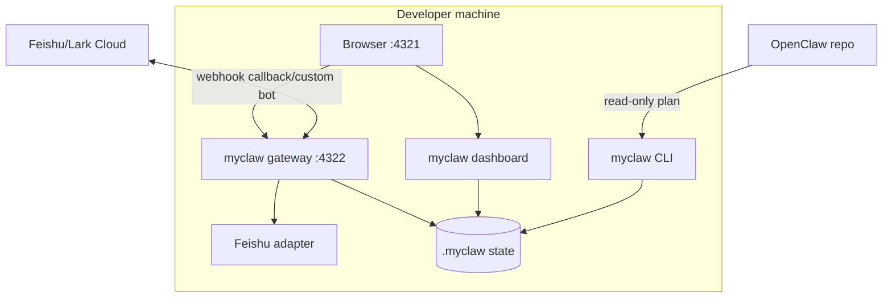

# MyClaw Phase 0.9 实现架构可视化评审

更新时间：2026-05-20

## 总诊断

Phase 0.9 把当前进度明确成 milestones，并把 Feishu outbound 从 channel 内部硬编码提升到 `packages/feishu-adapter` facade。结论：方向对，但仍只是 Feishu custom-bot webhook 的 text/card/result normalization，不是完整 OpenClaw Feishu app-token、WebSocket、policy 或 thread reply。

| 评分项 | 当前分 | 判断 |
|---|---:|---|
| 设计清晰度 | 8/10 | M0-M5 里程碑和 Feishu outbound 边界更清楚 |
| 可扩展性 | 8/10 | outbound 进入 adapter facade，channel 不再手写 Feishu payload |
| 可靠性 | 6/10 | 测试覆盖 text/card/result，缺真实 Feishu app-token e2e |
| 可维护性 | 8/10 | 所有文件低于 500 行，dashboard client 仍在增长 |
| 安全性 | 6/10 | webhook signature/decrypt 已有，缺 scoped token/redaction/replay persistence |

## 当前 Milestones

| Milestone | 状态 | 完成度 | 说明 |
|---|---|---:|---|
| M0 本地消息闭环 | done | 100 | CLI send/receive、state、channel registry |
| M1 Gateway 与 Dashboard | partial | 70 | HTTP 控制面、run detail、reference matrix |
| M2 Feishu/Lark 边界 | partial | 58 | encrypted challenge、custom-bot outbound facade |
| M3 OpenClaw 迁移 | partial | 55 | plan/stage/review summary |
| M4 Agent Runtime 与审批 | planned | 10 | LLM loop、approval、scoped token |
| M5 记忆、搜索与插件 | planned | 8 | SQLite/FTS、memory、plugin loader |

## Feishu/Lark 复用结论

| 问题 | 结论 | 理由 |
|---|---|---|
| 直接加载 OpenClaw Feishu？ | 仍不直接加载 | OpenClaw plugin-sdk/runtime/secrets/approval 仍未进入 MyClaw |
| 当前已 port 什么？ | webhook 安全和 outbound 子集 | signature、AES decrypt、text/card payload、send result normalization |
| 下一步 | app-token/policy | 先接 app-token outbound，再做 access policy 和持久 replay |

## 参考完成度矩阵

| 模块 | MyClaw | OpenClaw | Hermes-agent | OpenHuman | 当前差距 |
|---|---:|---:|---:|---:|---|
| Gateway / 控制面 | 60 | 90 | 78 | 86 | 已拆 routes/auth，仍缺 WS/SSE、scoped token |
| Feishu/Lark 接入 | 58 | 92 | 42 | 35 | 有 encrypted challenge/custom-bot outbound facade，缺 WebSocket/policy/app token |
| Dashboard / 观测 | 60 | 78 | 55 | 90 | 有 milestones/run detail/stage summary，缺 approval queue、实时事件 |
| OpenClaw 迁移 | 55 | 0 | 82 | 35 | 有 plan/stage/review summary，缺 apply/rollback/字段级 diff |
| Agent Runtime | 8 | 76 | 92 | 90 | 还没有 agent turn、tool loop、subagent |
| Memory / Search | 10 | 52 | 94 | 96 | 仅 JSON/JSONL state |
| Tools / Security | 22 | 88 | 74 | 84 | 缺 tool schema、approval queue、sandbox |
| Plugins / Skills | 18 | 92 | 88 | 78 | 仅 channel registry |

## 系统上下文图

这张图回答：MyClaw Phase 0.9 和用户、Feishu、OpenClaw、HTML Center 的边界。



Review 观察：

- 优点：OpenClaw 仍是 reference，不进入运行时依赖。
- 优点：Feishu outbound payload/result 进入 adapter facade。
- 风险：Gateway 和 Dashboard route 仍各自维护 if 链。
- 改进：Phase 1 前先做 controller/route adapter。

## 模块架构图

这张图回答：Phase 0.9 新增模块如何依赖，是否降低耦合。

```mermaid
flowchart TB
  Channels[packages/channels] --> FeishuChannel[channels/src/feishu.mjs]
  FeishuChannel --> Outbound[feishu-adapter/outbound.mjs]
  GatewayRoute[routes/feishu.mjs] --> Security[feishu-adapter/security.mjs]
  GatewayRoute --> Normalize[feishu-adapter/normalize.mjs]
  DashboardClient[dashboard/client.mjs] --> Milestones[/api/status milestones]
  ControlPlane[control-plane/status.mjs] --> MilestoneBuilder[control-plane/milestones.mjs]
  ControlPlane --> StageSummary[buildOpenClawStageSummary]
  Runtime[runtime/messages.mjs] --> Channels
  Runtime --> State[core/state.mjs]
```

Review 观察：

- 优点：Feishu text/card 构造不再散落在通用 channel registry 中。
- 优点：milestones 是 API payload，不只是文档表格。
- 风险：Dashboard client 261 行，后续 approval 前需要拆 renderer。
- 改进：把 milestone/reference/migration renderer 分文件。

## 核心业务流程图

这张图回答：一次 Feishu outbound send 如何经过 facade。



Review 观察：

- 优点：HTTP 200 但 Feishu code 非 0 会被视为失败。
- 优点：card payload 有契约，但不假装 app-token API 已完成。
- 风险：thread 只是 metadata，不能当真实 thread reply。
- 改进：app-token client 前先明确 credential 和 policy schema。

## 关键时序图

这张图回答：Dashboard 如何展示 milestones。



Review 观察：

- 优点：milestone 进入运行状态面，用户能看到当前处在哪个阶段。
- 风险：milestone 目前是静态 payload，后续要从验收项计算。
- 改进：Phase 1 将 milestone score 绑定 tests/reference criteria。

## 状态机图

这张图回答：Feishu outbound run 的成功、失败、重试边界。



Review 观察：

- 优点：失败进入 envelope/state，不吞掉错误。
- 风险：没有 idempotency key，重试可能重复发消息。
- 改进：outbound 前加 mutation idempotency 和 audit。

## 数据模型 / ER 图

这张图回答：milestone、run、outbound result 的数据关系。



Review 观察：

- 优点：milestones 不写状态，只作为控制面派生数据。
- 风险：outbound result 仍没有 provider-specific schema version。
- 改进：Feishu app-token client 加 `kind/schemaVersion`。

## 数据流图

这张图回答：消息、里程碑、报告如何流动。

```mermaid
flowchart LR
  UserInput[CLI/Gateway send] --> Runtime
  Runtime --> ChannelRegistry
  ChannelRegistry --> FeishuOutbound[custom-bot outbound facade]
  FeishuOutbound --> FeishuWebhook[Feishu custom bot]
  FeishuWebhook --> SendResult[normalized result]
  SendResult --> RunState[(runs/events)]
  Milestones[buildMilestonesPayload] --> Status[/api/status]
  RunState --> Status
  Status --> Dashboard
  Markdown[Review markdown] --> Html[build-review-html]
  Html --> HtmlCenter
```

Review 观察：

- 优点：outbound 和 dashboard 状态都可测试。
- 风险：milestones 静态，不能自动反映 test 失败。
- 改进：CI 或 check 脚本输出 milestone gate。

## 部署图

这张图回答：Phase 0.9 本地运行拓扑。



Review 观察：

- 优点：仍默认 loopback，本地调试安全。
- 风险：custom bot URL 是 secret-like 配置，日志和 raw JSON 后续要脱敏。
- 改进：scoped token + redaction policy。

## 概念解释

| 概念 | 含义 | 当前边界 |
|---|---|---|
| custom-bot outbound facade | MyClaw 自己的 Feishu webhook 发送契约 | text/card payload + send result normalization |
| milestone | 阶段交付物和完成度 | 当前静态 API payload |
| stage summary | stage 与 plan 的模块级审阅摘要 | `forReviewOnly: true`，非字段级 diff |
| custom bot webhook | Feishu 入站 webhook URL 发送 | 不等于 app-token rich card API |
| thread metadata | 记录期望线程上下文 | 当前不保证真实 thread reply |

## 相似技术比较

| 维度 | MyClaw Phase 0.9 | OpenClaw | Hermes-agent | OpenHuman |
|---|---|---|---|---|
| Feishu/Lark | encrypted challenge + custom-bot outbound facade | 完整 Feishu plugin | 平台 adapter 方向 | 非核心 |
| Dashboard | milestones + run detail + stage summary | Control UI/schema | CLI/TUI/ops | UI-first |
| Gateway | routes/auth/http 拆分 | 成熟 gateway/channel 安全 | 多平台 gateway | JSON-RPC/SSE |
| 迁移 | plan/stage/review summary | 被迁移源 | 有迁移经验 | controller 思想 |
| 记忆 | JSON/JSONL state | session/config | SQLite/FTS | memory tree |

## 目录结构与文件行数

| 路径 | 行数 | 职责 | 评价 |
|---|---:|---|---|
| `packages/feishu-adapter/src/outbound.mjs` | 46 | Feishu outbound payload/result facade | 健康 |
| `packages/channels/src/index.mjs` | 203 | generic channel registry + generic webhook | 健康 |
| `packages/channels/src/feishu.mjs` | 64 | Feishu webhook/event channel adapter | 健康；不要再回填到 index |
| `packages/control-plane/src/milestones.mjs` | 22 | static milestone roadmap payload | 健康；后续绑定检查结果 |
| `packages/control-plane/src/status.mjs` | 187 | status/run/detail/summary/milestones | 可接受 |
| `packages/dashboard/src/client.mjs` | 261 | dashboard render logic | 继续增长，approval 前必须拆 |
| `packages/dashboard/src/styles.mjs` | 208 | dashboard styles | 健康 |
| `docs/build-review-html.mjs` | 408 | HTML report builder | 接近 450，下一轮拆 |

没有手写文件超过 500 行。

## 风险分级

| 等级 | 问题 | 影响 | 建议 |
|---|---|---|---|
| High | custom-bot outbound facade 容易被误解为完整 Feishu outbound | 误导迁移和接入预期 | 文档和 API 明确 custom-bot only |
| High | GET 只读接口未来可能暴露 prompt/tool output | 安全边界不足 | scoped token + redaction policy |
| Medium | milestones 目前是静态数据 | 完成度可能漂移 | 绑定 tests/reference criteria |
| Medium | dashboard client 继续增长 | approval 加入后难维护 | 拆 renderer modules |
| Low | report builder 408 行 | 接近预警 | 拆 parser/template |

## Linus 视角严苛审查

独立 subagent 已按 30 年 Linux 内核维护者视角审查当前 diff，核心结论是“custom-bot outbound 可以接受，但别让通用 channel 继续塞 provider 分支，也别把静态 milestone 说成真实控制面状态”。

| 等级 | 发现 | 处理 |
|---|---|---|
| High | `channels/src/index.mjs` 被 Feishu 分支污染 | 已拆出 `channels/src/feishu.mjs`，通用 webhook 不再 import Feishu adapter |
| High | outbound 能力很窄，`threadId` 只是 metadata | 报告和 stage status 改成 custom-bot outbound facade，不宣称 app-token/thread reply |
| High | `/api/milestones` 又复制 route if 链 | 本轮记录为 Phase 1 前置；下一轮先做 controller/route adapter |
| Medium | milestones 是静态展示，不是真实控制面状态 | payload 标记 `computed: false` 和 `source: static-roadmap` |
| Medium | HTML phase sync 检查太弱 | 已要求 first rendered phase 必须等于 Markdown first phase |

## Skill 规范自检

- 使用 `web-design-review` 规则生成可视化 design review dashboard。
- 覆盖系统上下文、模块架构、核心流程、时序、状态机、ER、数据流、部署图。
- 报告包含目录行数、概念解释、相似技术比较、风险分级、Linus 视角。
- 单文件 500 行硬限制由 `npm run check` 执行。
- 按 `skill-creator` 要求保持 skill 本身精简；本轮未修改 skill。

## 下一阶段建议

1. Phase 1 前置：controller/route adapter。
2. Gateway scoped token、run redaction、mutation idempotency。
3. Dashboard approval queue 和字段级 migration diff drawer。
4. Feishu app-token outbound client 与 access policy。
