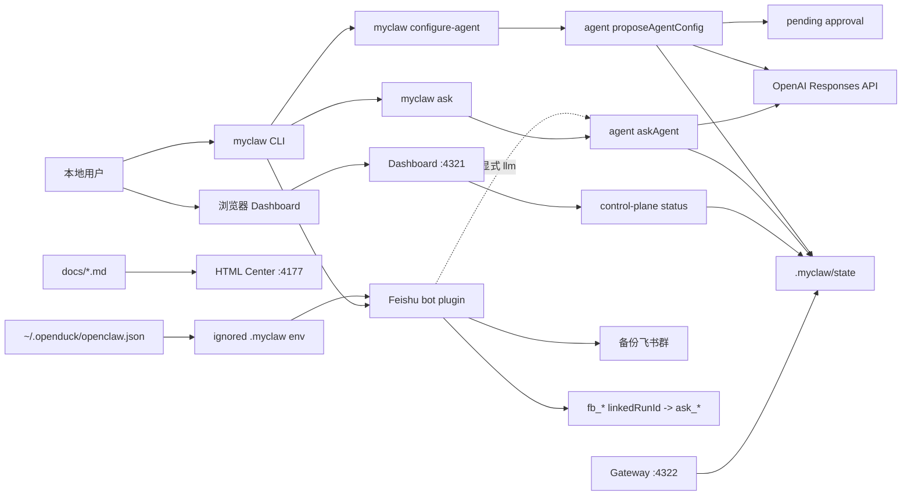
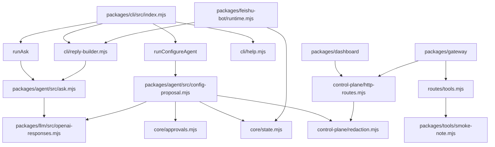
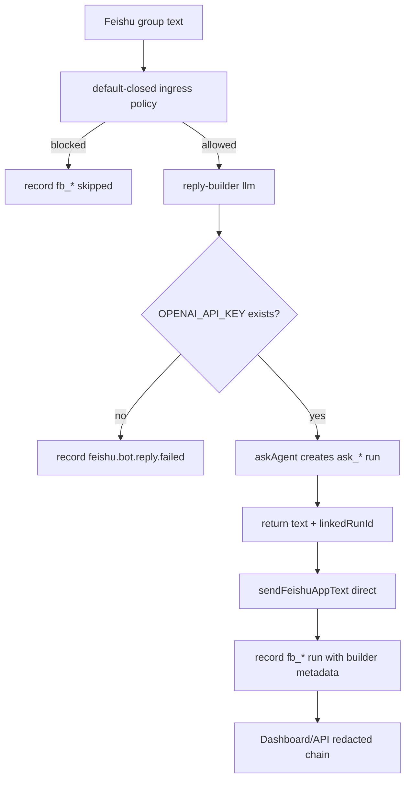
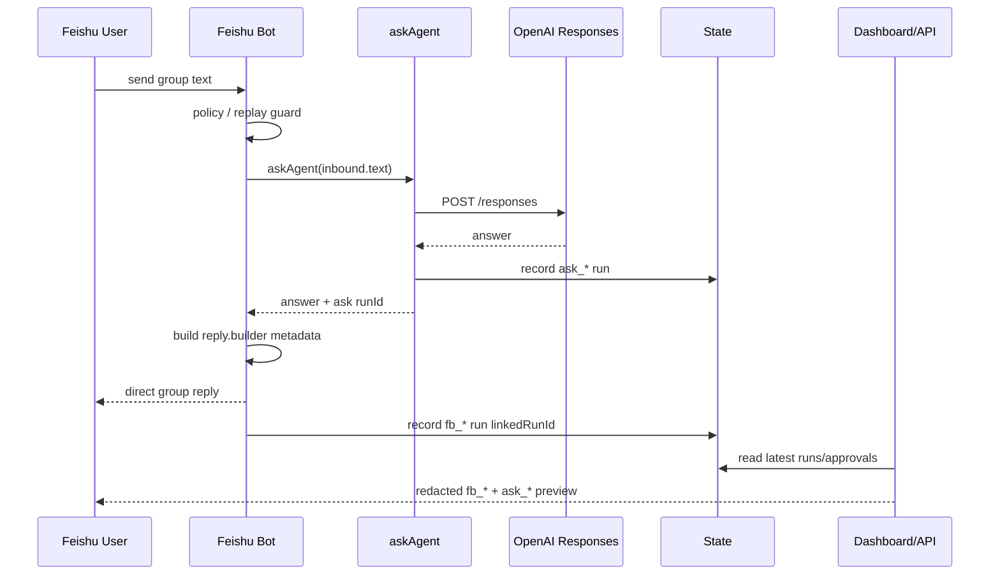
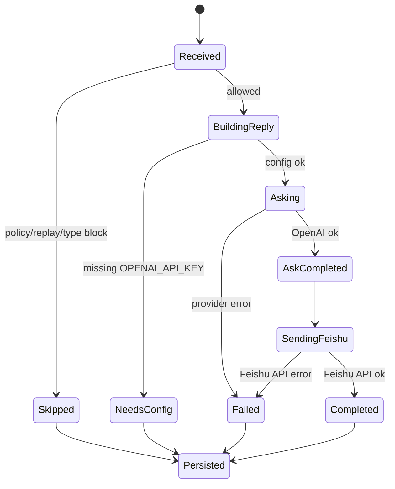
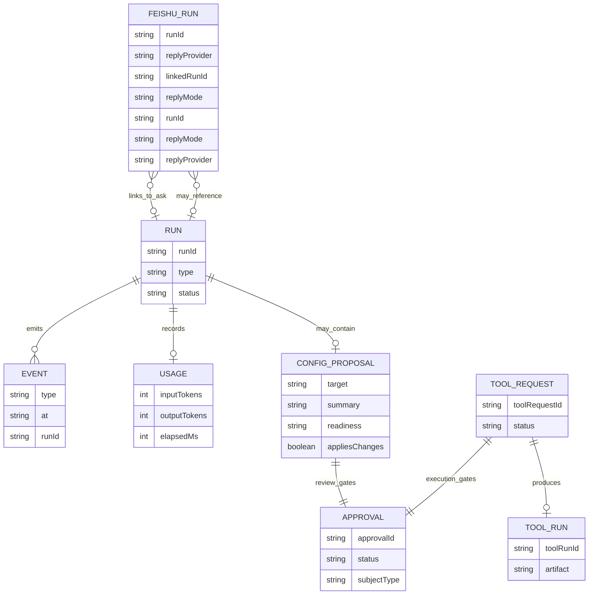
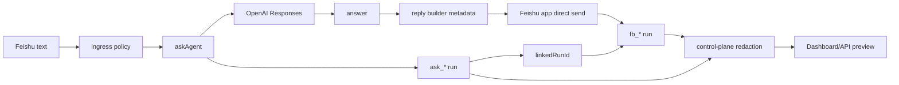
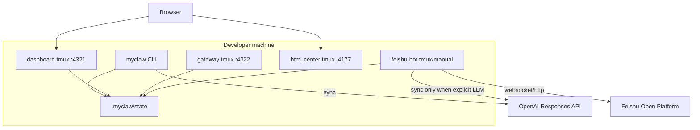

# MyClaw Phase 1.9 实现架构可视化评审

更新时间：2026-06-05

## 总诊断

Phase 1.9 把 L3 从“只能单独问 LLM/生成配置提案”推进到“可以在飞书群里测试真实 LLM 回复并追踪来源”：显式 LLM 模式下，Feishu bot 会把 `fb_*` run 的 `reply.builder.linkedRunId` 指向对应的 `ask_*` run。结论：你现在可以在备份飞书群验证真实回复效果；但这仍不是工具调用、记忆或自动配置落地。

| 评分项 | 当前分 | 判断 |
|---|---:|---|
| 设计清晰度 | 9/10 | 清楚区分 Feishu reply chain、ask、config proposal、tool calling、apply |
| 可扩展性 | 8/10 | replyBuilder metadata、proposal、LLM adapter、approval、redaction 分包 |
| 可靠性 | 7/10 | `cfg_*` run 与 approval 落盘；仍缺 apply recovery、provider retry、idempotency |
| 可维护性 | 8/10 | 新模块小于 200 行；CLI 425 行接近拆分线 |
| 安全性 | 8/10 | Feishu 正文/chat_id/sender_id 和完整 LLM answer 默认脱敏；prompt redaction 不是完整 DLP |

## 大规划图

这张图回答：从人类可测角度看，Phase 1.9 处在整个 milestone 的哪里。

```mermaid
flowchart LR
  E0["E0 本地消息"] --> E1["E1 Dashboard"]
  E1 --> E1C["E1C Stream + Scoped Token"]
  E1C --> E2B["E2B Feishu 群回复"]
  E2B --> E4["E4 OpenClaw stage"]
  E4 --> E5["E5 Approval decision"]
  E5 --> E5B["E5B Tool approval smoke"]
  E5B --> E6A["E6A LLM Reply Smoke"]
  E6A --> E6B["E6B Agent Config Proposal"]
  E6B --> E6C["E6C Feishu LLM Reply Chain"]
  E6C --> E6["E6 Agent Tool Loop"]
  E6 --> E8["E8 Session Search"]
  E8 --> E9["E9 Agent-to-Agent"]
  E9 --> E10["E10 Long Memory"]
```

Review 观察：

- 优点：E6C 给用户一个现在能在飞书群里测的真实 LLM 入口。
- 优点：E6B 仍排在 E5B 之后，避免 agent 写操作早于审批系统。
- 风险：用户可能把 Feishu LLM 回复误认为工具调用已经开放。
- 改进：Dashboard 增加 reply chain drawer，明确 `fb_* -> ask_*` 但 `toolCalls=[]`。

## 系统上下文图

这张图回答：MyClaw Phase 1.9 和用户、Feishu、OpenAI、HTML Center、OpenClaw 参考配置的边界在哪里。

```mermaid
flowchart LR
  User["本地用户"] --> CLI["myclaw CLI"]
  User --> Browser["浏览器 Dashboard"]
  CLI --> Ask["myclaw ask"]
  CLI --> Configure["myclaw configure-agent"]
  Ask --> AgentAsk["agent askAgent"]
  Configure --> ConfigProposal["agent proposeAgentConfig"]
  AgentAsk --> LLM["OpenAI Responses API"]
  ConfigProposal --> LLM
  ConfigProposal --> Approval["pending approval"]
  Browser --> Dashboard["Dashboard :4321"]
  Dashboard --> Control["control-plane status"]
  CLI --> FeishuBot["Feishu bot plugin"]
  FeishuBot --> FeishuGroup["备份飞书群"]
  FeishuBot -.显式 llm.-> AgentAsk
  FeishuBot --> LinkedRun["fb_* linkedRunId -> ask_*"]
  Gateway["Gateway :4322"] --> State[".myclaw/state"]
  Control --> State
  AgentAsk --> State
  ConfigProposal --> State
  Docs["docs/*.md"] --> HtmlCenter["HTML Center :4177"]
  Openduck["~/.openduck/openclaw.json"] --> LocalEnv["ignored .myclaw env"]
  LocalEnv --> FeishuBot
```

Review 观察：

- 优点：OpenAI 调用仍只在 agent/LLM adapter 内部，Gateway 不直接依赖 provider。
- 优点：openduck 配置只读导入 ignored `.myclaw/`，本轮 proposal 不读取 secret 值。
- 优点：Dashboard 通过 control-plane 只看 redacted run、proposalPreview 和 linkedRunId。
- 风险：用户输入给 `--text` 的敏感内容会被模式化脱敏，但不是完整泄漏防护。
- 改进：下一阶段把 prompt 输入前置为本地 structured checklist，减少自由文本粘贴 secret。

## 模块架构图

这张图回答：本轮新增的 Feishu LLM reply chain 如何保持主线干净，并为后续 Dashboard drawer 留接口。

```mermaid
flowchart TB
  CLI["packages/cli/src/index.mjs"] --> AskCmd["runAsk"]
  CLI --> ConfigCmd["runConfigureAgent"]
  CLI --> ReplyBuilder["cli/reply-builder.mjs"]
  CLI --> Help["cli/help.mjs"]
  AskCmd --> AgentAsk["packages/agent/src/ask.mjs"]
  ConfigCmd --> AgentConfig["packages/agent/src/config-proposal.mjs"]
  AgentAsk --> OpenAIAdapter["packages/llm/src/openai-responses.mjs"]
  AgentConfig --> OpenAIAdapter
  AgentConfig --> Approvals["core/approvals.mjs"]
  AgentConfig --> StateStore["core/state.mjs"]
  AgentConfig --> Redaction["control-plane/redaction.mjs"]
  ReplyBuilder --> AgentAsk
  FeishuBot["packages/feishu-bot/runtime.mjs"] --> ReplyBuilder
  FeishuBot --> StateStore
  Dashboard["packages/dashboard"] --> ControlRoutes["control-plane/http-routes.mjs"]
  Gateway["packages/gateway"] --> ControlRoutes
  ControlRoutes --> Redaction
  Gateway --> ToolRoutes["routes/tools.mjs"]
  ToolRoutes --> SmokeTool["packages/tools/smoke-note.mjs"]
```

Review 观察：

- 优点：LLM reply metadata 只扩展 replyBuilder contract，没有把 Feishu SDK 塞进 agent。
- 优点：approval 创建复用 core，不在 CLI 里手写状态格式。
- 优点：control-plane 是唯一脱敏出口，Dashboard/Gateway 不复制敏感逻辑。
- 风险：CLI 主文件 425 行，继续加命令会碰到 450 预警。
- 改进：拆 `packages/cli/src/commands/configure-agent.mjs` 和 `commands/ask.mjs`。

## 核心业务流程图

这张图回答：一条飞书群消息如何变成 LLM 回复，并被串到 `ask_*` run。

```mermaid
flowchart TD
  Start["Feishu group text"] --> Policy["default-closed ingress policy"]
  Policy -->|blocked| Skipped["record fb_* skipped"]
  Policy -->|allowed| Builder["reply-builder llm"]
  Builder --> Key{"OPENAI_API_KEY exists?"}
  Key -->|no| Failed["record feishu.bot.reply.failed"]
  Key -->|yes| Ask["askAgent creates ask_* run"]
  Ask --> ReplyMeta["return text + linkedRunId"]
  ReplyMeta --> Send["sendFeishuAppText direct"]
  Send --> Persist["record fb_* run with builder metadata"]
  Persist --> Dashboard["Dashboard/API redacted chain"]
```

Review 观察：

- 优点：缺 key 不伪造智能回复，会进入 failed run。
- 优点：`fb_*` 和 `ask_*` 都落盘，方便用户从群消息追踪 LLM 来源。
- 风险：当前 Dashboard 还需要看 run detail/raw JSON 才能串链路。
- 改进：做 reply chain drawer，显示 `fb_* -> ask_* -> answerPreview`。

## 关键时序图

这张图回答：Feishu LLM 回复一次请求里 Bot、Agent、LLM、State、Dashboard 如何协作。

```mermaid
sequenceDiagram
  participant U as Feishu User
  participant B as Feishu Bot
  participant A as askAgent
  participant O as OpenAI Responses
  participant S as State
  participant D as Dashboard/API

  U->>B: send group text
  B->>B: policy / replay guard
  B->>A: askAgent(inbound.text)
  A->>O: POST /responses
  O-->>A: answer
  A->>S: record ask_* run
  A-->>B: answer + ask runId
  B->>B: build reply.builder metadata
  B-->>U: direct group reply
  B->>S: record fb_* run linkedRunId
  D->>S: read latest runs/approvals
  D-->>U: redacted fb_* + ask_* preview
```

Review 观察：

- 优点：Feishu 回复和 LLM 请求不再是两条断开的 run。
- 优点：linkedRunId 是内部 run id，不是飞书 chat_id 或 sender_id。
- 风险：模型回复可能包含用户敏感内容，控制面必须继续只展示 answerPreview。
- 改进：为 Feishu LLM 模式增加 per-channel opt-in 状态展示。

## 状态机图

这张图回答：Feishu LLM reply chain 当前有哪些状态，以及失败如何呈现。

```mermaid
stateDiagram-v2
  [*] --> Received
  Received --> Skipped: policy/replay/type block
  Received --> BuildingReply: allowed
  BuildingReply --> NeedsConfig: missing OPENAI_API_KEY
  BuildingReply --> Asking: config ok
  Asking --> AskCompleted: OpenAI ok
  Asking --> Failed: provider error
  AskCompleted --> SendingFeishu
  SendingFeishu --> Completed: Feishu API ok
  SendingFeishu --> Failed: Feishu API error
  Skipped --> Persisted
  NeedsConfig --> Persisted
  Failed --> Persisted
  Completed --> Persisted
```

Review 观察：

- 优点：policy skip、LLM 配置缺失、provider 失败、Feishu API 失败都有状态。
- 优点：成功路径同时产生 `ask_*` 和 `fb_*`。
- 风险：没有 retry/cancel 状态，失败后需要人工重启或重发。
- 改进：后续把 Feishu reply job 提升成 durable dispatch。

## 数据模型 / ER 图

这张图回答：ask run、Feishu run、config proposal、approval、tool request 和 event 如何关联。

```mermaid
erDiagram
  RUN ||--o{ EVENT : emits
  RUN ||--o| USAGE : records
  RUN ||--o| CONFIG_PROPOSAL : may_contain
  FEISHU_RUN }o--o| RUN : links_to_ask
  CONFIG_PROPOSAL ||--|| APPROVAL : review_gates
  TOOL_REQUEST ||--|| APPROVAL : execution_gates
  TOOL_REQUEST ||--o| TOOL_RUN : produces
  FEISHU_RUN }o--o| RUN : may_reference

  RUN { string runId string type string status }
  EVENT { string type string at string runId }
  USAGE { int inputTokens int outputTokens int elapsedMs }
  CONFIG_PROPOSAL { string target string summary string readiness boolean appliesChanges }
  FEISHU_RUN { string runId string replyProvider string linkedRunId string replyMode }
  APPROVAL { string approvalId string status string subjectType }
  TOOL_REQUEST { string toolRequestId string status }
  TOOL_RUN { string toolRunId string artifact }
  FEISHU_RUN { string runId string replyMode string replyProvider }
```

Review 观察：

- 优点：`FEISHU_RUN` 和 `RUN` 通过 linkedRunId 建立轻量关联。
- 优点：tool approval 和 proposal approval 语义不同，后续能分别建 UI。
- 风险：完整 proposal 当前存在本地 state，控制面脱敏但本机文件仍需被视为敏感。
- 改进：未来加 proposal field-level sensitivity 和 encrypted local state。

## 数据流图

这张图回答：飞书消息和 LLM 回复数据从哪里来、经过哪些处理、最终到哪里去。

```mermaid
flowchart LR
  FeishuText["Feishu text"] --> Policy["ingress policy"]
  Policy --> Ask["askAgent"]
  Ask --> Provider["OpenAI Responses"]
  Provider --> Answer["answer"]
  Ask --> AskRun["ask_* run"]
  Answer --> ReplyBuilder["reply builder metadata"]
  ReplyBuilder --> FeishuSend["Feishu app direct send"]
  FeishuSend --> FbRun["fb_* run"]
  AskRun --> Link["linkedRunId"]
  Link --> FbRun
  FbRun --> Redaction["control-plane redaction"]
  AskRun --> Redaction
  Redaction --> Dashboard["Dashboard/API preview"]
```

Review 观察：

- 优点：只把内部 run id 作为链路字段，不把飞书 ID 当关联键。
- 优点：控制面二次脱敏，避免飞书正文和完整 answer 扩散。
- 风险：真实 LLM 回复会把群消息发给 provider，必须显式 opt-in。
- 改进：增加 per-channel privacy acknowledgment 记录。

## 部署图

这张图回答：本机服务和外部 provider 运行在哪里，哪些是同步/异步。

```mermaid
flowchart TB
  subgraph Local["Developer machine"]
    CLI["myclaw CLI"]
    Dashboard["dashboard tmux :4321"]
    Gateway["gateway tmux :4322"]
    HtmlCenter["html-center tmux :4177"]
    State[".myclaw/state"]
    FeishuBot["feishu-bot tmux/manual"]
    CLI --> State
    Dashboard --> State
    Gateway --> State
    FeishuBot --> State
  end
  CLI -->|sync| OpenAI["OpenAI Responses API"]
  FeishuBot -->|sync only when explicit LLM| OpenAI
  FeishuBot -->|websocket/http| Feishu["Feishu Open Platform"]
  Browser["Browser"] --> Dashboard
  Browser --> HtmlCenter
```

Review 观察：

- 优点：没有新增常驻 agent 配置服务，复杂度低。
- 优点：Dashboard/Gateway 仍读本地 state，不需要数据库迁移。
- 风险：Feishu bot、Dashboard、Gateway 仍靠 tmux 手工管理。
- 改进：`myclaw services status/start/stop` 统一本地服务生命周期。

## Human Experiments

| 实验 | 状态 | 用户动作 | 成功信号 |
|---|---|---|---|
| E0 | ready | `send --text` | ok envelope，run 可见 |
| E1 | ready | 打开 Dashboard | Phase 1.9、Approvals、LLM health、E6C 可见 |
| E1C | ready | 测非 loopback scoped token 与 SSE | 错 scope 被拒绝，stream snapshot 脱敏 |
| E2B | ready | 在备份飞书群发文本 | 群内直接收到确定性回复 |
| E5B | ready | POST smoke tool + approve/reject | approved 才写 tool-run；rejected 不执行 |
| E6A | ready | `myclaw ask --text ... --json` | 真实 answer、provider、usage、`toolCalls=[]` |
| E6B | ready | `myclaw configure-agent --target feishu-llm --text ... --json` | `cfg_*` run、proposal、pending approval、`appliesChanges=false` |
| E6C | ready | 飞书群发文本，LLM 模式直接回复 | `fb_*` run、`reply.builder.linkedRunId=ask_*`、控制面脱敏 |
| E6 | planned | agent run/resume/tool loop | 后续开放 |
| E8/E9/E10 | planned | search/A2A/memory | 后续开放 |

## 概念解释

| 概念 | 含义 | 当前边界 |
|---|---|---|
| LLM reply smoke | 单轮真实模型回复 | 不含工具调用、记忆、streaming |
| Config proposal | agent 生成配置建议 | review-only，不 apply、不写 `.myclaw` |
| Reply chain | 飞书回复与 LLM run 的关联 | `linkedRunId` 是内部 run id，不含飞书 ID |
| Sanitized context | 只含 readiness、计数和 guardrail | 不含 secret、chat_id、sender_id |
| Proposal preview | 控制面暴露的摘要 | 不含完整 proposal 正文 |
| Review approval | 人类审阅记录 | 当前不会触发配置变更 |
| Staged apply | 未来显式落地步骤 | 必须二次批准并输出 diff |
| ToolDescriptor | 后续工具注册契约 | Phase 1.9 尚未实现 |
| Durable dispatch | 可恢复工具执行分发 | 后续 E6 重点 |
| Policy snapshot | 工具可见性和审批策略快照 | 后续和每次 tool call 绑定 |
| Structure guardrail | 技术债红线 | 500 行、20 文件、4 层深度 |

## 相似技术比较

| 维度 | MyClaw Phase 1.9 | OpenClaw | Hermes-agent | OpenHuman |
|---|---|---|---|---|
| LLM 入口 | `ask` + config proposal + Feishu LLM reply chain | 成熟 agent/plugin runtime | 完整 agent loop | agent harness + provider/tool loop |
| 配置变更 | 当前不 apply，只提案 | Control UI / plugin config 更厚 | 配置散在 agent/runtime | controller/registry 组合更强 |
| 工具调用 | 未开放，仅 E5B smoke | policy/sandbox 更成熟 | registry/check_fn | ToolSpec/permission/scope |
| Feishu/Lark | 独立 bot，显式 LLM opt-in，linked ask run | 完整 Feishu extension | 非重点 | 多 controller/channel 思路 |
| 记忆 | JSON/JSONL state | session/plugin 边界 | SQLite/FTS 强 | memory tree/UnifiedMemory 强 |
| UI/观测 | Dashboard preview/health/run/audit/experiments | Control UI | TUI/ops | UI-first |

## 目录结构与文件行数

| 路径 | 行数/文件数 | 职责 | 评价 |
|---|---:|---|---|
| `packages/agent/src/config-proposal.mjs` | 213 行 | review-only 配置提案、sanitized context、target registry、approval 创建 | 健康；下一步拆 schema/prompt 可更稳 |
| `packages/agent/src/ask.mjs` | 86 行 | 单轮 ask runtime、事件和 run 记录 | 健康；后续接 provider registry |
| `packages/llm/src/openai-responses.mjs` | 127 行 | OpenAI Responses adapter | 健康；缺 retry/streaming |
| `packages/cli/src/index.mjs` | 421 行 | CLI 命令入口 | 接近 450；下一轮必须拆 commands |
| `packages/cli/src/config-output.mjs` | 62 行 | configure-agent safe projection 输出 | 健康；默认不打印完整 proposal |
| `packages/cli/src/help.mjs` | 40 行 | CLI help 文案 | 健康 |
| `packages/cli/src/reply-builder.mjs` | 37 行 | Feishu 确定性/LLM 回复生成插件点 | 健康；LLM 模式返回 linked ask run metadata |
| `packages/feishu-bot/src/runtime.mjs` | 191 行 | Feishu WebSocket bot、reply send、run 记录 | 健康；已记录 `reply.builder.linkedRunId` |
| `packages/feishu-bot/test/feishu-bot.test.mjs` | 336 行 | Feishu bot replay、policy、reply mode、LLM link 测试 | 健康 |
| `packages/cli/test/config-agent.test.mjs` | 98 行 | configure-agent missing-key 与 safe JSON 测试 | 健康 |
| `packages/agent/test/config-proposal.test.mjs` | 104 行 | proposal、approval、target、脱敏测试 | 健康 |
| `packages/control-plane/src/redaction.mjs` | 220 行 | Feishu/LLM/config proposal/approval 控制面脱敏 | 健康；规则继续集中维护 |
| `packages/control-plane/src/status.mjs` | 342 行 | status/runs/events/health/toolRequests/approvals | 健康，但继续增长要拆 health builder |
| `packages/control-plane/src/experiments.mjs` | 372 行 | E0-E10/E6C 与 L0-L6 payload | 健康；增长后拆 experiment registry |
| `packages/dashboard/src/client.mjs` | 432 行 | Dashboard renderer | 接近 450；下一轮拆 section renderer |
| `docs/build-review-html.mjs` | 414 行 | Markdown 到 HTML 生成器 | 接近 450；下一轮拆 parser/template |
| `docs/modules` | 16 直接文件 | 模块化源文档 | 低于 20 文件限制 |
| `docs/rendered/modules` | 16 直接文件 | 生成 HTML 模块页 | 生成物；低于 20 文件限制 |
| 仓库结构 | 131+ 文件，最大深度 4 | `npm run check` 红线 | 当前通过；无目录超过 20 个直接文件 |

## 风险分级

| 等级 | 问题 | 影响 | 建议 |
|---|---|---|---|
| High | proposal approval 被误当成 apply 授权 | 用户以为 agent 已经配置成功，后续实现可能绕过安全门 | UI/文档/CLI 都标注 review-only；staged apply 单独命令和二次 approval |
| High | 用户 prompt 可能包含未知格式 secret | 模式化 redaction 不能覆盖所有敏感格式 | 已默认 safe output；继续加敏感文本提示和结构化 checklist |
| High | 未来直接接模型工具调用 | 可能过早开放 shell/file/network | 先做 ToolDescriptor、policy snapshot、sandbox、idempotency、approval pause |
| Medium | CLI 421 行，Dashboard 432 行 | 下一轮功能会触发 450 预警 | 先拆 commands 和 section renderer |
| Medium | provider 没有 retry/backoff | 临时网络错误会直接失败 | 加 retry policy、timeout 分类和错误码 |
| Medium | `--unsafe-full-local` 可输出完整 envelope | 用户若复制到远程日志会泄露 proposal | 默认不用；只在本机刻意查看时使用 |
| Medium | proposal 本地 state 仍保存完整建议 | 本机 state 文件可能含用户目标或敏感回显 | 提醒 state 视为敏感；后续 field-level sensitivity |
| Low | Feishu reply chain 仍需要看 raw/detail | 用户还不能一眼看懂 `fb_* -> ask_*` | 下一轮做 Dashboard drawer |

## Linus 视角严苛审查

独立 subagent 结论：可以对用户说“能在备份飞书群手动验证 LLM 直接回复是否工作”，但边界必须很窄：必须显式 `--reply-provider llm --llm-privacy-ack --reply-mode direct`，必须有本地 policy，且这仍不代表工具调用、读写文件、记忆、自动配置或 Dashboard chain drawer 已完成。审查发现的 `reply.builder.text` 泄漏风险已在发布前修复。

| 等级 | 发现 | 处理 |
|---|---|---|
| Critical | `fb_*` run 曾可能通过 `reply.builder.text` 暴露完整 LLM answer | 已修：`fb_*` 只存 `textPreview`，control-plane 对旧 `builder.text` 兜底脱敏；补 status/run detail 测试 |
| High | `linkedRunId` 校验太宽，可能被误填成 Feishu ID | 已修：只允许 `ask_` 前缀；非法值置空；补测试 |
| High | Feishu send 失败时链路会断 | 已修：失败事件保留安全 `linkedRunId` 和 `replyProvider` |
| Medium | Phase 1.9 只能宣称备份群显式 LLM 直接回复可测 | 文档和实验 E6C 已收窄边界，不宣称工具调用或 Dashboard drawer 完成 |
| Medium | `reply.builder` 是实现细节 | 暂保留为最小改动；下一轮建议迁移为 `reply.provenance` 或顶层 `links` |
| Low | CLI/Dashboard/docs builder 接近 450 行 | 下一轮先拆分 |

## Skill 规范自检

- 已按 `web-design-review` 输出可视化 design review dashboard。
- 报告覆盖系统上下文、模块架构、业务流程、时序、状态机、ER、数据流、部署图。
- 报告包含目录行数、概念解释、相似技术比较、风险分级、Linus 视角。
- 单文件 500 行、每目录 20 文件、目录深度 4 层由 `npm run check` 执行。
- 按 `skill-creator` 原则检查：skill 规则保持精简，复杂细节由脚本和报告承载；本轮未向 skill 增加过程文档。

## 下一阶段建议

1. 做 Dashboard reply chain drawer：`fb_* -> ask_* -> answerPreview`，不展示原始正文或完整 answer。
2. 给 `configure-agent` 增加 staged apply：只写 ignored `.myclaw`，必须输出 diff、checksum 和二次 approval。
3. 抽 ToolDescriptor registry、durable dispatch、claim/recovery、idempotency key 和完整 ToolRequest 生命周期。
4. 给 OpenAI Responses 接 model tool calling，但只暴露 policy 裁剪后的工具。
5. 拆 `packages/cli/src/index.mjs`、`packages/dashboard/src/client.mjs` 和 `docs/build-review-html.mjs`。
