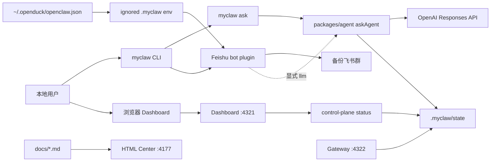
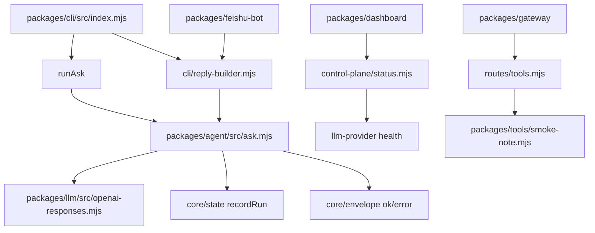
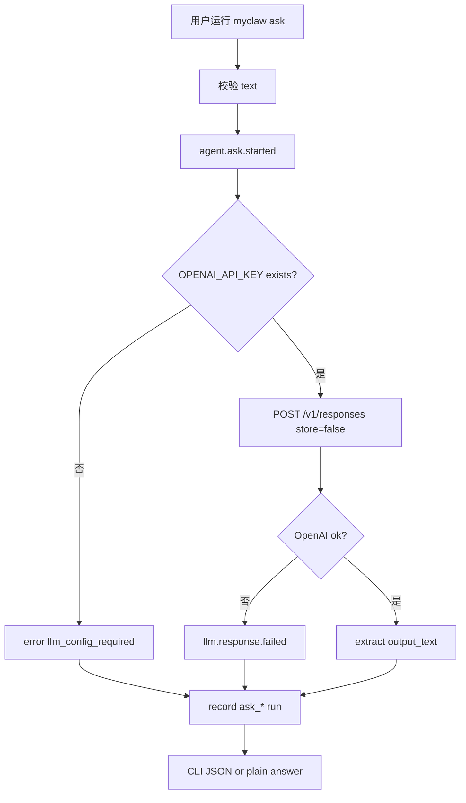
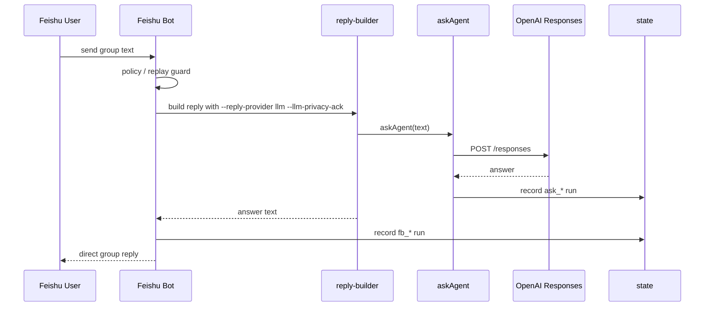
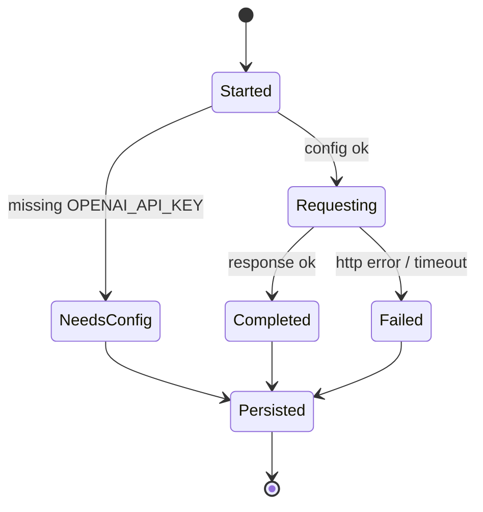
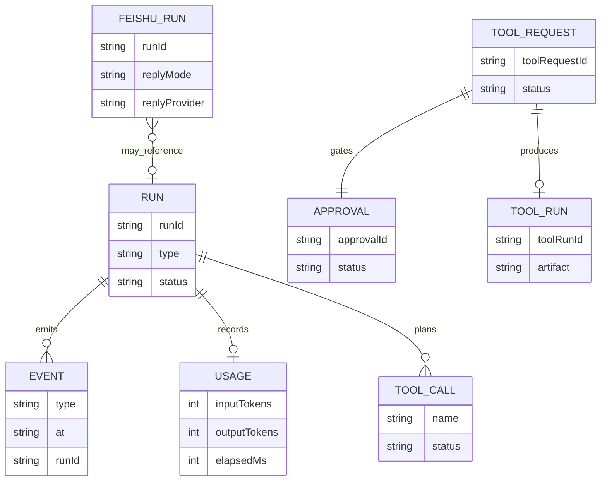
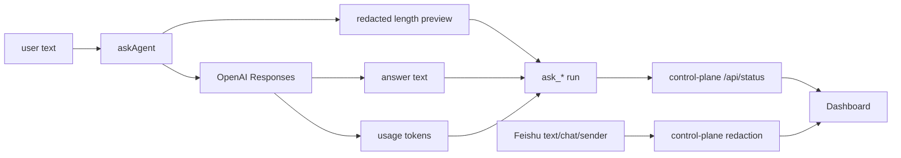
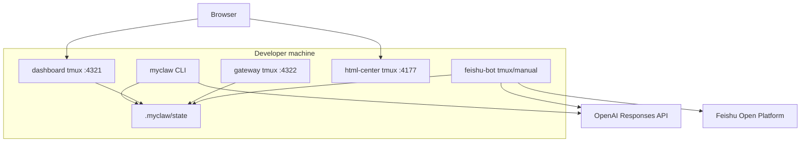

# MyClaw Phase 1.7 实现架构可视化评审

更新时间：2026-06-03

## 总诊断

Phase 1.7 把 L3 从“还不能测试 agent”推进到“可以测试真实 LLM 单轮回复”：`myclaw ask` 通过 OpenAI Responses 返回 answer，并把 `ask_*` run、usage、事件和 `toolCalls=[]` 写入 state。结论：你现在可以开始测试真实智能回复，但还不能测试 LLM 工具调用；下一阶段必须先补 ToolDescriptor、policy snapshot、durable dispatch 和 recovery。

| 评分项 | 当前分 | 判断 |
|---|---:|---|
| 设计清晰度 | 9/10 | 清楚区分 LLM reply smoke 与 agent tool loop |
| 可扩展性 | 8/10 | provider、agent ask、Feishu replyBuilder 已分包，主线较干净 |
| 可靠性 | 7/10 | ask run 会落盘；仍缺 provider retry、streaming 和 tool dispatch recovery |
| 可维护性 | 8/10 | CLI 已拆出 reply-builder 和 help，`index.mjs` 降到 404 行 |
| 安全性 | 8/10 | API key 不输出，Feishu LLM 模式显式开启；缺模型工具策略闭环 |

## 大规划图

这张图回答：从人类可测角度看，当前阶段和后续 milestone 怎么衔接。

```mermaid
flowchart LR
  E0["E0 本地消息"] --> E1["E1 Dashboard"]
  E1 --> E1C["E1C Stream + Scoped Token"]
  E1C --> E2B["E2B Feishu 群回复"]
  E2B --> E4["E4 OpenClaw stage"]
  E4 --> E5["E5 Approval decision"]
  E5 --> E5B["E5B Tool approval smoke"]
  E5B --> E6A["E6A LLM Reply Smoke"]
  E6A --> E6["E6 Agent tool loop"]
  E6 --> E8["E8 Session Search"]
  E8 --> E9["E9 Agent-to-Agent"]
  E9 --> E10["E10 Long Memory"]
```

Review 观察：

- 优点：E6A 给你一个现在就能测的真实 LLM 入口。
- 优点：E5B 仍是工具执行安全前置，不和 E6A 混成一件事。
- 风险：如果跳过 E5B 直接做 E6，模型会比权限系统跑得更快。
- 改进：下一阶段把 E5B 和 E6A 接到同一个 durable agent loop。

## 系统上下文图

这张图回答：MyClaw Phase 1.7 和用户、Feishu、OpenAI、HTML Center、OpenClaw 参考配置的边界在哪里。

```mermaid
flowchart LR
  User["本地用户"] --> CLI["myclaw CLI"]
  User --> Browser["浏览器 Dashboard"]
  CLI --> Ask["myclaw ask"]
  Ask --> Agent["packages/agent askAgent"]
  Agent --> LLM["OpenAI Responses API"]
  Browser --> Dashboard["Dashboard :4321"]
  Dashboard --> Control["control-plane status"]
  CLI --> FeishuBot["Feishu bot plugin"]
  FeishuBot --> FeishuGroup["备份飞书群"]
  FeishuBot -.显式 llm.-> Agent
  Gateway["Gateway :4322"] --> State[".myclaw/state"]
  Control --> State
  Agent --> State
  Docs["docs/*.md"] --> HtmlCenter["HTML Center :4177"]
  Openduck["~/.openduck/openclaw.json"] --> LocalEnv["ignored .myclaw env"]
  LocalEnv --> FeishuBot
```

Review 观察：

- 优点：LLM provider 只由 `packages/agent` 调用，Gateway 不直接依赖 OpenAI。
- 优点：Feishu LLM 回复必须显式启动，默认不把群消息送到模型。
- 优点：openduck 配置只读导入 ignored `.myclaw/`，不进入报告和 git。
- 风险：OpenAI provider 现在只有单次请求，没有 retry/backoff/streaming。
- 改进：下一阶段增加 provider interface 和 error taxonomy。

## 模块架构图

这张图回答：本轮 LLM reply smoke 如何保持主线干净，并为后续工具循环留接口。

```mermaid
flowchart TB
  CLI["packages/cli/src/index.mjs"] --> AskCmd["runAsk"]
  CLI --> ReplyBuilder["cli/reply-builder.mjs"]
  AskCmd --> AgentAsk["packages/agent/src/ask.mjs"]
  ReplyBuilder --> AgentAsk
  AgentAsk --> OpenAIAdapter["packages/llm/src/openai-responses.mjs"]
  AgentAsk --> StateStore["core/state recordRun"]
  AgentAsk --> Envelope["core/envelope ok/error"]
  FeishuBot["packages/feishu-bot"] --> ReplyBuilder
  Dashboard["packages/dashboard"] --> Status["control-plane/status.mjs"]
  Status --> Health["llm-provider health"]
  Gateway["packages/gateway"] --> ToolRoutes["routes/tools.mjs"]
  ToolRoutes --> SmokeTool["packages/tools/smoke-note.mjs"]
```

Review 观察：

- 优点：LLM adapter、agent ask、CLI replyBuilder 是三个独立小模块。
- 优点：Feishu SDK 仍隔离在 `packages/feishu-bot`。
- 优点：tool approval smoke 仍在 `packages/tools`，没有被 LLM adapter 吞掉。
- 风险：CLI 主文件 444 行，下一次加命令必须继续拆。
- 改进：抽 `commands/ask.mjs`、`commands/feishu-bot.mjs`，保持 CLI 壳层薄。

## 核心业务流程图

这张图回答：一次 `myclaw ask` 如何从用户输入变成可追踪的 LLM answer。

```mermaid
flowchart TD
  Start["用户运行 myclaw ask"] --> Validate["校验 text"]
  Validate --> EventStart["agent.ask.started"]
  EventStart --> Config{"OPENAI_API_KEY exists?"}
  Config -->|否| NeedConfig["error llm_config_required"]
  Config -->|是| Request["POST /v1/responses store=false"]
  Request --> Response{"OpenAI ok?"}
  Response -->|否| Failed["llm.response.failed"]
  Response -->|是| Answer["extract output_text"]
  Answer --> Persist["record ask_* run"]
  NeedConfig --> Persist
  Failed --> Persist
  Persist --> Output["CLI JSON or plain answer"]
```

Review 观察：

- 优点：missing key 是 recoverable error，不伪造智能回复。
- 优点：`store:false` 降低 provider 侧保留风险。
- 优点：run 中保留 usage 和事件，便于 Dashboard 追踪。
- 风险：当前没有输入/输出 token budget policy。
- 改进：加入 max prompt length、redaction policy 和 retry policy。

## 关键时序图

这张图回答：Feishu 群消息在显式 LLM 模式下如何协作。

```mermaid
sequenceDiagram
  participant U as Feishu User
  participant B as Feishu Bot
  participant P as reply-builder
  participant A as askAgent
  participant O as OpenAI Responses
  participant S as state

  U->>B: send group text
  B->>B: policy / replay guard
  B->>P: build reply with --reply-provider llm --llm-privacy-ack
  P->>A: askAgent(text)
  A->>O: POST /responses
  O-->>A: answer
  A->>S: record ask_* run
  P-->>B: answer text
  B->>S: record fb_* run
  B-->>U: direct group reply
```

Review 观察：

- 优点：Feishu 和 LLM run 分开落盘，便于排查哪一段失败。
- 优点：replyBuilder 是插件点，后续可以替换为 agent loop。
- 风险：同一群消息会产生 `ask_*` 和 `fb_*` 两条 run，需要 Dashboard 做关联视图。
- 改进：在 replyBuilder 返回 correlation id，让 Feishu run 指向 ask run。

## 状态机图

这张图回答：LLM ask run 当前有哪些生命周期状态，以及失败如何呈现。

```mermaid
stateDiagram-v2
  [*] --> Started
  Started --> NeedsConfig: missing OPENAI_API_KEY
  Started --> Requesting: config ok
  Requesting --> Completed: response ok
  Requesting --> Failed: http error / timeout
  NeedsConfig --> Persisted
  Completed --> Persisted
  Failed --> Persisted
  Persisted --> [*]
```

Review 观察：

- 优点：配置缺失、请求失败、成功都持久化。
- 优点：`needs_config` 是可恢复错误，用户补 key 后可重试。
- 风险：没有 `retrying`、`cancelled`、`streaming` 状态。
- 改进：Phase 1.8 引入 `agent-step` 状态机，与 ToolRequest 生命周期统一。

## 数据模型 / ER 图

这张图回答：ask run、Feishu run、event、usage 和 tool request 之间如何关联。

```mermaid
erDiagram
  RUN ||--o{ EVENT : emits
  RUN ||--o| USAGE : records
  RUN ||--o{ TOOL_CALL : plans
  FEISHU_RUN }o--o| RUN : may_reference
  TOOL_REQUEST ||--|| APPROVAL : gates
  TOOL_REQUEST ||--o| TOOL_RUN : produces

  RUN { string runId string type string status }
  EVENT { string type string at string runId }
  USAGE { int inputTokens int outputTokens int elapsedMs }
  TOOL_CALL { string name string status }
  FEISHU_RUN { string runId string replyMode string replyProvider }
  TOOL_REQUEST { string toolRequestId string status }
  APPROVAL { string approvalId string status }
  TOOL_RUN { string toolRunId string artifact }
```

Review 观察：

- 优点：Phase 1.7 的 ask run 已有 `toolCalls=[]`，给后续 schema 留位置。
- 风险：Feishu run 与 ask run 目前没有 explicit correlation id。
- 风险：Usage 只有 provider 返回时才完整，missing key 没有 token 信息。
- 改进：把 run relation 写成一等字段，Dashboard 再做链路视图。

## 数据流图

这张图回答：数据从用户输入到 provider、state、Dashboard 的路径，以及哪些内容被脱敏。

```mermaid
flowchart LR
  Input["user text"] --> Agent["askAgent"]
  Agent --> Preview["redacted length preview"]
  Agent --> Provider["OpenAI Responses"]
  Provider --> Answer["answer text"]
  Provider --> Usage["usage tokens"]
  Preview --> Run["ask_* run"]
  Answer --> Run
  Usage --> Run
  Run --> Status["control-plane /api/status"]
  Status --> Dashboard["Dashboard"]
  FeishuRaw["Feishu text/chat/sender"] --> Redaction["control-plane redaction"]
  Redaction --> Dashboard
```

Review 观察：

- 优点：ask input 在 run result 中只保留长度型 preview。
- 优点：Feishu 控制面继续隐藏正文、chat_id、sender_id。
- 风险：provider request 必然包含用户原文；Feishu LLM 模式需人工显式确认。
- 改进：增加 per-channel LLM opt-in、prompt redaction 和 retention 设置。

## 部署图

这张图回答：本机服务和外部 provider 运行在哪里。

```mermaid
flowchart TB
  subgraph Local["Developer machine"]
    CLI["myclaw CLI"]
    Dashboard["dashboard tmux :4321"]
    Gateway["gateway tmux :4322"]
    HtmlCenter["html-center tmux :4177"]
    State[".myclaw/state"]
    FeishuBot["feishu-bot tmux/manual"]
    CLI --> State
    Dashboard --> State
    Gateway --> State
    FeishuBot --> State
  end
  CLI --> OpenAI["OpenAI Responses API"]
  FeishuBot --> OpenAI
  FeishuBot --> Feishu["Feishu Open Platform"]
  Browser["Browser"] --> Dashboard
  Browser --> HtmlCenter
```

Review 观察：

- 优点：本地状态仍在 `.myclaw/state`，不需要外部数据库。
- 优点：HTML Center 继续做阶段报告中心。
- 风险：Feishu bot 和 Dashboard/Gateway 还没有统一 supervisor。
- 改进：`myclaw services status` 汇总 tmux、端口、health 和 last error。

## Human Experiments

| 实验 | 状态 | 用户动作 | 成功信号 |
|---|---|---|---|
| E0 | ready | `send --text` | ok envelope，run 可见 |
| E1 | ready | 打开 Dashboard | Phase 1.7、Approvals、LLM health 可见 |
| E1C | ready | 测非 loopback scoped token 与 SSE | 错 scope 被拒绝，stream snapshot 脱敏 |
| E2B | ready | 在备份飞书群发文本 | 群内直接收到确定性回复 |
| E5B | ready | POST smoke tool + approve/reject | approved 才写 tool-run；rejected 不执行 |
| E6A | ready | `myclaw ask --text ... --json` | 真实 answer、provider、usage、`toolCalls=[]` |
| E6 | planned | agent run/resume/tool loop | 后续开放 |
| E8/E9/E10 | planned | search/A2A/memory | 后续开放 |

## 概念解释

| 概念 | 含义 | 当前边界 |
|---|---|---|
| LLM reply smoke | 单轮真实模型回复 | 不含工具调用、记忆、streaming |
| OpenAI Responses | 统一模型响应接口 | 当前只用 `input`、`instructions`、`store:false` |
| Agent ask | MyClaw 的单轮 answer runtime | 写 `ask_*` run 和事件 |
| Reply builder | Feishu 回复生成插件点 | 可返回确定性文本或 LLM answer |
| ToolDescriptor | 后续工具注册契约 | Phase 1.7 尚未实现 |
| Durable dispatch | 可恢复工具执行分发 | Phase 1.8 重点 |
| Policy snapshot | 工具可见性和审批策略快照 | 后续和每次 tool call 绑定 |
| Redacted preview | 不保存正文，只保存长度提示 | 用于 ask input 和 tool request note |
| Structure guardrail | 技术债红线 | 500 行、20 文件、4 层深度 |

## 相似技术比较

| 维度 | MyClaw Phase 1.7 | OpenClaw | Hermes-agent | OpenHuman |
|---|---|---|---|---|
| LLM 入口 | 单轮 `myclaw ask` | 成熟 agent/plugin runtime | 完整 agent loop | agent harness + provider/tool loop |
| 工具调用 | 未开放，仅 E5B smoke | policy/sandbox 更成熟 | registry/check_fn | ToolSpec/permission/scope |
| Feishu/Lark | 独立 bot，显式 LLM opt-in | 完整 Feishu extension | 非重点 | 多 controller/channel 思路 |
| 记忆 | JSON/JSONL state | session/plugin 边界 | SQLite/FTS 强 | memory tree/UnifiedMemory 强 |
| UI/观测 | Dashboard health/run/audit/experiments | Control UI | TUI/ops | UI-first |

## 目录结构与文件行数

| 路径 | 行数/文件数 | 职责 | 评价 |
|---|---:|---|---|
| `packages/llm/src/openai-responses.mjs` | 127 行 | OpenAI Responses adapter | 健康；不暴露 API key，缺 retry/streaming |
| `packages/agent/src/ask.mjs` | 86 行 | 单轮 ask runtime、事件和 run 记录 | 健康；后续拆 provider interface |
| `packages/cli/src/index.mjs` | 404 行 | CLI 命令入口 | 健康；已把 help 和 replyBuilder 拆出 |
| `packages/cli/src/help.mjs` | 39 行 | CLI help 文案 | 健康 |
| `packages/cli/src/reply-builder.mjs` | 32 行 | Feishu replyBuilder 插件点与 LLM 隐私门槛 | 健康，耦合低 |
| `packages/control-plane/src/redaction.mjs` | 147 行 | Feishu/LLM 控制面脱敏 | 健康；默认不暴露完整 LLM answer |
| `packages/control-plane/src/status.mjs` | 342 行 | status/runs/events/health/toolRequests | 健康，但继续增长要拆 health builder |
| `packages/control-plane/src/experiments.mjs` | 328 行 | E0-E10 与 L0-L6 payload | 健康，受 invariant test 约束 |
| `packages/control-plane/src/reference-completion.mjs` | 179 行 | 参考完成度矩阵 | 健康 |
| `packages/core/src/state.mjs` | 197 行 | run/event/state 摘要 | 健康，已支持 agent answer 摘要 |
| `packages/dashboard/src/client.mjs` | 432 行 | Dashboard renderer | 接近 450；下一轮拆 section renderer |
| `docs/build-review-html.mjs` | 414 行 | Markdown 到 HTML 生成器 | 接近 450；下一轮拆 parser/template |
| `packages/llm/test/openai-responses.test.mjs` | 47 行 | LLM adapter 测试 | 健康 |
| `packages/agent/test/ask.test.mjs` | 53 行 | ask runtime 测试 | 健康 |
| `packages/cli/test/ask.test.mjs` | 43 行 | CLI ask missing-key 测试 | 健康 |
| 仓库结构 | 140 文件，最大深度 4 | `npm run check` 红线 | 通过；无目录超过 20 个直接文件 |

## 风险分级

| 等级 | 问题 | 影响 | 建议 |
|---|---|---|---|
| Medium | Dashboard client 432 行 | 下一轮继续加 UI 会触发 450 预警 | 先拆 section renderer |
| High | 单轮 LLM 被误当成 agent tool loop | 可能过早开放 shell/file/network | 文档、Dashboard、E6A 都标明 `toolCalls=[]` |
| High | Feishu LLM 模式会把群消息发送给 provider | 备份群隐私边界改变 | 已要求 `--reply-provider llm --llm-privacy-ack`，后续加 per-channel opt-in |
| High | `ask_*` answer 通过控制面暴露 | 模型回复可能包含群聊隐私或回显 | 已改为 Dashboard/API 默认只暴露 `[redacted N chars]` preview |
| Medium | provider 没有 retry/backoff | 临时网络错误会直接失败 | 加 retry policy、timeout 分类和错误码 |
| Medium | Feishu run 与 ask run 未关联 | Dashboard 追踪一次群聊智能回复不够顺 | 增加 correlation id |
| Medium | Tool approval settlement 仍非 durable dispatch | 真工具会有崩溃窗口 | Phase 1.8 做 claim/recovery/idempotency |

## Linus 视角严苛审查

独立 subagent 结论：Phase 1.7 可以叫 LLM reply smoke，不能叫 agent tool loop。未发现 Critical 级别 secret 泄漏；`.myclaw/` 仍被 git ignored。主要问题是隐私边界和下一阶段工具门槛，不应继续往模型里塞能力。

| 等级 | 发现 | 处理 |
|---|---|---|
| High | `ask_*` run 曾会通过 Dashboard/API 暴露完整 LLM answer | 已修：control-plane redaction 默认只给 `answerPreview` 和 `[redacted]` |
| High | Feishu `--reply-provider llm` 虽是显式 opt-in，但还需要更硬隐私门槛 | 已修：要求 `--llm-privacy-ack` 或 `MYCLAW_FEISHU_LLM_ENABLED=1`，并拒绝 `unsafeOpenIngress` |
| High | 下一阶段不能直接做模型调用工具 | Phase 1.8 门槛列为 ToolDescriptor、policy snapshot、idempotency、durable claim/recovery、timeout/retry/cancel、sandbox、approval hook |
| Medium | `askAgent` / `agent-answer` 命名容易被误解为完整 agent loop | 已加 capabilities：`toolCalling:false`、`memory:false`、`streaming:false` |
| Medium | provider 耦合开始冒头 | 下一阶段抽 `llmProvider` registry，control-plane 只问 registry health |
| Medium | CLI 和 Dashboard 文件尺寸风险 | CLI 已拆到 404 行；Dashboard 432 行下一阶段拆 renderer |
| Medium | secret leak check 未覆盖 shell `OPENAI_API_KEY` 和 openduck JSON | 放入下一阶段安全任务；扫描时只打印 key 名，不打印值 |

## Skill 规范自检

- 已按 `web-design-review` 输出可视化 design review dashboard。
- 报告覆盖系统上下文、模块架构、业务流程、时序、状态机、ER、数据流、部署图。
- 报告包含目录行数、概念解释、相似技术比较、风险分级、Linus 视角。
- 单文件 500 行、每目录 20 文件、目录深度 4 层由 `npm run check` 执行。
- 按 `skill-creator` 原则检查：skill 规则保持精简，复杂细节由脚本和报告承载；本轮未向 skill 增加过程文档。

## 下一阶段建议

1. 抽 ToolDescriptor registry、durable dispatch、claim/recovery、idempotency key 和完整 ToolRequest 生命周期。
2. 给 OpenAI Responses 接 model tool calling，但只暴露 policy 裁剪后的工具。
3. 拆 `packages/cli/src/index.mjs`、`packages/dashboard/src/client.mjs` 和 `docs/build-review-html.mjs`。
4. 给 Feishu LLM reply 增加 correlation id、per-channel opt-in 和 Dashboard run chain。
