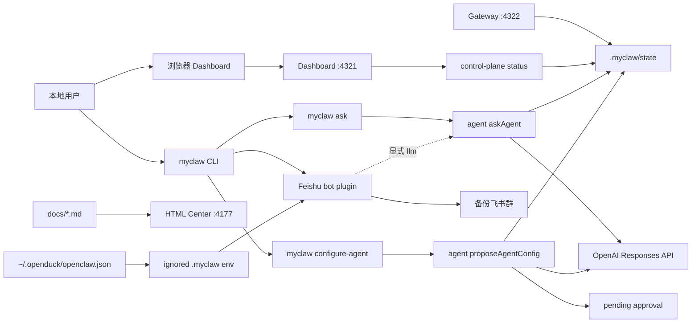
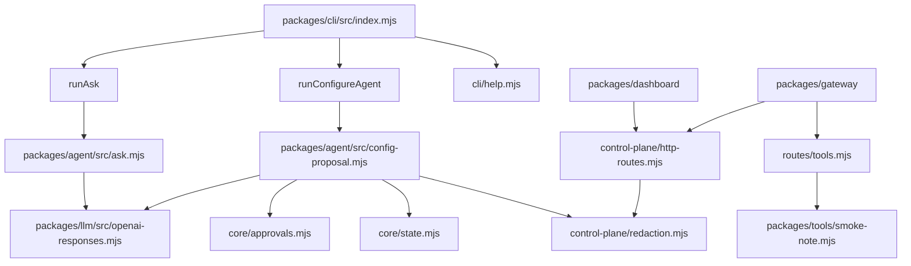
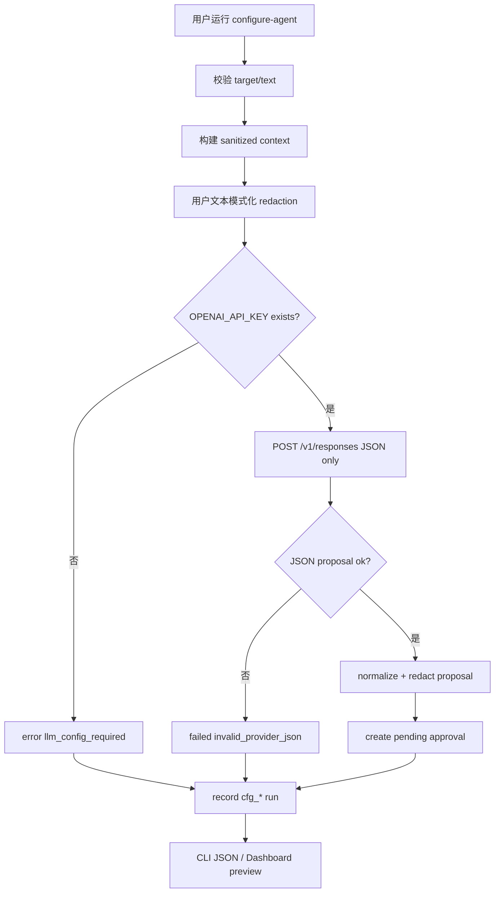
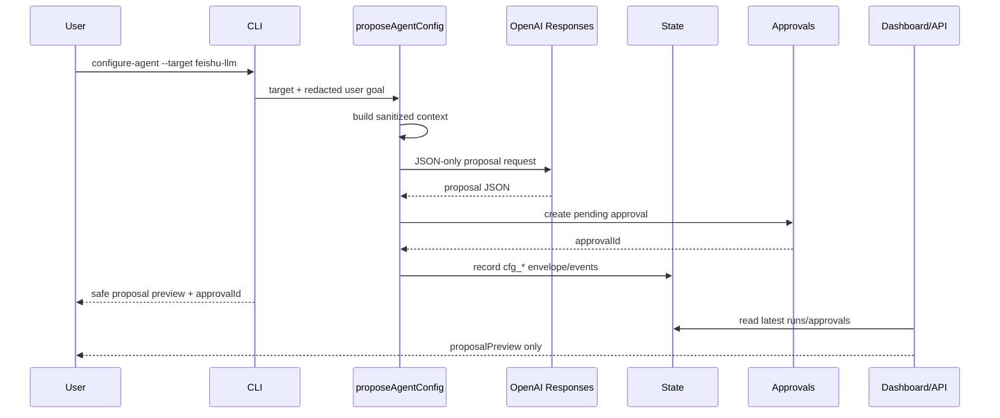
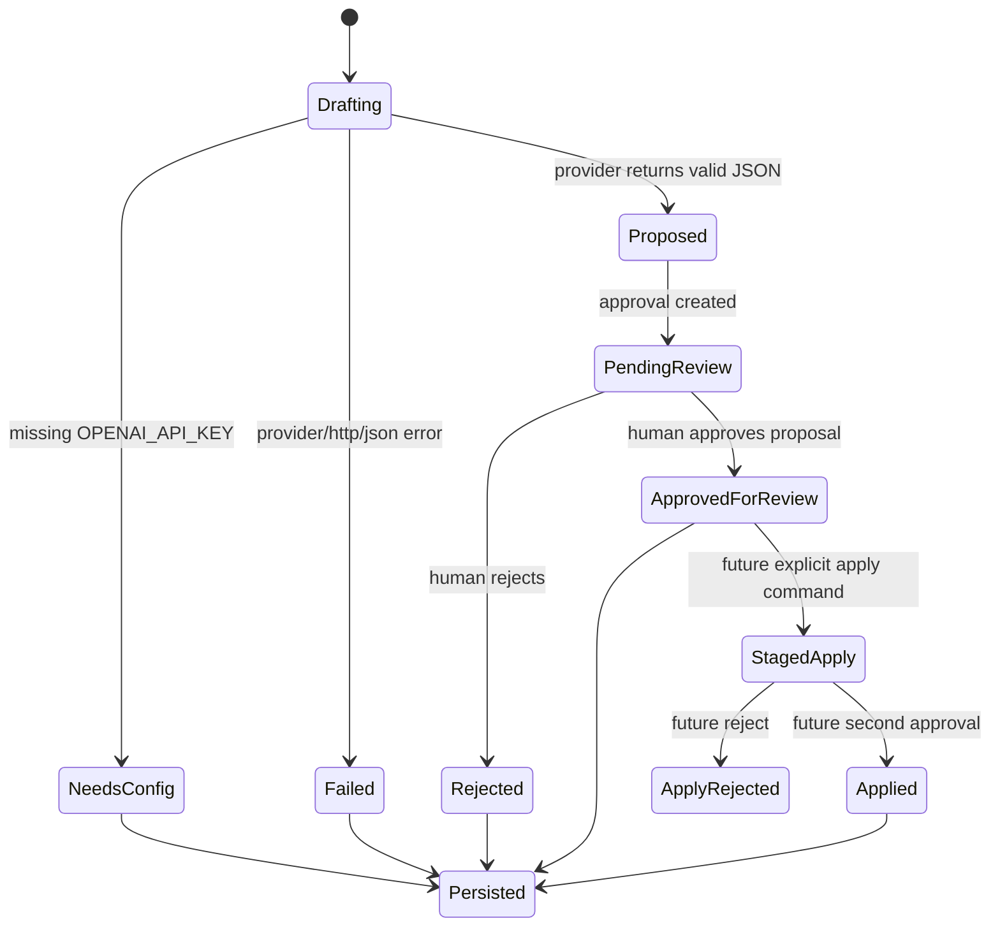
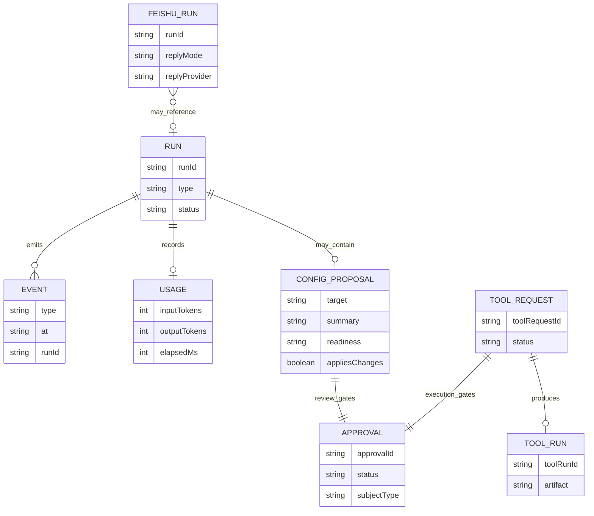
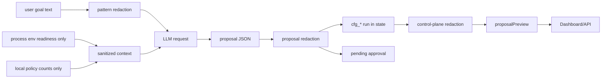
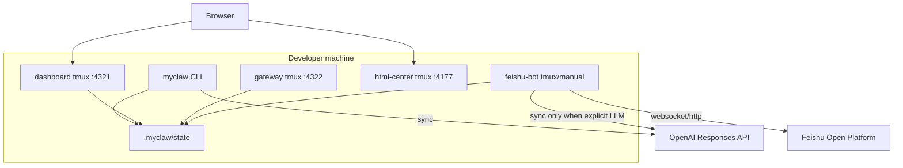

# MyClaw Phase 1.8 实现架构可视化评审

更新时间：2026-06-04

## 总诊断

Phase 1.8 把 L3 从“只能问真实 LLM”推进到“可以让 agent 生成配置提案”：`myclaw configure-agent` 会基于 sanitized context 调用 OpenAI Responses，生成 review-only proposal，写入 `cfg_*` run，并创建 pending approval。结论：你现在可以用 agent 做配置审查和建议，但不能让 agent 自动应用配置；下一阶段必须把 staged apply、ToolDescriptor、policy snapshot、durable dispatch 分开实现。

| 评分项 | 当前分 | 判断 |
|---|---:|---|
| 设计清晰度 | 9/10 | 清楚区分 ask、config proposal、tool calling、apply |
| 可扩展性 | 8/10 | proposal、LLM adapter、approval、redaction 分包；后续可接 staged apply |
| 可靠性 | 7/10 | `cfg_*` run 与 approval 落盘；仍缺 apply recovery、provider retry、idempotency |
| 可维护性 | 8/10 | 新模块小于 200 行；CLI 425 行接近拆分线 |
| 安全性 | 8/10 | 默认不读 secret、不写配置、不暴露完整 proposal；prompt redaction 不是完整 DLP |

## 大规划图

这张图回答：从人类可测角度看，Phase 1.8 处在整个 milestone 的哪里。

```mermaid
flowchart LR
  E0["E0 本地消息"] --> E1["E1 Dashboard"]
  E1 --> E1C["E1C Stream + Scoped Token"]
  E1C --> E2B["E2B Feishu 群回复"]
  E2B --> E4["E4 OpenClaw stage"]
  E4 --> E5["E5 Approval decision"]
  E5 --> E5B["E5B Tool approval smoke"]
  E5B --> E6A["E6A LLM Reply Smoke"]
  E6A --> E6B["E6B Agent Config Proposal"]
  E6B --> E6["E6 Agent Tool Loop"]
  E6 --> E8["E8 Session Search"]
  E8 --> E9["E9 Agent-to-Agent"]
  E9 --> E10["E10 Long Memory"]
```

Review 观察：

- 优点：E6B 给用户一个现在能测的 agent 配置审查入口。
- 优点：E6B 仍排在 E5B 之后，避免 agent 写操作早于审批系统。
- 风险：用户可能把 proposal approval 误认为 apply approval。
- 改进：下一阶段新增 staged apply，单独生成 apply approval 和 artifact diff。

## 系统上下文图

这张图回答：MyClaw Phase 1.8 和用户、Feishu、OpenAI、HTML Center、OpenClaw 参考配置的边界在哪里。

```mermaid
flowchart LR
  User["本地用户"] --> CLI["myclaw CLI"]
  User --> Browser["浏览器 Dashboard"]
  CLI --> Ask["myclaw ask"]
  CLI --> Configure["myclaw configure-agent"]
  Ask --> AgentAsk["agent askAgent"]
  Configure --> ConfigProposal["agent proposeAgentConfig"]
  AgentAsk --> LLM["OpenAI Responses API"]
  ConfigProposal --> LLM
  ConfigProposal --> Approval["pending approval"]
  Browser --> Dashboard["Dashboard :4321"]
  Dashboard --> Control["control-plane status"]
  CLI --> FeishuBot["Feishu bot plugin"]
  FeishuBot --> FeishuGroup["备份飞书群"]
  FeishuBot -.显式 llm.-> AgentAsk
  Gateway["Gateway :4322"] --> State[".myclaw/state"]
  Control --> State
  AgentAsk --> State
  ConfigProposal --> State
  Docs["docs/*.md"] --> HtmlCenter["HTML Center :4177"]
  Openduck["~/.openduck/openclaw.json"] --> LocalEnv["ignored .myclaw env"]
  LocalEnv --> FeishuBot
```

Review 观察：

- 优点：OpenAI 调用仍只在 agent/LLM adapter 内部，Gateway 不直接依赖 provider。
- 优点：openduck 配置只读导入 ignored `.myclaw/`，本轮 proposal 不读取 secret 值。
- 优点：Dashboard 通过 control-plane 只看 redacted run 和 proposalPreview。
- 风险：用户输入给 `--text` 的敏感内容会被模式化脱敏，但不是完整泄漏防护。
- 改进：下一阶段把 prompt 输入前置为本地 structured checklist，减少自由文本粘贴 secret。

## 模块架构图

这张图回答：本轮新增的配置提案如何保持主线干净，并为后续 staged apply 留接口。

```mermaid
flowchart TB
  CLI["packages/cli/src/index.mjs"] --> AskCmd["runAsk"]
  CLI --> ConfigCmd["runConfigureAgent"]
  CLI --> Help["cli/help.mjs"]
  AskCmd --> AgentAsk["packages/agent/src/ask.mjs"]
  ConfigCmd --> AgentConfig["packages/agent/src/config-proposal.mjs"]
  AgentAsk --> OpenAIAdapter["packages/llm/src/openai-responses.mjs"]
  AgentConfig --> OpenAIAdapter
  AgentConfig --> Approvals["core/approvals.mjs"]
  AgentConfig --> StateStore["core/state.mjs"]
  AgentConfig --> Redaction["control-plane/redaction.mjs"]
  Dashboard["packages/dashboard"] --> ControlRoutes["control-plane/http-routes.mjs"]
  Gateway["packages/gateway"] --> ControlRoutes
  ControlRoutes --> Redaction
  Gateway --> ToolRoutes["routes/tools.mjs"]
  ToolRoutes --> SmokeTool["packages/tools/smoke-note.mjs"]
```

Review 观察：

- 优点：`config-proposal.mjs` 是独立插件状能力，没有塞进 ask runtime。
- 优点：approval 创建复用 core，不在 CLI 里手写状态格式。
- 优点：control-plane 是唯一脱敏出口，Dashboard/Gateway 不复制敏感逻辑。
- 风险：CLI 主文件 425 行，继续加命令会碰到 450 预警。
- 改进：拆 `packages/cli/src/commands/configure-agent.mjs` 和 `commands/ask.mjs`。

## 核心业务流程图

这张图回答：一次 `myclaw configure-agent` 如何从用户目标变成可审阅的配置提案。

```mermaid
flowchart TD
  Start["用户运行 configure-agent"] --> Validate["校验 target/text"]
  Validate --> Sanitize["构建 sanitized context"]
  Sanitize --> RedactText["用户文本模式化 redaction"]
  RedactText --> Key{"OPENAI_API_KEY exists?"}
  Key -->|否| NeedConfig["error llm_config_required"]
  Key -->|是| Request["POST /v1/responses JSON only"]
  Request --> Parse{"JSON proposal ok?"}
  Parse -->|否| Failed["failed invalid_provider_json"]
  Parse -->|是| Normalize["normalize + redact proposal"]
  Normalize --> Approval["create pending approval"]
  Approval --> Persist["record cfg_* run"]
  NeedConfig --> Persist
  Failed --> Persist
  Persist --> Output["CLI JSON / Dashboard preview"]
```

Review 观察：

- 优点：缺 key 不伪造提案，仍写入可诊断 run。
- 优点：proposal approval 在生成阶段创建，但不触发任何副作用。
- 风险：provider 返回非法 JSON 会失败；还没有自动 retry 或 fallback。
- 改进：加 provider retry、schema explain error 和本地 checklist fallback。

## 关键时序图

这张图回答：配置提案一次请求里 CLI、Agent、LLM、State、Dashboard 如何协作。

```mermaid
sequenceDiagram
  participant U as User
  participant C as CLI
  participant A as proposeAgentConfig
  participant O as OpenAI Responses
  participant S as State
  participant P as Approvals
  participant D as Dashboard/API

  U->>C: configure-agent --target feishu-llm
  C->>A: target + redacted user goal
  A->>A: build sanitized context
  A->>O: JSON-only proposal request
  O-->>A: proposal JSON
  A->>P: create pending approval
  P-->>A: approvalId
  A->>S: record cfg_* envelope/events
  C-->>U: safe proposal preview + approvalId
  D->>S: read latest runs/approvals
  D-->>U: proposalPreview only
```

Review 观察：

- 优点：CLI 返回给本机用户可见，控制面默认只给 preview。
- 优点：approval 队列把“人来审”变成可跟踪状态。
- 风险：approval decision 当前不会触发 apply，用户需要文档和 UI 清楚提示。
- 改进：Dashboard 增加 config proposal drawer，展示可审字段但仍隐藏敏感输入。

## 状态机图

这张图回答：配置提案、审批、未来 apply 的生命周期如何区分。

```mermaid
stateDiagram-v2
  [*] --> Drafting
  Drafting --> NeedsConfig: missing OPENAI_API_KEY
  Drafting --> Proposed: provider returns valid JSON
  Drafting --> Failed: provider/http/json error
  Proposed --> PendingReview: approval created
  PendingReview --> Rejected: human rejects
  PendingReview --> ApprovedForReview: human approves proposal
  ApprovedForReview --> StagedApply: future explicit apply command
  StagedApply --> Applied: future second approval
  StagedApply --> ApplyRejected: future reject
  NeedsConfig --> Persisted
  Failed --> Persisted
  Rejected --> Persisted
  ApprovedForReview --> Persisted
  Applied --> Persisted
```

Review 观察：

- 优点：review approval 和 future apply approval 被明确分开。
- 优点：失败、配置缺失、拒绝都能落盘观察。
- 风险：当前没有 `expired`、`superseded`、`retrying` 状态。
- 改进：proposal 加 checksum/version，apply 前确认仍匹配当前本地配置。

## 数据模型 / ER 图

这张图回答：ask run、config proposal、approval、tool request 和 event 如何关联。

```mermaid
erDiagram
  RUN ||--o{ EVENT : emits
  RUN ||--o| USAGE : records
  RUN ||--o| CONFIG_PROPOSAL : may_contain
  CONFIG_PROPOSAL ||--|| APPROVAL : review_gates
  TOOL_REQUEST ||--|| APPROVAL : execution_gates
  TOOL_REQUEST ||--o| TOOL_RUN : produces
  FEISHU_RUN }o--o| RUN : may_reference

  RUN { string runId string type string status }
  EVENT { string type string at string runId }
  USAGE { int inputTokens int outputTokens int elapsedMs }
  CONFIG_PROPOSAL { string target string summary string readiness boolean appliesChanges }
  APPROVAL { string approvalId string status string subjectType }
  TOOL_REQUEST { string toolRequestId string status }
  TOOL_RUN { string toolRunId string artifact }
  FEISHU_RUN { string runId string replyMode string replyProvider }
```

Review 观察：

- 优点：`CONFIG_PROPOSAL` 是一等结果类型，不伪装成 tool request。
- 优点：tool approval 和 proposal approval 语义不同，后续能分别建 UI。
- 风险：完整 proposal 当前存在本地 state，控制面脱敏但本机文件仍需被视为敏感。
- 改进：未来加 proposal field-level sensitivity 和 encrypted local state。

## 数据流图

这张图回答：配置相关数据从哪里来、经过哪些处理、最终到哪里去。

```mermaid
flowchart LR
  Env["process env readiness only"] --> Context["sanitized context"]
  Policy["local policy counts only"] --> Context
  UserGoal["user goal text"] --> PromptRedact["pattern redaction"]
  PromptRedact --> LLMRequest["LLM request"]
  Context --> LLMRequest
  LLMRequest --> Proposal["proposal JSON"]
  Proposal --> ProposalRedact["proposal redaction"]
  ProposalRedact --> Run["cfg_* run in state"]
  ProposalRedact --> Approval["pending approval"]
  Run --> Control["control-plane redaction"]
  Control --> Preview["proposalPreview"]
  Preview --> Dashboard["Dashboard/API"]
```

Review 观察：

- 优点：发送给 LLM 的配置上下文不含 secret 值，只含 readiness 和数量。
- 优点：控制面二次脱敏，避免 proposal 全文通过 API 扩散。
- 风险：用户自由文本仍可能带入未知格式的敏感信息。
- 改进：把配置检查改成结构化问题，并给 CLI 加敏感文本确认提示。

## 部署图

这张图回答：本机服务和外部 provider 运行在哪里，哪些是同步/异步。

```mermaid
flowchart TB
  subgraph Local["Developer machine"]
    CLI["myclaw CLI"]
    Dashboard["dashboard tmux :4321"]
    Gateway["gateway tmux :4322"]
    HtmlCenter["html-center tmux :4177"]
    State[".myclaw/state"]
    FeishuBot["feishu-bot tmux/manual"]
    CLI --> State
    Dashboard --> State
    Gateway --> State
    FeishuBot --> State
  end
  CLI -->|sync| OpenAI["OpenAI Responses API"]
  FeishuBot -->|sync only when explicit LLM| OpenAI
  FeishuBot -->|websocket/http| Feishu["Feishu Open Platform"]
  Browser["Browser"] --> Dashboard
  Browser --> HtmlCenter
```

Review 观察：

- 优点：没有新增常驻 agent 配置服务，复杂度低。
- 优点：Dashboard/Gateway 仍读本地 state，不需要数据库迁移。
- 风险：Feishu bot、Dashboard、Gateway 仍靠 tmux 手工管理。
- 改进：`myclaw services status/start/stop` 统一本地服务生命周期。

## Human Experiments

| 实验 | 状态 | 用户动作 | 成功信号 |
|---|---|---|---|
| E0 | ready | `send --text` | ok envelope，run 可见 |
| E1 | ready | 打开 Dashboard | Phase 1.8、Approvals、LLM health、E6B 可见 |
| E1C | ready | 测非 loopback scoped token 与 SSE | 错 scope 被拒绝，stream snapshot 脱敏 |
| E2B | ready | 在备份飞书群发文本 | 群内直接收到确定性回复 |
| E5B | ready | POST smoke tool + approve/reject | approved 才写 tool-run；rejected 不执行 |
| E6A | ready | `myclaw ask --text ... --json` | 真实 answer、provider、usage、`toolCalls=[]` |
| E6B | ready | `myclaw configure-agent --target feishu-llm --text ... --json` | `cfg_*` run、proposal、pending approval、`appliesChanges=false` |
| E6 | planned | agent run/resume/tool loop | 后续开放 |
| E8/E9/E10 | planned | search/A2A/memory | 后续开放 |

## 概念解释

| 概念 | 含义 | 当前边界 |
|---|---|---|
| LLM reply smoke | 单轮真实模型回复 | 不含工具调用、记忆、streaming |
| Config proposal | agent 生成配置建议 | review-only，不 apply、不写 `.myclaw` |
| Sanitized context | 只含 readiness、计数和 guardrail | 不含 secret、chat_id、sender_id |
| Proposal preview | 控制面暴露的摘要 | 不含完整 proposal 正文 |
| Review approval | 人类审阅记录 | 当前不会触发配置变更 |
| Staged apply | 未来显式落地步骤 | 必须二次批准并输出 diff |
| ToolDescriptor | 后续工具注册契约 | Phase 1.8 尚未实现 |
| Durable dispatch | 可恢复工具执行分发 | 后续 E6 重点 |
| Policy snapshot | 工具可见性和审批策略快照 | 后续和每次 tool call 绑定 |
| Structure guardrail | 技术债红线 | 500 行、20 文件、4 层深度 |

## 相似技术比较

| 维度 | MyClaw Phase 1.8 | OpenClaw | Hermes-agent | OpenHuman |
|---|---|---|---|---|
| LLM 入口 | `ask` + review-only config proposal | 成熟 agent/plugin runtime | 完整 agent loop | agent harness + provider/tool loop |
| 配置变更 | 当前不 apply，只提案 | Control UI / plugin config 更厚 | 配置散在 agent/runtime | controller/registry 组合更强 |
| 工具调用 | 未开放，仅 E5B smoke | policy/sandbox 更成熟 | registry/check_fn | ToolSpec/permission/scope |
| Feishu/Lark | 独立 bot，显式 LLM opt-in | 完整 Feishu extension | 非重点 | 多 controller/channel 思路 |
| 记忆 | JSON/JSONL state | session/plugin 边界 | SQLite/FTS 强 | memory tree/UnifiedMemory 强 |
| UI/观测 | Dashboard preview/health/run/audit/experiments | Control UI | TUI/ops | UI-first |

## 目录结构与文件行数

| 路径 | 行数/文件数 | 职责 | 评价 |
|---|---:|---|---|
| `packages/agent/src/config-proposal.mjs` | 213 行 | review-only 配置提案、sanitized context、target registry、approval 创建 | 健康；下一步拆 schema/prompt 可更稳 |
| `packages/agent/src/ask.mjs` | 86 行 | 单轮 ask runtime、事件和 run 记录 | 健康；后续接 provider registry |
| `packages/llm/src/openai-responses.mjs` | 127 行 | OpenAI Responses adapter | 健康；缺 retry/streaming |
| `packages/cli/src/index.mjs` | 421 行 | CLI 命令入口 | 接近 450；下一轮必须拆 commands |
| `packages/cli/src/config-output.mjs` | 62 行 | configure-agent safe projection 输出 | 健康；默认不打印完整 proposal |
| `packages/cli/src/help.mjs` | 40 行 | CLI help 文案 | 健康 |
| `packages/cli/test/config-agent.test.mjs` | 98 行 | configure-agent missing-key 与 safe JSON 测试 | 健康 |
| `packages/agent/test/config-proposal.test.mjs` | 104 行 | proposal、approval、target、脱敏测试 | 健康 |
| `packages/control-plane/src/redaction.mjs` | 220 行 | Feishu/LLM/config proposal/approval 控制面脱敏 | 健康；规则继续集中维护 |
| `packages/control-plane/src/status.mjs` | 342 行 | status/runs/events/health/toolRequests/approvals | 健康，但继续增长要拆 health builder |
| `packages/control-plane/src/experiments.mjs` | 349 行 | E0-E10 与 L0-L6 payload | 健康；增长后拆 experiment registry |
| `packages/dashboard/src/client.mjs` | 432 行 | Dashboard renderer | 接近 450；下一轮拆 section renderer |
| `docs/build-review-html.mjs` | 414 行 | Markdown 到 HTML 生成器 | 接近 450；下一轮拆 parser/template |
| `docs/modules` | 16 直接文件 | 模块化源文档 | 低于 20 文件限制 |
| `docs/rendered/modules` | 16 直接文件 | 生成 HTML 模块页 | 生成物；低于 20 文件限制 |
| 仓库结构 | 131+ 文件，最大深度 4 | `npm run check` 红线 | 当前通过；无目录超过 20 个直接文件 |

## 风险分级

| 等级 | 问题 | 影响 | 建议 |
|---|---|---|---|
| High | proposal approval 被误当成 apply 授权 | 用户以为 agent 已经配置成功，后续实现可能绕过安全门 | UI/文档/CLI 都标注 review-only；staged apply 单独命令和二次 approval |
| High | 用户 prompt 可能包含未知格式 secret | 模式化 redaction 不能覆盖所有敏感格式 | 已默认 safe output；继续加敏感文本提示和结构化 checklist |
| High | 未来直接接模型工具调用 | 可能过早开放 shell/file/network | 先做 ToolDescriptor、policy snapshot、sandbox、idempotency、approval pause |
| Medium | CLI 421 行，Dashboard 432 行 | 下一轮功能会触发 450 预警 | 先拆 commands 和 section renderer |
| Medium | provider 没有 retry/backoff | 临时网络错误会直接失败 | 加 retry policy、timeout 分类和错误码 |
| Medium | `--unsafe-full-local` 可输出完整 envelope | 用户若复制到远程日志会泄露 proposal | 默认不用；只在本机刻意查看时使用 |
| Medium | proposal 本地 state 仍保存完整建议 | 本机 state 文件可能含用户目标或敏感回显 | 提醒 state 视为敏感；后续 field-level sensitivity |
| Low | Feishu run 与 ask run 未关联 | Dashboard 追踪群聊智能回复不够顺 | 增加 correlation id |

## Linus 视角严苛审查

独立 subagent 结论：现在不能笼统说“可以用 agent 配置”。只能说可以用 agent 生成 review-only 配置提案，用来检查 Feishu LLM 配置缺口；它不 apply、不写 `.myclaw`、不启动飞书 LLM、不具备工具调用。approval 当前只代表“请人审阅”，不是“授权执行”。

| 等级 | 发现 | 处理 |
|---|---|---|
| Critical | approval API 曾可能暴露 proposal summary | 已修：approval 创建使用 redacted summary；approval list/detail 走 `redactApprovalRecord`；补测试 |
| High | CLI `--json` 曾会打印完整 proposal envelope | 已修：默认输出 safe projection；显式 `--unsafe-full-local` 才输出完整本机 envelope；补成功路径测试 |
| High | `target` 曾是自由字符串 | 已修：当前只允许 `feishu-llm`，非法 target 不回显；补测试 |
| High | redaction 是模式匹配，不是 DLP | 保留风险：不主动读取 secret，但用户不能把 secret 粘进 prompt；后续结构化 checklist |
| Medium | Agent 层直接知道 Feishu env | 下一阶段抽 adapter `safeConfigSnapshot()`，避免每个接入层污染 agent runtime |
| Medium | proposal 和 staged apply 契约还没硬隔离 | 后续新建 `staged-config-change`，带 hash、diff、allowlist 路径、过期时间和二次确认 |
| Low | CLI/Dashboard/docs builder 接近 450 行 | 下一轮先拆分 |

## Skill 规范自检

- 已按 `web-design-review` 输出可视化 design review dashboard。
- 报告覆盖系统上下文、模块架构、业务流程、时序、状态机、ER、数据流、部署图。
- 报告包含目录行数、概念解释、相似技术比较、风险分级、Linus 视角。
- 单文件 500 行、每目录 20 文件、目录深度 4 层由 `npm run check` 执行。
- 按 `skill-creator` 原则检查：skill 规则保持精简，复杂细节由脚本和报告承载；本轮未向 skill 增加过程文档。

## 下一阶段建议

1. 给 `configure-agent` 增加 staged apply：只写 ignored `.myclaw`，必须输出 diff、checksum 和二次 approval。
2. 抽 ToolDescriptor registry、durable dispatch、claim/recovery、idempotency key 和完整 ToolRequest 生命周期。
3. 给 OpenAI Responses 接 model tool calling，但只暴露 policy 裁剪后的工具。
4. 拆 `packages/cli/src/index.mjs`、`packages/dashboard/src/client.mjs` 和 `docs/build-review-html.mjs`。
5. 给 Feishu LLM reply 增加 correlation id、per-channel opt-in 和 Dashboard run chain。
