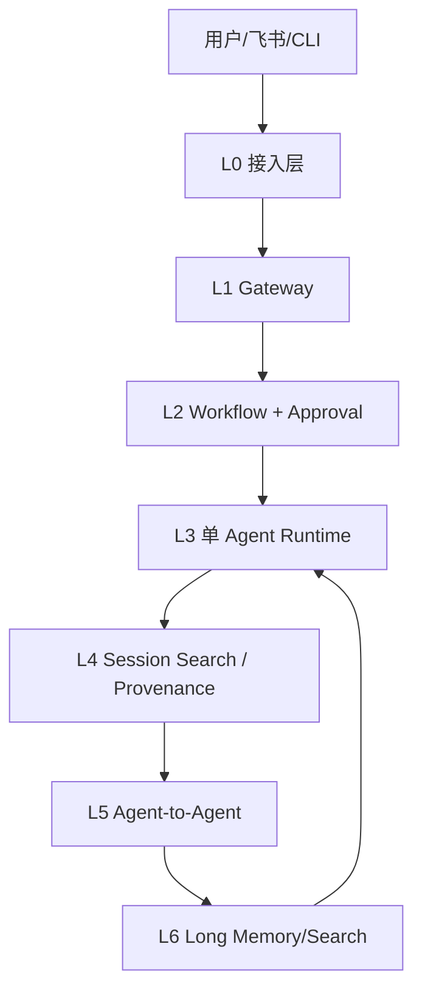
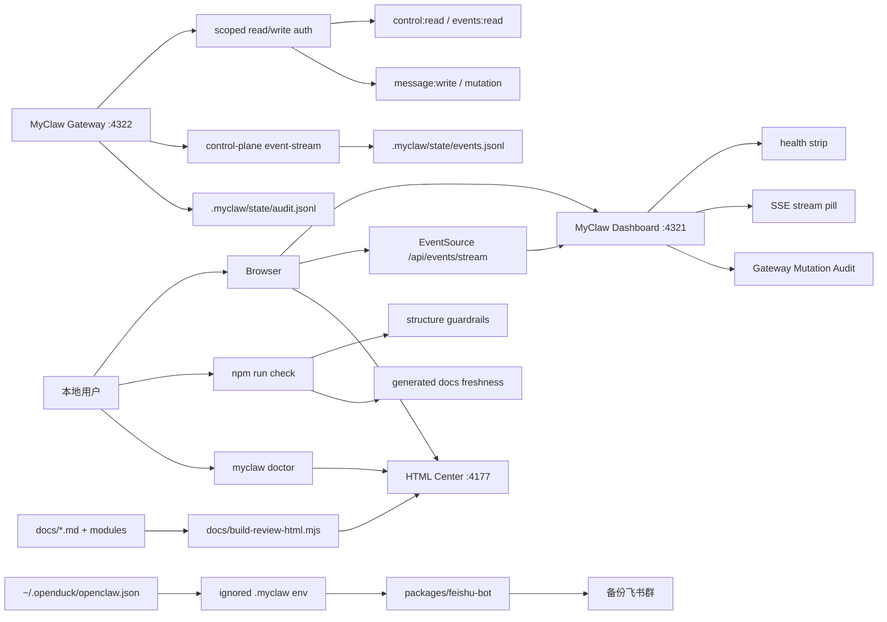
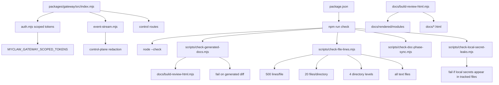
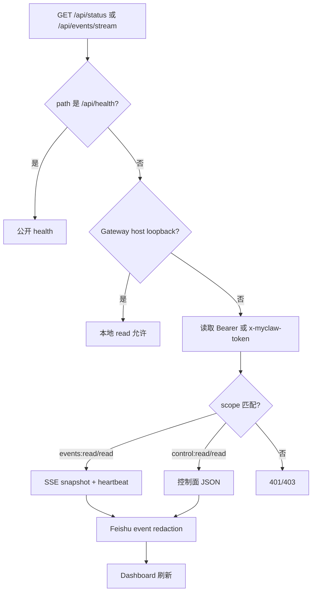
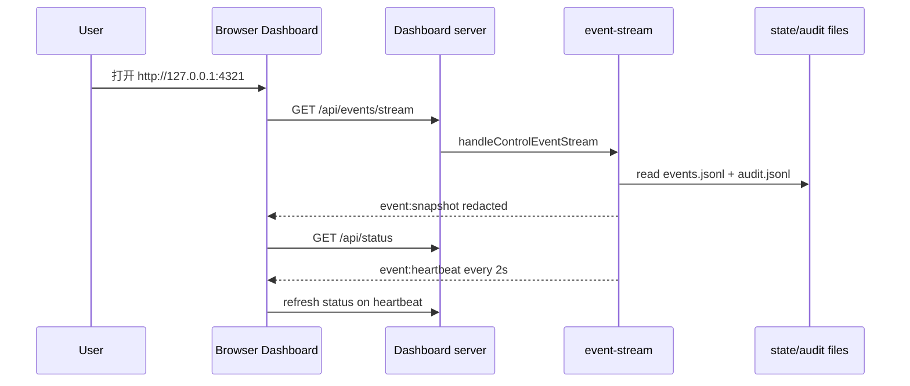
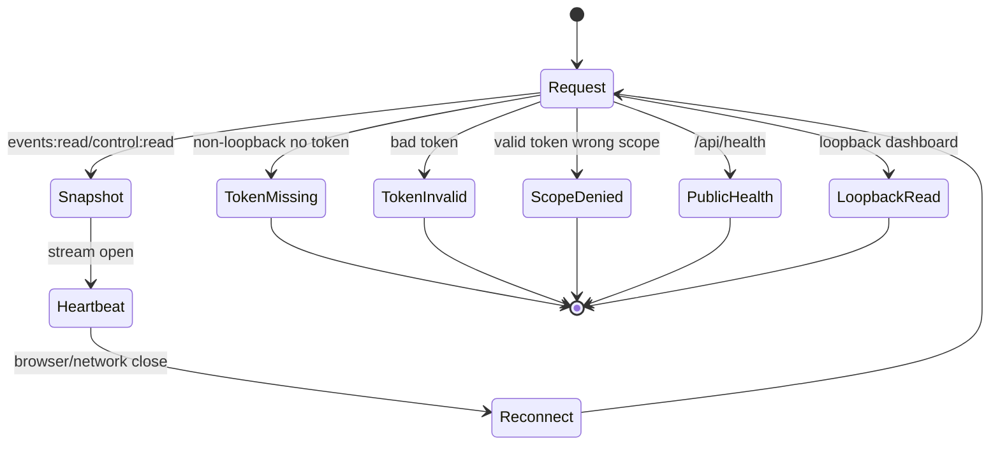
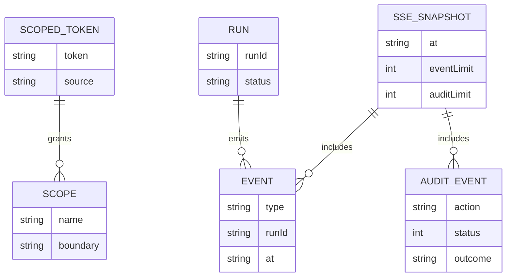
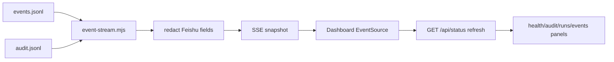

# MyClaw Phase 1.5 实现架构可视化评审

更新时间：2026-05-31

## 总诊断

Phase 1.5 把 L1 从“能看健康、能追写操作”推进到“能实时感知连接、能分权读取”：Gateway SSE snapshot/heartbeat 已接入 Dashboard，非 loopback 控制面 GET 统一走 read auth，scoped token 可把 `message:write`、`events:read`、`control:read` 分开。结论：MyClaw 可以继续做 approval-to-tool，但还不能让 agent 直接执行真实工具。

| 评分项 | 当前分 | 判断 |
|---|---:|---|
| 设计清晰度 | 9/10 | L0-L6 分层测试新增 E1C stream/scoped token |
| 可扩展性 | 8/10 | Gateway read/write scope 开始分离，后续插件可按最小权限接入 |
| 可靠性 | 8/10 | Dashboard 可随 SSE heartbeat 自动刷新，但 stream 还没有 seq/replay |
| 可维护性 | 8/10 | 结构债务和生成物 stale 进入 `npm run check`，Dashboard client 已到 432 行 |
| 安全性 | 9/10 | 非 loopback 控制面 GET 不再裸露；SSE snapshot 复用 Feishu 脱敏 |

## 大规划图

这张图回答：当前哪些能力已经可由用户亲手测试，哪些还在后续阶段。

```mermaid
flowchart LR
  E0[E0 本地消息] --> E1[E1 Dashboard]
  E1 --> E1B[E1B Health + Audit]
  E1B --> E1C[E1C Stream + Scoped Token]
  E1C --> E2A[E2A Openduck Feishu credential presence]
  E2A --> E2B[E2B Feishu websocket group reply]
  E2B --> E4[E4 OpenClaw stage]
  E4 --> E5[E5 Approval decision]
  E5 --> E7[E7 工程约束]
  E7 --> L0[L0 接入层]
  L0 --> L1[L1 Gateway]
  L1 --> L2[L2 Workflow + Approval]
  L2 --> E6[E6 单 Agent]
  E6 --> E8[E8 Session Search]
  E8 --> E9[E9 Agent-to-Agent]
  E9 --> E10[E10 Long Memory]
  E2[E2 Feishu outbound] -.配置后.-> E3[E3 callback smoke]
  E2A -.credentials present.-> E2B
```

Review 观察：

- 优点：E7 把技术债约束变成可执行实验。
- 优点：当前可测入口已经覆盖消息、Dashboard health/audit/stream、scoped token、Feishu app credential presence、Feishu 群回复、迁移、审批、结构约束。
- 优点：L0-L6 让“先交互基础、后 agent 智能”成为硬路线。
- 风险：L3-L6 仍未实现，不能测试 agent runtime、agent 协作 和记忆。
- 改进：下一阶段优先补 approval-to-tool、route schema 和 event seq/replay，而不是直接堆能执行真实工具的 agent。

## 分层交互架构图

这张图回答：为什么接入层和 gateway 要排在 agent、agent 协作、记忆之前。

```mermaid
flowchart TB
  User[用户/飞书/CLI] --> L0[L0 接入层]
  L0 --> L1[L1 Gateway]
  L1 --> L2[L2 Workflow + Approval]
  L2 --> L3[L3 单 Agent Runtime]
  L3 --> L4[L4 Session Search / Provenance]
  L4 --> L5[L5 Agent-to-Agent]
  L5 --> L6[L6 Long Memory/Search]
  L6 --> L3
```

Review 观察：

- 优点：L0/L1 先解决信息入口、回执、鉴权、状态查询，是所有 agent 能力的地基。
- 优点：L2 把高风险动作先变成 review/approval，避免 agent 直接执行危险操作。
- 风险：如果跳过 L0/L1，后续 agent 和记忆会缺少可信事件来源；如果跳过 L4，agent-to-agent 没有可追踪上下文。
- 改进：Dashboard 必须按层展示测试入口和开放条件。

## 系统上下文图

这张图回答：HTML Center、文档生成、Dashboard、openduck 本地配置和正在运行的 OpenClaw 之间的边界。

```mermaid
flowchart LR
  User[本地用户] --> Browser[Browser]
  Browser --> Dashboard[MyClaw Dashboard :4321]
  Dashboard --> Health[health strip]
  Dashboard --> Stream[SSE stream pill]
  Dashboard --> AuditView[Gateway Mutation Audit]
  Browser --> EventSource[EventSource /api/events/stream]
  EventSource --> Dashboard
  Gateway[MyClaw Gateway :4322] --> ScopedAuth[scoped read/write auth]
  ScopedAuth --> ReadPlane[control:read / events:read]
  ScopedAuth --> WritePlane[message:write / mutation]
  Gateway --> EventStream[control-plane event-stream]
  EventStream --> EventsLog[.myclaw/state/events.jsonl]
  Gateway[MyClaw Gateway :4322] --> AuditLog[.myclaw/state/audit.jsonl]
  Browser --> HtmlCenter[HTML Center :4177]
  User --> Check[npm run check]
  Check --> Structure[structure guardrails]
  Check --> Generated[generated docs freshness]
  User --> Doctor[myclaw doctor]
  Doctor --> HtmlCenter
  Openduck[~/.openduck/openclaw.json] --> LocalEnv[ignored .myclaw env]
  LocalEnv --> FeishuBot[packages/feishu-bot]
  FeishuBot --> FeishuGroup[备份飞书群]
  Docs[docs/*.md + modules] --> Builder[docs/build-review-html.mjs]
  Builder --> HtmlCenter
```

Review 观察：

- 优点：旧链接打不开的根因是服务未运行，已用 `ensure_html_center.py` 恢复。
- 优点：openduck secret 不进入 repo，导入脚本只写 ignored `.myclaw/`。
- 优点：HTML Center 仍依赖 tmux 常驻，但 Dashboard health 能暴露 unreachable。
- 风险：Feishu bot 目前只做文本自动回复，已支持默认封闭 policy、persistent replay 和 direct/thread 模式，但还没有 rich card 和 agent replyBuilder。
- 改进：后续把 health strip 接到 event stream 或自动刷新，不只靠手动刷新。

## 模块架构图

这张图回答：Gateway stream/scoped token 如何和结构约束一起进入开发闭环。

```mermaid
flowchart TB
  Package[package.json] --> CheckScript[npm run check]
  GatewayIndex[packages/gateway/src/index.mjs] --> Auth[auth.mjs scoped tokens]
  GatewayIndex --> EventStream[event-stream.mjs]
  GatewayIndex --> ControlRoutes[control routes]
  EventStream --> Redaction[control-plane redaction]
  Auth --> ScopedTokens[MYCLAW_GATEWAY_SCOPED_TOKENS]
  CheckScript --> Syntax[node --check]
  CheckScript --> Generated[scripts/check-generated-docs.mjs]
  CheckScript --> Structure[scripts/check-file-lines.mjs]
  CheckScript --> PhaseSync[scripts/check-doc-phase-sync.mjs]
  CheckScript --> SecretScan[scripts/check-local-secret-leaks.mjs]
  Generated --> Builder[docs/build-review-html.mjs]
  Generated --> Fresh[fail on generated diff]
  Structure --> LineLimit[500 lines/file]
  Structure --> FileLimit[20 files/directory]
  Structure --> DepthLimit[4 directory levels]
  Structure --> TextDetect[all text files]
  BuildDocs[docs/build-review-html.mjs] --> Rendered[docs/rendered/modules]
  BuildDocs --> DocsRoot[docs/*.html]
  SecretScan --> NoLeaks[fail if local secrets appear in tracked files]
```

Review 观察：

- 优点：约束是硬失败，不是 README 建议。
- 优点：目录文件数按直接文件计算，能防止一个目录变抽屉。
- 优点：本地 secret 泄露扫描进入 `npm run check`，不是只靠人工纪律。
- 优点：Feishu SDK 只在 `packages/feishu-bot`，core/runtime/gateway 主线保持干净。
- 优点：SSE stream、auth、control route 分开，主入口只做分发和权限边界。
- 风险：`docs/build-review-html.mjs` 414 行，仍接近 450 预警。
- 改进：下一步拆 Dashboard renderer 和 Markdown parser。

## 核心业务流程图

这张图回答：一次非 loopback Gateway 读请求如何被 scoped token 约束。

```mermaid
flowchart TD
  Start[GET /api/status 或 /api/events/stream] --> Health{path 是 /api/health?}
  Health -->|是| Public[公开 health]
  Health -->|否| Host{Gateway host loopback?}
  Host -->|是| LocalRead[本地 read 允许]
  Host -->|否| Token[读取 Bearer 或 x-myclaw-token]
  Token --> Scope{scope 匹配?}
  Scope -->|control:read/read| Control[控制面 JSON]
  Scope -->|events:read/read| Stream[SSE snapshot + heartbeat]
  Scope -->|否| Deny[401/403]
  Stream --> Redact[Feishu event redaction]
  Control --> Redact
  Redact --> Dashboard[Dashboard 刷新]
```

Review 观察：

- 优点：非 loopback read plane 不再裸露，`events:read` 与 `control:read` 分开。
- 优点：legacy gateway token 仍是 `*`，避免破坏本地脚本。
- 风险：SSE 目前是 snapshot/heartbeat，不是有 seq 的增量事件总线。
- 改进：下一步补 route schema、event seq/replay 和短期 stream URL。

## 关键时序图

这张图回答：Dashboard 如何通过 SSE 感知状态并刷新。

```mermaid
sequenceDiagram
  participant U as User
  participant B as Browser Dashboard
  participant D as Dashboard server
  participant S as event-stream
  participant F as state/audit files

  U->>B: 打开 http://127.0.0.1:4321
  B->>D: GET /api/events/stream
  D->>S: handleControlEventStream
  S->>F: read events.jsonl + audit.jsonl
  S-->>B: event:snapshot redacted
  B->>D: GET /api/status
  S-->>B: event:heartbeat every 2s
  B->>D: refresh status on heartbeat
```

Review 观察：

- 优点：Dashboard 不需要读取本地文件，只通过 HTTP/SSE 控制面。
- 优点：stream 先读 snapshot 再发 headers，避免半截 SSE 500。
- 风险：heartbeat 刷新是轻量轮询，不是精确 delta。
- 改进：下一阶段加 seq/replay 和 changed event。

## 状态机图

这张图回答：Gateway read token 和 SSE 连接的状态如何流转。

```mermaid
stateDiagram-v2
  [*] --> Request
  Request --> PublicHealth: /api/health
  Request --> LoopbackRead: loopback dashboard
  Request --> TokenMissing: non-loopback no token
  Request --> TokenInvalid: bad token
  Request --> ScopeDenied: valid token wrong scope
  Request --> Snapshot: events:read/control:read
  Snapshot --> Heartbeat: stream open
  Heartbeat --> Reconnect: browser/network close
  Reconnect --> Request
  TokenMissing --> [*]
  TokenInvalid --> [*]
  ScopeDenied --> [*]
  PublicHealth --> [*]
  LoopbackRead --> [*]
```

Review 观察：

- 优点：401、403、loopback、本地 dashboard 路径有清晰分支。
- 风险：EventSource 不能带自定义 header，浏览器直连 Gateway 还没认证形态。
- 改进：保持 Dashboard proxy 为默认入口，后续再做短期签名 stream URL。

## 数据模型 / ER 图

这张图回答：scoped token、SSE snapshot、events 和 audit 的关系。

```mermaid
erDiagram
  SCOPED_TOKEN ||--o{ SCOPE : grants
  SSE_SNAPSHOT ||--o{ EVENT : includes
  SSE_SNAPSHOT ||--o{ AUDIT_EVENT : includes
  RUN ||--o{ EVENT : emits

  SCOPED_TOKEN { string token string source }
  SCOPE { string name string boundary }
  SSE_SNAPSHOT { string at int eventLimit int auditLimit }
  RUN { string runId string status }
  EVENT { string type string runId string at }
  AUDIT_EVENT { string action int status string outcome }
```

Review 观察：

- 优点：token 不入 state，snapshot 只携带脱敏运行数据。
- 风险：没有 seq/replay 时，snapshot 只能代表“最近状态”。
- 改进：为 events/audit 加统一 cursor。

## 数据流图

这张图回答：Dashboard stream 数据从哪里来，经过哪些处理，最终到哪里去。

```mermaid
flowchart LR
  Runs[events.jsonl] --> EventStream[event-stream.mjs]
  Audit[audit.jsonl] --> EventStream
  EventStream --> Redaction[redact Feishu fields]
  Redaction --> Snapshot[SSE snapshot]
  Snapshot --> Browser[Dashboard EventSource]
  Browser --> StatusFetch[GET /api/status refresh]
  StatusFetch --> Panels[health/audit/runs/events panels]
```

Review 观察：

- 优点：SSE 只读 state/audit，不写业务状态。
- 风险：heartbeat 触发完整 `/api/status`，数据规模变大后要缓存和 delta。
- 改进：加 cursor 后 Dashboard 只拉增量。

## 部署图

这张图回答：本机服务现在如何运行。

```mermaid
flowchart TB
  subgraph Local[Developer machine]
    Dashboard[myclaw-dashboard tmux :4321]
    Gateway[myclaw-gateway tmux :4322]
    HtmlCenter[html-center tmux :4177]
    Repo[myclaw repo]
    Repo --> Dashboard
    Repo --> Gateway
    Dashboard --> EventSource[/api/events/stream]
    Gateway --> ReadAuth[read auth for non-loopback]
    Repo --> Doctor[myclaw doctor]
    Repo --> Publish[scripts/html-center.mjs publish]
    Repo --> HtmlCenter
  end
  Browser --> Dashboard
  Browser --> HtmlCenter
```

Review 观察：

- 优点：三个本地服务都回到 tmux 常驻。
- 优点：Dashboard 本地 proxy 避免浏览器 EventSource header token 问题。
- 风险：没有统一 supervisor。
- 改进：doctor 已有 HTML Center health；后续做统一 services status。

## Human Experiments

| 实验 | 状态 | 用户动作 | 成功信号 |
|---|---|---|---|
| E0 | ready | `send --text` | ok envelope，run 可见 |
| E1 | ready | 打开 Dashboard | Phase 1.5、Approvals 可见 |
| E1B | ready | 写一次 Gateway mutation | Dashboard health/audit 可见，audit 不含正文/token |
| E1C | ready | 测非 loopback scoped token 与 SSE | 错 scope 被拒绝，stream snapshot 脱敏，Dashboard heartbeat 刷新 |
| E2A | ready | `npm run import:openduck` | credentials present；runtime/outbound ready |
| E2B | ready | 在备份飞书群发文本 | 群内直接收到 `MyClaw 收到了：...`，出现脱敏 `fb_*` run |
| E2C | ready | 跑 hardening tests | persistent replay、policy file、read redaction 通过 |
| E4 | ready | `migrate openclaw --stage --json` | stage 带 approval，review-only |
| E5 | ready | GET approvals + POST decision | approval 变 approved/rejected |
| E7 | ready | `npm run check` | 输出 500 行、20 文件/目录、depth 4 |
| E2/E3 | needs_config | Feishu webhook/callback | 配置后可测 |
| E6 | planned | 单 agent run/resume/tool loop | 后续开放 |
| E8 | planned | session search + provenance | 后续开放 |
| E9 | planned | agent-to-agent review | 后续开放 |
| E10 | planned | long memory add/search/delete | 后续开放 |

## 概念解释

| 概念 | 含义 | 当前边界 |
|---|---|---|
| Structure guardrail | 机器强制的技术债红线 | 500 行、20 文件、4 层深度 |
| Direct file count | 一个目录下直接文件数 | 不递归计入子目录 |
| Rendered docs | 从 Markdown 生成的 HTML | 位于 `docs/rendered/modules` |
| HTML Center | 本机报告中心 | 依赖 4177 服务常驻 |
| Phase sync | Markdown 与 HTML 阶段一致性 | 防止 stale report |
| Generated freshness | 生成物新鲜度 | `check-generated-docs` 重建后检测 diff |
| Access layer | 接入层 | CLI/webhook/Feishu 等消息入口和出口 |
| Gateway | 控制面入口 | HTTP route、鉴权、状态和 mutation 边界 |
| Scoped token | 分权 gateway token | `message:write`、`events:read`、`control:read`，legacy token 是 `*` |
| SSE snapshot | Server-Sent Events 快照 | 当前 snapshot + heartbeat，不是 seq/replay delta |
| Read plane | 控制面读取面 | 非 loopback 需要 `control:read` 或 `read` |
| Mutation audit | 写操作审计 | action、status、actor、resource；不保存 request body/token |
| Health strip | 运行健康条 | Control API、state、HTML Center、Feishu adapter、mutation auth |
| Session provenance | session 来源追踪 | run、step、message、tool result 的可检索来源 |
| Agent-to-Agent | agent 协作 | 多 agent 分工、交接上下文、互相 review |

## 相似技术比较

| 维度 | MyClaw Phase 1.5 | OpenClaw | Hermes-agent | OpenHuman |
|---|---|---|---|---|
| 结构约束 | 硬性 check 脚本 | 大 repo 模块化 | 成熟工程分层 | Rust workspace 分层 |
| Secret 导入 | `.myclaw/*.env` 本地导入，只输出变量名 | schema + credential 边界成熟 | `.env`/session 配置简单 | controller/tool 权限清晰 |
| 文档发布 | HTML Center + rendered docs | docs/control UI | README/ops docs | UI/docs 混合 |
| 审批 | migration approval seed | 成熟 policy/approval | ops guard | risk/autonomy policy |
| Dashboard | health strip + audit + stream heartbeat | control UI | TUI/ops | UI-first |
| Gateway 权限 | loopback + legacy `*` + scoped read/write | pairing/auth 成熟 | ops token/profile | controller permission/scope |

## 目录结构与文件行数

| 路径 | 行数/文件数 | 职责 | 评价 |
|---|---:|---|---|
| `scripts/check-file-lines.mjs` | 120 行 | 文本文件行数、目录文件数、深度检查 | 健康 |
| `scripts/check-generated-docs.mjs` | 63 行 | 重建 HTML 并检测 stale 生成物 | 健康 |
| `scripts/html-center.mjs` | 121 行 | HTML Center status/start/publish/verify，发布前校验生成物 | 健康 |
| `scripts/import-openduck-config.mjs` | 189 行 | openduck Feishu 配置到本地 MyClaw env 的安全导入 | 健康，输出不含 secret 值，拒绝非 `.myclaw/` 输出 |
| `scripts/check-local-secret-leaks.mjs` | 88 行 | 扫描本地 `.myclaw/*.env` 敏感值是否进入 tracked/untracked files | 健康 |
| `packages/core/src/audit.mjs` | 89 行 | 本地 mutation audit JSONL 读写 | 健康，不保存正文或 token |
| `packages/gateway/src/audit.mjs` | 77 行 | Gateway response finish 审计 hook | 健康，耦合低 |
| `packages/gateway/src/auth.mjs` | 122 行 | loopback、legacy token、scoped token 和 read/write scope 鉴权 | 健康，any-scope 语义需继续文档化 |
| `packages/gateway/src/index.mjs` | 144 行 | Gateway route 分发、read/write 鉴权和 audit hook 挂载 | 健康 |
| `packages/control-plane/src/event-stream.mjs` | 37 行 | SSE snapshot/heartbeat，复用 events/audit 和 Feishu redaction | 健康，但缺 seq/replay |
| `packages/control-plane/src/status.mjs` | 305 行 | status/runs/events/audit/health/迁移 payload | 健康，但继续增长要拆 health/status 子模块 |
| `packages/control-plane/src/redaction.mjs` | 109 行 | Dashboard/API/SSE Feishu 与本地路径脱敏 | 健康，read exposure 边界清晰 |
| `packages/feishu-bot/myclaw.plugin.json` | 22 行 | Feishu bot capability contract | 健康，先有 manifest，后续做 loader |
| `docs/build-review-html.mjs` | 414 行 | HTML report builder | 接近 450，下一轮拆 |
| `docs/modules` | 16 文件 | 模块 Markdown 源文档，含人类测试手册 | 已低于 20 |
| `docs/rendered/modules` | 16 文件 | 生成 HTML 模块页 | 已低于 20 |
| `docs/modules/human-testing-playbook.md` | 157 行 | 人类测试手册、本地参与流程和反馈格式 | 健康 |
| `packages/cli/src/index.mjs` | 419 行 | CLI 命令、doctor 与 feishu-bot 启动入口 | 健康，但继续增长要拆命令 |
| `packages/control-plane/src/experiments.mjs` | 286 行 | Human Experiments 与分层路线 payload，含 E1B/E1C | 健康 |
| `packages/dashboard/src/client.mjs` | 432 行 | Dashboard client，含 health/audit/stream/分层路线渲染 | 已接近 450，下一轮必须拆 renderer |
| `packages/gateway/test/gateway.test.mjs` | 347 行 | Gateway 主流程、Feishu callback、迁移和 approval 测试 | 已拆出 audit/auth 测试，健康 |
| `packages/gateway/test/gateway-audit-auth.test.mjs` | 134 行 | Gateway audit、scoped token、非 loopback read auth 测试 | 健康 |
| `packages/control-plane/test/event-stream.test.mjs` | 66 行 | SSE snapshot Feishu/path redaction 测试 | 健康 |
| `packages/core/src/approvals.mjs` | 198 行 | approval state | 健康 |

当前最大目录深度是 4，当前最大目录文件数是 16。

## 风险分级

| 等级 | 问题 | 影响 | 建议 |
|---|---|---|---|
| Medium | HTML Center 依赖 tmux 常驻 | 服务掉了链接就打不开 | doctor 已覆盖，后续纳入 Dashboard health |
| High | Feishu secret 被误写进代码/报告/命令行参数 | appSecret、token、encrypt key 或 webhook URL 泄露会影响测试群 | 只允许 ignored `.myclaw/` 本地 env，脚本和报告只输出变量名，check 扫描 tracked/untracked files |
| Medium | Feishu bot policy 配错会导致测试群收不到回复 | 默认封闭避免误触发，但本地 policy 缺失时 E2B 会被跳过 | 已支持 `.myclaw/feishu-policy.json`；当前本机用 ignored policy 绑定备份群 |
| High | Feishu replay 不是 exactly-once | 如果发出回复后、标记 completed 前崩溃，stale retry 可能再次发送 | 当前明确为 at-least-once；下一步加 outbound operation/delivery record |
| High | Feishu redaction 仍是字段路径式 | 新字段可能绕过 read redaction | 已移除正文 preview 明文；下一步做 schema/recursive redaction，并减少写入时 raw |
| Medium | Gateway audit 只记录 response finish | 进程在 response 后、audit 写入前崩溃会漏一条审计 | 当前适合本地 L1；真实工具前要加 sync/queue 或 durable command log |
| High | Gateway read plane 曾只保护 SSE | 非 loopback 暴露时 `/api/status`、`/api/audit` 等控制面可被读取 | 已修：除 `/api/health` 外，Gateway GET 统一走 read auth |
| Medium | SSE 只有 snapshot/heartbeat | Dashboard 会刷新，但无法证明没有丢增量事件 | 下一阶段补 seq/replay/cursor |
| Medium | EventSource 不能带自定义 header | 浏览器直连 Gateway scoped token 体验不成立 | 当前明确只经 Dashboard proxy；后续做短期签名 URL |
| Medium | `/api/status` 会探测 HTML Center | HTML Center 卡顿会拖慢 Dashboard | 已设置 600ms timeout；后续把 health check 做缓存 |
| High | Dashboard client 仍在变大 | 已到 432 行，继续加 UI 会逼近 450 预警 | 下一轮拆 section renderer registry |
| High | 跳过接入层/Gateway 直接做 agent | 后续 agent 和记忆会缺少可信事件边界 | 先完成 L0/L1 smoke，再做 L3 |
| High | 跳过 session provenance 直接做 agent-to-agent | 多 agent 交接无法审计 | L4 最小 search/provenance 必须早于 L5 |
| Medium | 人类测试手册若不维护会变成静态愿望清单 | 用户反馈无法回流到阶段计划 | 每轮开始先更新 playbook，再实现 |
| Medium | docs build script 414 行 | 接近拆分预警 | 拆 parser/template/rewrite |

## Linus 视角严苛审查

独立 subagent 结论：Phase 1.5 的 stream/scoped token 方向正确，但初稿只保护了 `/api/events/stream`，其它 Gateway GET 控制面仍会在非 loopback 暴露，这是 Critical。已按审查意见修复：除 `/api/health` 外，Gateway GET 统一走 read auth；测试拆分后主测试文件不再接近 450；SSE 先构造 snapshot 再写 header，并明确当前是 snapshot/heartbeat，不是 seq/replay delta。

| 等级 | 发现 | 处理 |
|---|---|---|
| Medium | Gateway mutation audit 如果记录 body/token 会直接变成泄露面 | 已修：`packages/core/src/audit.mjs` 只保留 action、method、path、status、actor/resource，测试断言 audit JSON 不含正文或 token |
| Critical | Gateway 非 loopback read plane 不应裸露 | 已修：`/api/status` 等控制面 GET 需要 `control:read` 或 `read`，`/api/events/stream` 需要 `events:read` 或 `read` |
| High | 454 行测试文件触发“接近 450 必须拆” | 已修：拆出 `gateway-audit-auth.test.mjs`，主测试文件 347 行 |
| High | UI 把 heartbeat 称为 live event stream 会误导 | 已修：文案改为 snapshot/heartbeat，并用 heartbeat 触发状态刷新 |
| Medium | SSE headers 先写再读文件会产生半截响应 | 已修：先构造 snapshot，再 `writeHead` |
| Medium | EventSource 无法带 token header | 设计约束写入报告：Dashboard 通过本地同源 proxy 连接，直连 Gateway 认证后置 |
| Medium | Dashboard health 如果没有超时会拖慢第一屏 | 已修：HTML Center health probe 设置 600ms abort，失败显示 warn |
| Medium | secret 不泄露缺少自动约束 | 已新增 `scripts/check-local-secret-leaks.mjs` 并纳入 `npm run check` |
| Medium | `docs/build-review-html.mjs` 414 行接近阈值 | 记录为下一阶段拆分任务 |
| Medium | Dashboard client 仍继续增长 | 下一阶段拆 renderer registry |
| Low | 硬规则会带来目录规划成本 | 保留，作为技术债刹车 |

## Skill 规范自检

- 已按 `web-design-review` 输出可视化 design review dashboard。
- 报告覆盖系统上下文、模块架构、业务流程、时序、状态机、ER、数据流、部署图。
- 报告包含目录行数、概念解释、相似技术比较、风险分级、Linus 视角。
- 单文件 500 行、每目录 20 文件、目录深度 4 层由 `npm run check` 执行。
- 本轮已更新 `web-design-review` skill 的 500 行、20 文件/目录、4 层深度约束；按 `skill-creator` 原则保持 `SKILL.md` 247 行，未增加额外过程文档。

## 下一阶段建议

1. 把 approval queue 接到真实 tool action，但仍默认需要人工确认。
2. 为 SSE 增加 seq/replay/cursor，不再只靠 heartbeat 刷新。
3. 拆 `packages/dashboard/src/client.mjs` 和 `docs/build-review-html.mjs`。
4. 把 Feishu replyBuilder 接到后续 agent runtime 的安全壳，并补 rich card。
5. 给 Feishu outbound 增加 operation/delivery record，明确 at-least-once 恢复语义。
