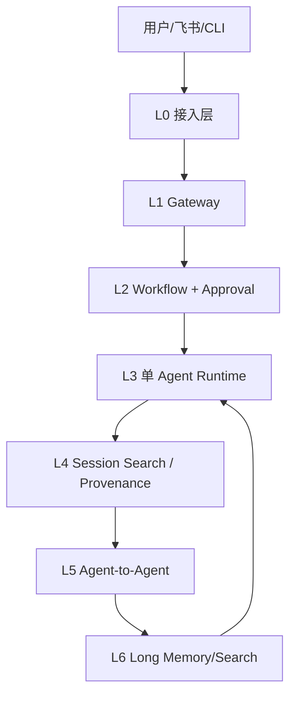
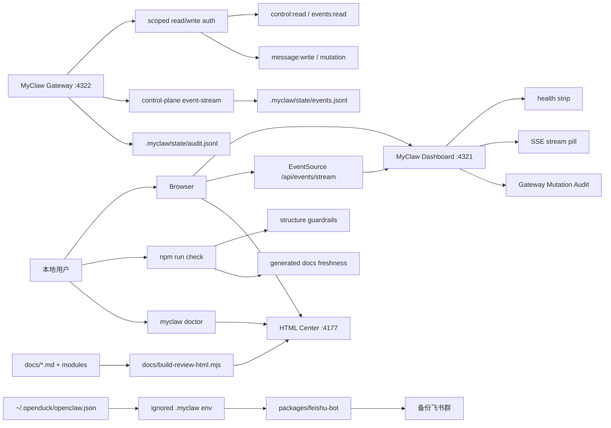
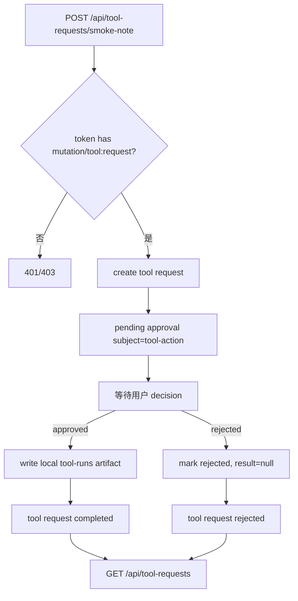
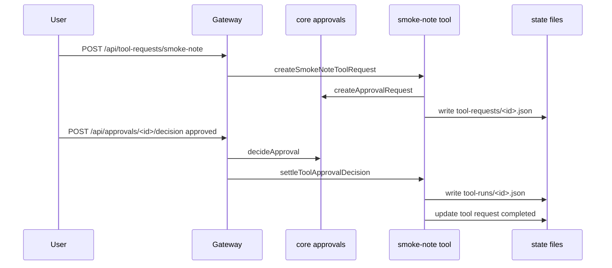
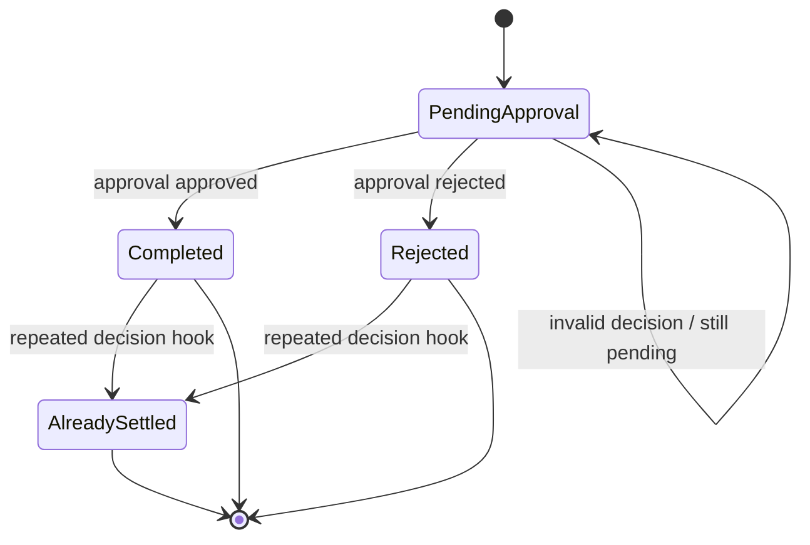
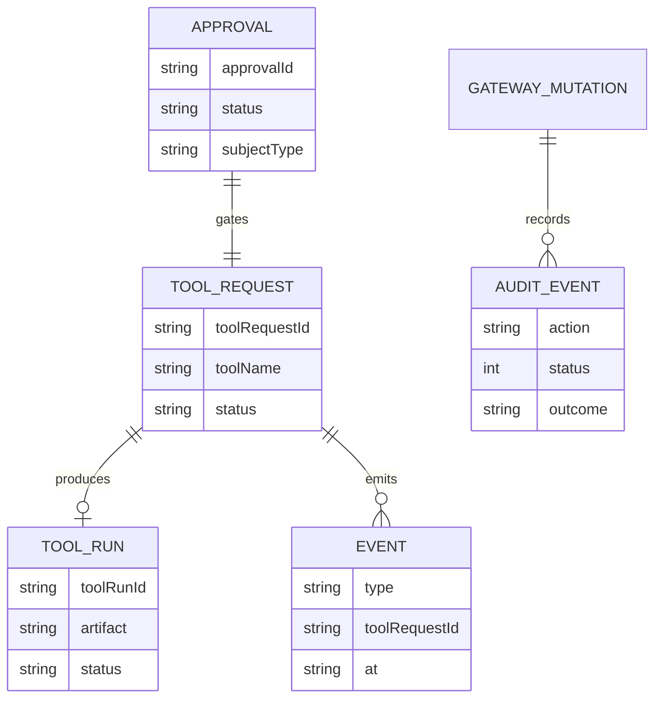
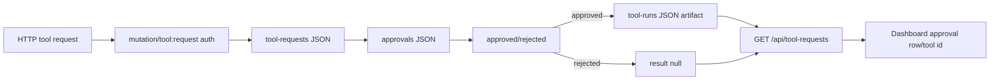

# MyClaw Phase 1.6 实现架构可视化评审

更新时间：2026-06-02

## 总诊断

Phase 1.6 把 L2 从“能审批记录”推进到“能审批后执行一个安全本地工具”：`POST /api/tool-requests/smoke-note` 只创建 pending approval，approved 后才写本地相对 `tool-runs/...`，rejected 不执行。结论：MyClaw 已具备后续 agent tool loop 的安全前置样本，但还不能开放通用 shell、文件写入、网络或 LLM tool。

| 评分项 | 当前分 | 判断 |
|---|---:|---|
| 设计清晰度 | 9/10 | E5B 明确“工具请求必须先审批”，没有伪装成完整 agent |
| 可扩展性 | 8/10 | side effect 先隔离在 `packages/tools`，下一步可抽 ToolDescriptor |
| 可靠性 | 8/10 | approved/rejected 都落本地 state 和 event；仍缺通用幂等 key |
| 可维护性 | 8/10 | 结构债务和生成物 stale 进入 `npm run check`，Dashboard client 已到 432 行 |
| 安全性 | 9/10 | rejected 不执行，artifact 只暴露相对路径；仍缺通用 policy/sandbox |

## 大规划图

这张图回答：当前哪些能力已经可由用户亲手测试，哪些还在后续阶段。

```mermaid
flowchart LR
  E0[E0 本地消息] --> E1[E1 Dashboard]
  E1 --> E1B[E1B Health + Audit]
  E1B --> E1C[E1C Stream + Scoped Token]
  E1C --> E2A[E2A Openduck Feishu credential presence]
  E2A --> E2B[E2B Feishu websocket group reply]
  E2B --> E4[E4 OpenClaw stage]
  E4 --> E5[E5 Approval decision]
  E5 --> E5B[E5B Tool approval smoke]
  E5B --> E7[E7 工程约束]
  E7 --> L0[L0 接入层]
  L0 --> L1[L1 Gateway]
  L1 --> L2[L2 Workflow + Approval]
  L2 --> E6[E6 单 Agent]
  E6 --> E8[E8 Session Search]
  E8 --> E9[E9 Agent-to-Agent]
  E9 --> E10[E10 Long Memory]
  E2[E2 Feishu outbound] -.配置后.-> E3[E3 callback smoke]
  E2A -.credentials present.-> E2B
```

Review 观察：

- 优点：E7 把技术债约束变成可执行实验。
- 优点：当前可测入口已经覆盖消息、Dashboard health/audit/stream、scoped token、Feishu app credential presence、Feishu 群回复、迁移、审批、safe tool approval、结构约束。
- 优点：L0-L6 让“先交互基础、后 agent 智能”成为硬路线。
- 风险：L3-L6 仍未实现，不能测试 agent runtime、agent 协作 和记忆。
- 改进：下一阶段优先把 smoke tool 抽成 ToolDescriptor/policy/sandbox，再补 route schema 和 event seq/replay。

## 分层交互架构图

这张图回答：为什么接入层和 gateway 要排在 agent、agent 协作、记忆之前。

```mermaid
flowchart TB
  User[用户/飞书/CLI] --> L0[L0 接入层]
  L0 --> L1[L1 Gateway]
  L1 --> L2[L2 Workflow + Approval]
  L2 --> L3[L3 单 Agent Runtime]
  L3 --> L4[L4 Session Search / Provenance]
  L4 --> L5[L5 Agent-to-Agent]
  L5 --> L6[L6 Long Memory/Search]
  L6 --> L3
```

Review 观察：

- 优点：L0/L1 先解决信息入口、回执、鉴权、状态查询，是所有 agent 能力的地基。
- 优点：L2 把高风险动作先变成 review/approval，避免 agent 直接执行危险操作。
- 风险：如果跳过 L0/L1，后续 agent 和记忆会缺少可信事件来源；如果跳过 L4，agent-to-agent 没有可追踪上下文。
- 改进：Dashboard 必须按层展示测试入口和开放条件。

## 系统上下文图

这张图回答：HTML Center、文档生成、Dashboard、openduck 本地配置和正在运行的 OpenClaw 之间的边界。

```mermaid
flowchart LR
  User[本地用户] --> Browser[Browser]
  Browser --> Dashboard[MyClaw Dashboard :4321]
  Dashboard --> Health[health strip]
  Dashboard --> Stream[SSE stream pill]
  Dashboard --> AuditView[Gateway Mutation Audit]
  Browser --> EventSource[EventSource /api/events/stream]
  EventSource --> Dashboard
  Gateway[MyClaw Gateway :4322] --> ScopedAuth[scoped read/write auth]
  ScopedAuth --> ReadPlane[control:read / events:read]
  ScopedAuth --> WritePlane[message:write / mutation]
  Gateway --> EventStream[control-plane event-stream]
  EventStream --> EventsLog[.myclaw/state/events.jsonl]
  Gateway[MyClaw Gateway :4322] --> AuditLog[.myclaw/state/audit.jsonl]
  Browser --> HtmlCenter[HTML Center :4177]
  User --> Check[npm run check]
  Check --> Structure[structure guardrails]
  Check --> Generated[generated docs freshness]
  User --> Doctor[myclaw doctor]
  Doctor --> HtmlCenter
  Openduck[~/.openduck/openclaw.json] --> LocalEnv[ignored .myclaw env]
  LocalEnv --> FeishuBot[packages/feishu-bot]
  FeishuBot --> FeishuGroup[备份飞书群]
  Docs[docs/*.md + modules] --> Builder[docs/build-review-html.mjs]
  Builder --> HtmlCenter
```

Review 观察：

- 优点：旧链接打不开的根因是服务未运行，已用 `ensure_html_center.py` 恢复。
- 优点：openduck secret 不进入 repo，导入脚本只写 ignored `.myclaw/`。
- 优点：HTML Center 仍依赖 tmux 常驻，但 Dashboard health 能暴露 unreachable。
- 风险：Feishu bot 目前只做文本自动回复，已支持默认封闭 policy、persistent replay 和 direct/thread 模式，但还没有 rich card 和 agent replyBuilder。
- 改进：后续把 health strip 接到 event stream 或自动刷新，不只靠手动刷新。

## 模块架构图

这张图回答：tool approval smoke 如何保持 Gateway 主线干净，并把副作用限制在 tools 模块。

```mermaid
flowchart TB
  Package[package.json] --> CheckScript[npm run check]
  GatewayIndex[packages/gateway/src/index.mjs] --> Auth[auth.mjs scoped tokens]
  GatewayIndex --> ToolsRoute[routes/tools.mjs]
  GatewayIndex --> ApprovalRoute[routes/approvals.mjs]
  ToolsRoute --> SmokeTool[packages/tools/src/smoke-note.mjs]
  ApprovalRoute --> SmokeSettle[settleToolApprovalDecision]
  SmokeTool --> ToolRequests[state/tool-requests]
  SmokeSettle --> ToolRuns[state/tool-runs]
  SmokeTool --> Approvals[core approvals]
  GatewayIndex --> EventStream[event-stream.mjs]
  GatewayIndex --> ControlRoutes[control routes]
  EventStream --> Redaction[control-plane redaction]
  Auth --> ScopedTokens[MYCLAW_GATEWAY_SCOPED_TOKENS]
  CheckScript --> Syntax[node --check]
  CheckScript --> Generated[scripts/check-generated-docs.mjs]
  CheckScript --> Structure[scripts/check-file-lines.mjs]
  CheckScript --> PhaseSync[scripts/check-doc-phase-sync.mjs]
  CheckScript --> SecretScan[scripts/check-local-secret-leaks.mjs]
  Generated --> Builder[docs/build-review-html.mjs]
  Generated --> Fresh[fail on generated diff]
  Structure --> LineLimit[500 lines/file]
  Structure --> FileLimit[20 files/directory]
  Structure --> DepthLimit[4 directory levels]
  Structure --> TextDetect[all text files]
  BuildDocs[docs/build-review-html.mjs] --> Rendered[docs/rendered/modules]
  BuildDocs --> DocsRoot[docs/*.html]
  SecretScan --> NoLeaks[fail if local secrets appear in tracked files]
```

Review 观察：

- 优点：约束是硬失败，不是 README 建议。
- 优点：目录文件数按直接文件计算，能防止一个目录变抽屉。
- 优点：tool side effect 在 `packages/tools`，Gateway route 只做 request/decision bridge。
- 优点：Feishu SDK 只在 `packages/feishu-bot`，core/runtime/gateway 主线保持干净。
- 风险：approval route 直接 import smoke tool settlement，下一步应抽 dispatch registry。
- 改进：下一步拆 Dashboard renderer、Markdown parser 和 ToolDescriptor registry。

## 核心业务流程图

这张图回答：一次工具请求如何先暂停给人审批，再按 decision 执行或放弃。

```mermaid
flowchart TD
  Start[POST /api/tool-requests/smoke-note] --> Auth{token has mutation/tool:request?}
  Auth -->|否| Deny[401/403]
  Auth -->|是| Create[create tool request]
  Create --> Approval[pending approval subject=tool-action]
  Approval --> Wait[等待用户 decision]
  Wait -->|approved| Execute[write local tool-runs artifact]
  Wait -->|rejected| Reject[mark rejected, result=null]
  Execute --> Completed[tool request completed]
  Reject --> Done[tool request rejected]
  Completed --> Read[GET /api/tool-requests]
  Done --> Read
```

Review 观察：

- 优点：副作用前有明确人工介入点，rejected 不执行。
- 优点：result artifact 是相对路径，避免 API 泄露本机绝对路径。
- 风险：当前只有一个 smoke tool，不能代表完整 tool registry。
- 改进：下一步补 ToolDescriptor、policy snapshot、幂等 key 和 sandbox dispatch。

## 关键时序图

这张图回答：审批 decision 如何触发 safe tool settlement。

```mermaid
sequenceDiagram
  participant U as User
  participant G as Gateway
  participant A as core approvals
  participant T as smoke-note tool
  participant S as state files

  U->>G: POST /api/tool-requests/smoke-note
  G->>T: createSmokeNoteToolRequest
  T->>A: createApprovalRequest
  T->>S: write tool-requests/<id>.json
  U->>G: POST /api/approvals/<id>/decision approved
  G->>A: decideApproval
  G->>T: settleToolApprovalDecision
  T->>S: write tool-runs/<id>.json
  T->>S: update tool request completed
```

Review 观察：

- 优点：approval 状态和 tool request 状态都持久化，Dashboard/API 可复核。
- 优点：settlement 在 approval decision 后发生，符合人工确认语义。
- 风险：approval route 现在知道 smoke tool，未来多个工具会变成 if 链。
- 改进：用 tool registry/hook 订阅 approval.decided，降低 route 耦合。

## 状态机图

这张图回答：ToolRequest 生命周期如何处理批准、拒绝和重复 settlement。

```mermaid
stateDiagram-v2
  [*] --> PendingApproval
  PendingApproval --> Completed: approval approved
  PendingApproval --> Rejected: approval rejected
  PendingApproval --> PendingApproval: invalid decision / still pending
  Completed --> AlreadySettled: repeated decision hook
  Rejected --> AlreadySettled: repeated decision hook
  AlreadySettled --> [*]
  Completed --> [*]
  Rejected --> [*]
```

Review 观察：

- 优点：rejected 是终态，不写 tool-run。
- 优点：重复 settlement 返回 `already_settled`，避免重复执行 smoke tool。
- 风险：还没有 expires/timeout/cancelled 状态。
- 改进：通用 tool request 应加入 idempotency key、timeout 和 manual resume。

## 数据模型 / ER 图

这张图回答：approval、tool request、tool run 和 event/audit 的关系。

```mermaid
erDiagram
  APPROVAL ||--|| TOOL_REQUEST : gates
  TOOL_REQUEST ||--o| TOOL_RUN : produces
  TOOL_REQUEST ||--o{ EVENT : emits
  GATEWAY_MUTATION ||--o{ AUDIT_EVENT : records

  APPROVAL { string approvalId string status string subjectType }
  TOOL_REQUEST { string toolRequestId string toolName string status }
  TOOL_RUN { string toolRunId string artifact string status }
  EVENT { string type string toolRequestId string at }
  AUDIT_EVENT { string action int status string outcome }
```

Review 观察：

- 优点：approval 和 tool request 双记录，方便人从审批追到结果。
- 优点：tool run artifact 是相对路径，API 不泄露本机绝对路径。
- 风险：tool input/output 还没有 schema versioned validator。
- 改进：通用工具前补 ToolDescriptor schema 和 redaction contract。

## 数据流图

这张图回答：tool approval smoke 数据从哪里来，经过哪些处理，最终到哪里去。

```mermaid
flowchart LR
  Request[HTTP tool request] --> Auth[mutation/tool:request auth]
  Auth --> ToolRequest[tool-requests JSON]
  ToolRequest --> Approval[approvals JSON]
  Approval --> Decision[approved/rejected]
  Decision -->|approved| ToolRun[tool-runs JSON artifact]
  Decision -->|rejected| NoRun[result null]
  ToolRun --> Status[GET /api/tool-requests]
  NoRun --> Status
  Status --> Dashboard[Dashboard approval row/tool id]
```

Review 观察：

- 优点：数据流里没有 shell、网络、LLM provider，适合作为安全烟测。
- 风险：Dashboard 目前只显示 toolRequestId，还没有独立 tool panel。
- 改进：拆 renderer 后增加 tool request drawer 和 result 摘要。

## 部署图

这张图回答：本机服务现在如何运行。

```mermaid
flowchart TB
  subgraph Local[Developer machine]
    Dashboard[myclaw-dashboard tmux :4321]
    Gateway[myclaw-gateway tmux :4322]
    HtmlCenter[html-center tmux :4177]
    Tools[packages/tools local side effects]
    Repo[myclaw repo]
    Repo --> Dashboard
    Repo --> Gateway
    Gateway --> Tools
    Dashboard --> EventSource[/api/events/stream]
    Gateway --> ReadAuth[read auth for non-loopback]
    Repo --> Doctor[myclaw doctor]
    Repo --> Publish[scripts/html-center.mjs publish]
    Repo --> HtmlCenter
  end
  Browser --> Dashboard
  Browser --> HtmlCenter
```

Review 观察：

- 优点：三个本地服务都回到 tmux 常驻。
- 优点：Dashboard 本地 proxy 避免浏览器 EventSource header token 问题。
- 风险：没有统一 supervisor，tool side effect 也没有独立 worker。
- 改进：doctor 已有 HTML Center health；后续做统一 services status 和 worker/queue 边界。

## Human Experiments

| 实验 | 状态 | 用户动作 | 成功信号 |
|---|---|---|---|
| E0 | ready | `send --text` | ok envelope，run 可见 |
| E1 | ready | 打开 Dashboard | Phase 1.6、Approvals 可见 |
| E1B | ready | 写一次 Gateway mutation | Dashboard health/audit 可见，audit 不含正文/token |
| E1C | ready | 测非 loopback scoped token 与 SSE | 错 scope 被拒绝，stream snapshot 脱敏，Dashboard heartbeat 刷新 |
| E2A | ready | `npm run import:openduck` | credentials present；runtime/outbound ready |
| E2B | ready | 在备份飞书群发文本 | 群内直接收到 `MyClaw 收到了：...`，出现脱敏 `fb_*` run |
| E2C | ready | 跑 hardening tests | persistent replay、policy file、read redaction 通过 |
| E4 | ready | `migrate openclaw --stage --json` | stage 带 approval，review-only |
| E5 | ready | GET approvals + POST decision | approval 变 approved/rejected |
| E5B | ready | POST smoke tool + approve/reject | approved 才写 tool-run；rejected 不执行 |
| E7 | ready | `npm run check` | 输出 500 行、20 文件/目录、depth 4 |
| E2/E3 | needs_config | Feishu webhook/callback | 配置后可测 |
| E6 | planned | 单 agent run/resume/tool loop | 后续开放 |
| E8 | planned | session search + provenance | 后续开放 |
| E9 | planned | agent-to-agent review | 后续开放 |
| E10 | planned | long memory add/search/delete | 后续开放 |

## 概念解释

| 概念 | 含义 | 当前边界 |
|---|---|---|
| Structure guardrail | 机器强制的技术债红线 | 500 行、20 文件、4 层深度 |
| Direct file count | 一个目录下直接文件数 | 不递归计入子目录 |
| Rendered docs | 从 Markdown 生成的 HTML | 位于 `docs/rendered/modules` |
| HTML Center | 本机报告中心 | 依赖 4177 服务常驻 |
| Phase sync | Markdown 与 HTML 阶段一致性 | 防止 stale report |
| Generated freshness | 生成物新鲜度 | `check-generated-docs` 重建后检测 diff |
| Access layer | 接入层 | CLI/webhook/Feishu 等消息入口和出口 |
| Gateway | 控制面入口 | HTTP route、鉴权、状态和 mutation 边界 |
| Tool request | 待执行工具请求 | Phase 1.6 只有 `smoke.note.write` |
| Tool run | 工具执行结果 | 只写本地 `tool-runs/...` 相对 artifact |
| Approval settlement | 审批后的副作用桥 | 当前直接 settlement，后续抽 hook/registry |
| Scoped token | 分权 gateway token | `message:write`、`events:read`、`control:read`，legacy token 是 `*` |
| SSE snapshot | Server-Sent Events 快照 | 当前 snapshot + heartbeat，不是 seq/replay delta |
| Read plane | 控制面读取面 | 非 loopback 需要 `control:read` 或 `read` |
| Mutation audit | 写操作审计 | action、status、actor、resource；不保存 request body/token |
| Health strip | 运行健康条 | Control API、state、HTML Center、Feishu adapter、mutation auth |
| Session provenance | session 来源追踪 | run、step、message、tool result 的可检索来源 |
| Agent-to-Agent | agent 协作 | 多 agent 分工、交接上下文、互相 review |

## 相似技术比较

| 维度 | MyClaw Phase 1.6 | OpenClaw | Hermes-agent | OpenHuman |
|---|---|---|---|---|
| 结构约束 | 硬性 check 脚本 | 大 repo 模块化 | 成熟工程分层 | Rust workspace 分层 |
| Secret 导入 | `.myclaw/*.env` 本地导入，只输出变量名 | schema + credential 边界成熟 | `.env`/session 配置简单 | controller/tool 权限清晰 |
| 文档发布 | HTML Center + rendered docs | docs/control UI | README/ops docs | UI/docs 混合 |
| 审批 | migration approval + smoke tool approval | 成熟 policy/approval | ops guard | risk/autonomy policy |
| Dashboard | health strip + audit + stream heartbeat | control UI | TUI/ops | UI-first |
| Gateway 权限 | loopback + legacy `*` + scoped read/write | pairing/auth 成熟 | ops token/profile | controller permission/scope |

## 目录结构与文件行数

| 路径 | 行数/文件数 | 职责 | 评价 |
|---|---:|---|---|
| `scripts/check-file-lines.mjs` | 120 行 | 文本文件行数、目录文件数、深度检查 | 健康 |
| `scripts/check-generated-docs.mjs` | 63 行 | 重建 HTML 并检测 stale 生成物 | 健康 |
| `scripts/html-center.mjs` | 121 行 | HTML Center status/start/publish/verify，发布前校验生成物 | 健康 |
| `scripts/import-openduck-config.mjs` | 189 行 | openduck Feishu 配置到本地 MyClaw env 的安全导入 | 健康，输出不含 secret 值，拒绝非 `.myclaw/` 输出 |
| `scripts/check-local-secret-leaks.mjs` | 88 行 | 扫描本地 `.myclaw/*.env` 敏感值是否进入 tracked/untracked files | 健康 |
| `packages/core/src/audit.mjs` | 89 行 | 本地 mutation audit JSONL 读写 | 健康，不保存正文或 token |
| `packages/gateway/src/audit.mjs` | 80 行 | Gateway response finish 审计 hook | 健康，耦合低 |
| `packages/gateway/src/auth.mjs` | 122 行 | loopback、legacy token、scoped token 和 read/write scope 鉴权 | 健康，any-scope 语义需继续文档化 |
| `packages/gateway/src/index.mjs` | 152 行 | Gateway route 分发、read/write 鉴权、tool request route 和 audit hook 挂载 | 健康 |
| `packages/gateway/src/routes/tools.mjs` | 11 行 | safe smoke tool request HTTP 入口 | 健康，保持 thin route |
| `packages/gateway/src/routes/approvals.mjs` | 47 行 | approval decision route，并触发 smoke tool settlement | 健康，但下一步应抽 hook |
| `packages/control-plane/src/event-stream.mjs` | 37 行 | SSE snapshot/heartbeat，复用 events/audit 和 Feishu redaction | 健康，但缺 seq/replay |
| `packages/control-plane/src/status.mjs` | 335 行 | status/runs/events/audit/toolRequests/health/迁移 payload | 健康，但继续增长要拆 health/status 子模块 |
| `packages/control-plane/src/redaction.mjs` | 109 行 | Dashboard/API/SSE Feishu 与本地路径脱敏 | 健康，read exposure 边界清晰 |
| `packages/tools/src/smoke-note.mjs` | 195 行 | safe local tool request、approval settlement、tool-run artifact | 健康，但后续要抽 ToolDescriptor |
| `packages/feishu-bot/myclaw.plugin.json` | 22 行 | Feishu bot capability contract | 健康，先有 manifest，后续做 loader |
| `docs/build-review-html.mjs` | 414 行 | HTML report builder | 接近 450，下一轮拆 |
| `docs/modules` | 16 文件 | 模块 Markdown 源文档，含人类测试手册 | 已低于 20 |
| `docs/rendered/modules` | 16 文件 | 生成 HTML 模块页 | 已低于 20 |
| `docs/modules/human-testing-playbook.md` | 161 行 | 人类测试手册、本地参与流程和反馈格式 | 健康 |
| `packages/cli/src/index.mjs` | 419 行 | CLI 命令、doctor 与 feishu-bot 启动入口 | 健康，但继续增长要拆命令 |
| `packages/control-plane/src/experiments.mjs` | 308 行 | Human Experiments 与分层路线 payload，含 E1B/E1C/E5B | 健康 |
| `packages/dashboard/src/client.mjs` | 432 行 | Dashboard client，含 health/audit/stream/分层路线渲染 | 已接近 450，下一轮必须拆 renderer |
| `packages/gateway/test/gateway.test.mjs` | 347 行 | Gateway 主流程、Feishu callback、迁移和 approval 测试 | 已拆出 audit/auth 测试，健康 |
| `packages/gateway/test/gateway-audit-auth.test.mjs` | 134 行 | Gateway audit、scoped token、非 loopback read auth 测试 | 健康 |
| `packages/gateway/test/tool-approval.test.mjs` | 67 行 | Gateway smoke tool approval approve/reject 测试 | 健康 |
| `packages/control-plane/test/event-stream.test.mjs` | 66 行 | SSE snapshot Feishu/path redaction 测试 | 健康 |
| `packages/core/src/approvals.mjs` | 198 行 | approval state | 健康 |

## 风险分级

| 等级 | 问题 | 影响 | 建议 |
|---|---|---|---|
| Medium | HTML Center 依赖 tmux 常驻 | 服务掉了链接就打不开 | doctor 已覆盖，后续纳入 Dashboard health |
| High | Feishu secret 被误写进代码/报告/命令行参数 | appSecret、token、encrypt key 或 webhook URL 泄露会影响测试群 | 只允许 ignored `.myclaw/` 本地 env，脚本和报告只输出变量名，check 扫描 tracked/untracked files |
| Medium | Gateway audit 只记录 response finish | 进程在 response 后、audit 写入前崩溃会漏一条审计 | 当前适合本地 L1；真实工具前要加 sync/queue 或 durable command log |
| High | Gateway read plane 曾只保护 SSE | 非 loopback 暴露时 `/api/status`、`/api/audit` 等控制面可被读取 | 已修：除 `/api/health` 外，Gateway GET 统一走 read auth |
| Medium | SSE 只有 snapshot/heartbeat | Dashboard 会刷新，但无法证明没有丢增量事件 | 下一阶段补 seq/replay/cursor |
| High | approval route 直接 import smoke tool settlement | 后续多个工具会把 route 变成不可维护的分发器 | 下一阶段抽 ToolDescriptor registry 或 approval.decided hook |
| Medium | smoke tool 没有 expires/timeout/cancel 状态 | pending request 可能长期悬挂 | 通用 tool request 加 expiresAt、cancelled、retry state |
| Medium | `/api/status` 会探测 HTML Center | HTML Center 卡顿会拖慢 Dashboard | 已设置 600ms timeout；后续把 health check 做缓存 |
| High | Dashboard client 仍在变大 | 已到 432 行，继续加 UI 会逼近 450 预警 | 下一轮拆 section renderer registry |
| High | 跳过接入层/Gateway 直接做 agent | 后续 agent 和记忆会缺少可信事件边界 | 先完成 L0/L1 smoke，再做 L3 |
| Medium | docs build script 414 行 | 接近拆分预警 | 拆 parser/template/rewrite |

## Linus 视角严苛审查

独立 subagent 结论：Phase 1.6 smoke 能证明“先审批、后执行”的用户体验，但不能作为通用 ToolDescriptor 的底座。最大风险是 approval decision 和 tool side effect 绑在同一个 HTTP 写路径里，缺少可恢复、可重放、可幂等的执行边界。

| 等级 | 发现 | 处理 |
|---|---|---|
| Critical | decision 后同步执行工具，崩溃窗口会导致 approval 已 approved 但 tool 未完成，真实副作用可能重复 | Phase 1.6 只允许 safe local smoke；下一阶段必须 durable dispatch、claim/recovery、idempotency |
| High | Gateway/control-plane 直接依赖 `smoke-note.mjs` | 接受为 smoke；下一阶段抽 ToolRegistry/ToolDescriptor 和 approval.decided hook |
| High | `approval:decide` 实际触发 execution，权限语义混在一起 | 下一阶段拆“人类授权”和“系统执行”，记录 actor 与 policy snapshot |
| High | `/api/status` 曾暴露绝对 `stateDir`，tool request 列表曾暴露完整 note | 已修：status 只返回 `state.label`，tool request read payload 只给 redacted preview |
| High | 创建 tool request 曾接受外部 `toolRequestId` | 已修：非法 id 会被忽略并生成安全 id |
| Medium | ToolRequest 状态机缺 `executing/failed/retry/timeout/cancelled` | 下一阶段补完整生命周期和人工恢复入口 |
| Medium | 测试缺崩溃窗口和并发恢复覆盖 | smoke 阶段覆盖 approve/reject/invalid id；通用工具前补 recovery tests |
| Medium | `docs/build-review-html.mjs` 414 行、Dashboard client 432 行 | 下一阶段拆 docs builder 和 renderer，再加 tool panel |

## Skill 规范自检

- 已按 `web-design-review` 输出可视化 design review dashboard。
- 报告覆盖系统上下文、模块架构、业务流程、时序、状态机、ER、数据流、部署图。
- 报告包含目录行数、概念解释、相似技术比较、风险分级、Linus 视角。
- 单文件 500 行、每目录 20 文件、目录深度 4 层由 `npm run check` 执行。
- 本轮已更新 `web-design-review` skill 的 500 行、20 文件/目录、4 层深度约束；按 `skill-creator` 原则保持 `SKILL.md` 247 行，未增加额外过程文档。

## 下一阶段建议

1. 抽 ToolDescriptor registry、durable dispatch、claim/recovery、idempotency key 和完整 ToolRequest 生命周期。
2. 拆 `packages/dashboard/src/client.mjs` 与 `docs/build-review-html.mjs`，再做 tool panel。
3. 为 SSE 增加 seq/replay/cursor，并把 Feishu replyBuilder 接到 agent runtime 安全壳。
