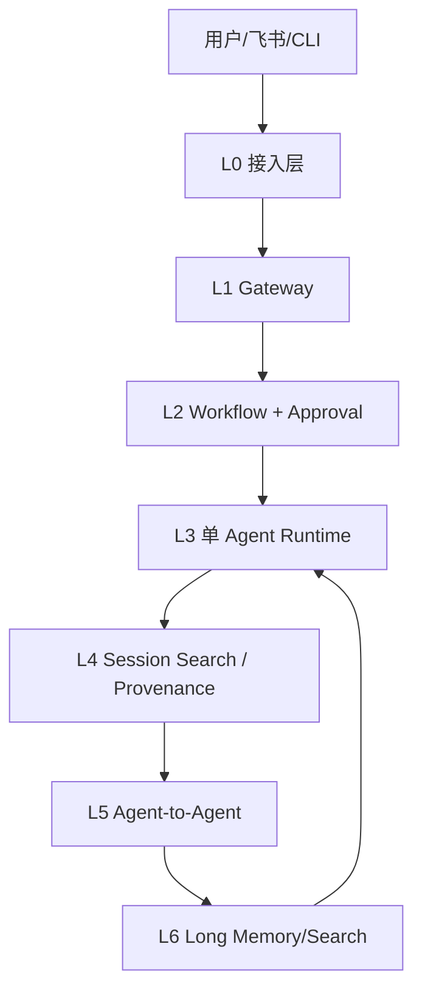
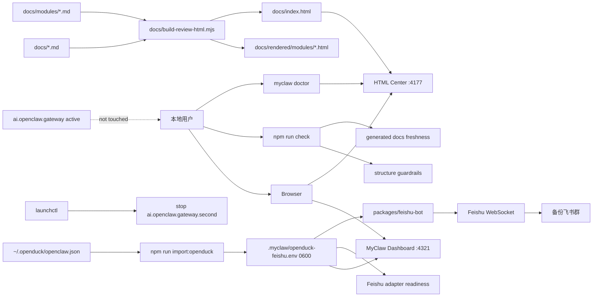
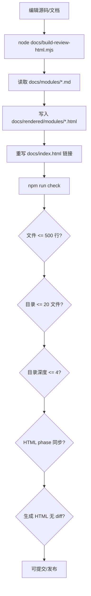
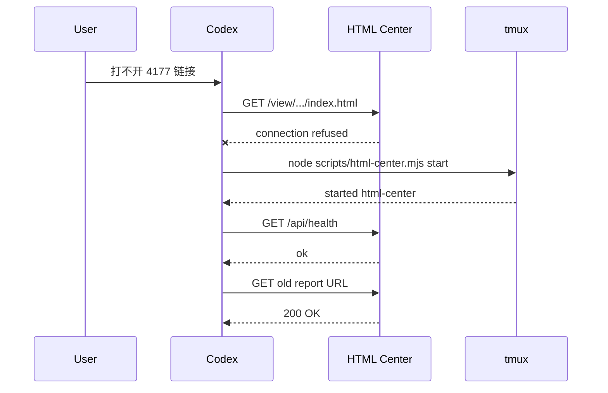
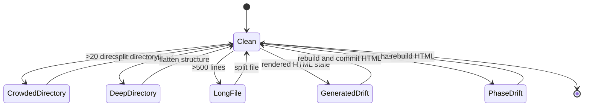
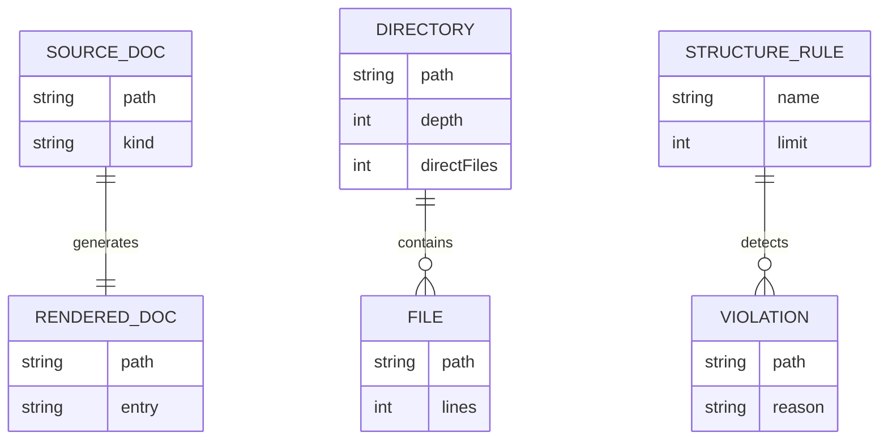
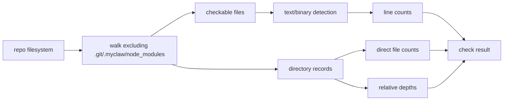
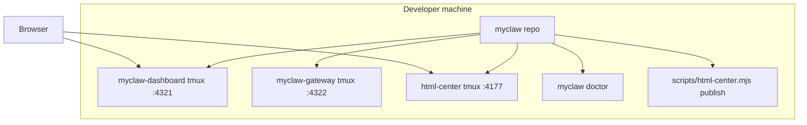

# MyClaw Phase 1.3 实现架构可视化评审

更新时间：2026-05-31

## 总诊断

Phase 1.3 把 L0/L1 从“配置可识别”推进到“飞书群消息可回复并默认收紧”：`packages/feishu-bot` 独立封装 Feishu SDK WebSocket、EventDispatcher、app-token direct reply、default-closed ingress、persistent replay 和本地 policy 文件，control-plane 对 Feishu run 做 read redaction。结论：MyClaw 仍不能直接跳到能执行工具的 agent 和记忆，下一步要先补 Gateway audit、Dashboard health strip、rich card 和 agent replyBuilder 安全壳。

| 评分项 | 当前分 | 判断 |
|---|---:|---|
| 设计清晰度 | 9/10 | 路线从功能清单改成 L0-L6 分层测试 |
| 可扩展性 | 8/10 | 先接入层/Gateway，再 agent/记忆，依赖顺序更稳 |
| 可靠性 | 8/10 | HTML Center 有仓库命令和 doctor health，仍缺自动告警 |
| 可维护性 | 8/10 | 结构债务和生成物 stale 进入 `npm run check`，Dashboard client 仍要拆 |
| 安全性 | 9/10 | openduck secret 只写 ignored `.myclaw/`，Feishu ingress 默认封闭，check 会扫描本地 secret 泄露 |

## 大规划图

这张图回答：当前哪些能力已经可由用户亲手测试，哪些还在后续阶段。

```mermaid
flowchart LR
  E0[E0 本地消息] --> E1[E1 Dashboard]
  E1 --> E2A[E2A Openduck Feishu credential presence]
  E2A --> E2B[E2B Feishu websocket group reply]
  E2B --> E4[E4 OpenClaw stage]
  E4 --> E5[E5 Approval decision]
  E5 --> E7[E7 工程约束]
  E7 --> L0[L0 接入层]
  L0 --> L1[L1 Gateway]
  L1 --> L2[L2 Workflow + Approval]
  L2 --> E6[E6 单 Agent]
  E6 --> E8[E8 Session Search]
  E8 --> E9[E9 Agent-to-Agent]
  E9 --> E10[E10 Long Memory]
  E2[E2 Feishu outbound] -.配置后.-> E3[E3 callback smoke]
  E2A -.credentials present.-> E2B
```

Review 观察：

- 优点：E7 把技术债约束变成可执行实验。
- 优点：当前可测入口已经覆盖消息、Dashboard、Feishu app credential presence、Feishu 群回复、迁移、审批、结构约束。
- 优点：L0-L6 让“先交互基础、后 agent 智能”成为硬路线。
- 风险：L3-L6 仍未实现，不能测试 agent runtime、agent 协作 和记忆。
- 改进：下一阶段优先补 L1 的 Gateway audit、health strip 和 Feishu agent replyBuilder 安全壳，而不是直接堆能执行工具的 agent。

## 分层交互架构图

这张图回答：为什么接入层和 gateway 要排在 agent、agent 协作、记忆之前。

```mermaid
flowchart TB
  User[用户/飞书/CLI] --> L0[L0 接入层]
  L0 --> L1[L1 Gateway]
  L1 --> L2[L2 Workflow + Approval]
  L2 --> L3[L3 单 Agent Runtime]
  L3 --> L4[L4 Session Search / Provenance]
  L4 --> L5[L5 Agent-to-Agent]
  L5 --> L6[L6 Long Memory/Search]
  L6 --> L3
```

Review 观察：

- 优点：L0/L1 先解决信息入口、回执、鉴权、状态查询，是所有 agent 能力的地基。
- 优点：L2 把高风险动作先变成 review/approval，避免 agent 直接执行危险操作。
- 风险：如果跳过 L0/L1，后续 agent 和记忆会缺少可信事件来源；如果跳过 L4，agent-to-agent 没有可追踪上下文。
- 改进：Dashboard 必须按层展示测试入口和开放条件。

## 系统上下文图

这张图回答：HTML Center、文档生成、Dashboard、openduck 本地配置和正在运行的 OpenClaw 之间的边界。

```mermaid
flowchart LR
  User[本地用户] --> Browser[Browser]
  Browser --> Dashboard[MyClaw Dashboard :4321]
  Browser --> HtmlCenter[HTML Center :4177]
  User --> Check[npm run check]
  Check --> Structure[structure guardrails]
  Check --> Generated[generated docs freshness]
  User --> Doctor[myclaw doctor]
  Doctor --> HtmlCenter
  Openduck[~/.openduck/openclaw.json] --> Import[npm run import:openduck]
  Import --> LocalEnv[.myclaw/openduck-feishu.env 0600]
  LocalEnv --> Dashboard
  LocalEnv --> FeishuAdapter[Feishu adapter readiness]
  LocalEnv --> FeishuBot[packages/feishu-bot]
  FeishuBot --> FeishuWs[Feishu WebSocket]
  FeishuWs --> FeishuGroup[备份飞书群]
  Launchctl[launchctl] --> StopSecond[stop ai.openclaw.gateway.second]
  ActiveOpenClaw[ai.openclaw.gateway active] -.not touched.-> User
  Docs[docs/*.md] --> Builder[docs/build-review-html.mjs]
  Modules[docs/modules/*.md] --> Builder
  Builder --> Rendered[docs/rendered/modules/*.html]
  Builder --> Index[docs/index.html]
  Index --> HtmlCenter
```

Review 观察：

- 优点：旧链接打不开的根因是服务未运行，已用 `ensure_html_center.py` 恢复。
- 优点：HTML 生成物移动后，`docs/modules` 只放源文档。
- 优点：openduck secret 不进入 repo，导入脚本只允许写 ignored `.myclaw/` 并拒绝 symlink。
- 风险：HTML Center 仍依赖 tmux 常驻，没有自动告警。
- 风险：Feishu bot 目前只做文本自动回复，已支持默认封闭 policy、persistent replay 和 direct/thread 模式，但还没有 rich card 和 agent replyBuilder。
- 改进：后续把 doctor 和 Feishu readiness 显示到 Dashboard 顶部 health strip。

## 模块架构图

这张图回答：结构约束如何进入开发闭环。

```mermaid
flowchart TB
  Package[package.json] --> CheckScript[npm run check]
  Package --> ImportScript[npm run import:openduck]
  Package --> BotScript[myclaw feishu-bot]
  CheckScript --> Syntax[node --check]
  CheckScript --> Generated[scripts/check-generated-docs.mjs]
  CheckScript --> Structure[scripts/check-file-lines.mjs]
  CheckScript --> PhaseSync[scripts/check-doc-phase-sync.mjs]
  CheckScript --> SecretScan[scripts/check-local-secret-leaks.mjs]
  Generated --> Builder[docs/build-review-html.mjs]
  Generated --> Fresh[fail on generated diff]
  Structure --> LineLimit[500 lines/file]
  Structure --> FileLimit[20 files/directory]
  Structure --> DepthLimit[4 directory levels]
  Structure --> TextDetect[all text files]
  BuildDocs[docs/build-review-html.mjs] --> Rendered[docs/rendered/modules]
  BuildDocs --> DocsRoot[docs/*.html]
  ImportScript --> LocalOnly[.myclaw/openduck-feishu.env]
  LocalOnly --> GitIgnored[git ignored + mode 600]
  SecretScan --> NoLeaks[fail if local secrets appear in tracked files]
  BotScript --> FeishuBotPkg[packages/feishu-bot]
  FeishuBotPkg --> Sdk[@larksuiteoapi/node-sdk]
  FeishuBotPkg --> CoreState[core state recordRun]
```

Review 观察：

- 优点：约束是硬失败，不是 README 建议。
- 优点：目录文件数按直接文件计算，能防止一个目录变抽屉。
- 优点：导入脚本和运行 env 分离，避免把 secret 当成项目配置提交。
- 优点：本地 secret 泄露扫描进入 `npm run check`，不是只靠人工纪律。
- 优点：Feishu SDK 只在 `packages/feishu-bot`，core/runtime/gateway 主线保持干净。
- 风险：`docs/build-review-html.mjs` 414 行，仍接近 450 预警。
- 改进：拆 Markdown parser、shell template、index rewrite。

## 核心业务流程图

这张图回答：一次文档构建和结构检查如何流动。

```mermaid
flowchart TD
  Start[编辑源码/文档] --> Build[node docs/build-review-html.mjs]
  Build --> ReadMd[读取 docs/modules/*.md]
  ReadMd --> WriteHtml[写入 docs/rendered/modules/*.html]
  WriteHtml --> Rewrite[重写 docs/index.html 链接]
  Rewrite --> Check[npm run check]
  Check --> Lines{文件 <= 500 行?}
  Lines --> Files{目录 <= 20 文件?}
  Files --> Depth{目录深度 <= 4?}
  Depth --> Phase{HTML phase 同步?}
  Phase --> Fresh{生成 HTML 无 diff?}
  Fresh --> Pass[可提交/发布]
```

Review 观察：

- 优点：生成物目录也接受结构检查。
- 优点：`check-generated-docs` 会在 HTML 生成物过期时失败。
- 风险：index 仍是手写 HTML，后续也应从数据生成。
- 改进：下一步把 index metadata 抽到结构化数据。

## 关键时序图

这张图回答：旧 HTML Center 链接如何恢复。

```mermaid
sequenceDiagram
  participant U as User
  participant C as Codex
  participant H as HTML Center
  participant T as tmux

  U->>C: 打不开 4177 链接
  C->>H: GET /view/.../index.html
  H--xC: connection refused
  C->>T: node scripts/html-center.mjs start
  T-->>C: started html-center
  C->>H: GET /api/health
  H-->>C: ok
  C->>H: GET old report URL
  H-->>C: 200 OK
```

Review 观察：

- 优点：旧链接无需重新上传即可恢复。
- 风险：如果 tmux session 再掉，链接仍会失败。
- 改进：doctor 已能报 health；下一步把 health 结果放进 Dashboard。

## 状态机图

这张图回答：结构检查从通过到失败的状态如何流转。

```mermaid
stateDiagram-v2
  [*] --> Clean
  Clean --> CrowdedDirectory: >20 direct files
  Clean --> DeepDirectory: depth >4
  Clean --> LongFile: >500 lines
  Clean --> GeneratedDrift: rendered HTML stale
  Clean --> PhaseDrift: rendered phase stale
  CrowdedDirectory --> Clean: split directory
  DeepDirectory --> Clean: flatten structure
  LongFile --> Clean: split file
  GeneratedDrift --> Clean: rebuild and commit HTML
  PhaseDrift --> Clean: rebuild HTML
  Clean --> [*]
```

Review 观察：

- 优点：四类技术债都有明确失败原因。
- 风险：20 文件/目录会迫使生成物规划更谨慎。
- 改进：失败时输出修复建议和当前 top offenders。

## 数据模型 / ER 图

这张图回答：文档源文件、生成文件和结构规则的关系。

```mermaid
erDiagram
  SOURCE_DOC ||--|| RENDERED_DOC : generates
  DIRECTORY ||--o{ FILE : contains
  STRUCTURE_RULE ||--o{ VIOLATION : detects

  SOURCE_DOC { string path string kind }
  RENDERED_DOC { string path string entry }
  DIRECTORY { string path int depth int directFiles }
  FILE { string path int lines }
  STRUCTURE_RULE { string name int limit }
  VIOLATION { string path string reason }
```

Review 观察：

- 优点：源文档和生成文档现在有不同目录职责。
- 风险：生成文件仍入仓，体积会增长。
- 改进：后续可考虑只发布生成物，不长期跟踪全部 HTML。

## 数据流图

这张图回答：检查数据从文件系统如何变成失败/通过。

```mermaid
flowchart LR
  FS[repo filesystem] --> Walk[walk excluding .git/.myclaw/node_modules]
  Walk --> Files[checkable files]
  Walk --> Directories[directory records]
  Files --> TextDetect[text/binary detection]
  TextDetect --> LineCounts[line counts]
  Directories --> FileCounts[direct file counts]
  Directories --> Depths[relative depths]
  LineCounts --> Report[check result]
  FileCounts --> Report
  Depths --> Report
```

Review 观察：

- 优点：检查逻辑很小，容易理解。
- 风险：二进制会跳过行数，但会计入目录文件数；文本文件默认进入行数检查。
- 改进：加白名单配置前先保持硬规则简单。

## 部署图

这张图回答：本机服务现在如何运行。

```mermaid
flowchart TB
  subgraph Local[Developer machine]
    Dashboard[myclaw-dashboard tmux :4321]
    Gateway[myclaw-gateway tmux :4322]
    HtmlCenter[html-center tmux :4177]
    Repo[myclaw repo]
    Repo --> Dashboard
    Repo --> Gateway
    Repo --> Doctor[myclaw doctor]
    Repo --> Publish[scripts/html-center.mjs publish]
    Repo --> HtmlCenter
  end
  Browser --> Dashboard
  Browser --> HtmlCenter
```

Review 观察：

- 优点：三个本地服务都回到 tmux 常驻。
- 风险：没有统一 supervisor。
- 改进：doctor 已有 HTML Center health；后续做统一 services status。

## Human Experiments

| 实验 | 状态 | 用户动作 | 成功信号 |
|---|---|---|---|
| E0 | ready | `send --text` | ok envelope，run 可见 |
| E1 | ready | 打开 Dashboard | Phase 1.3、Approvals 可见 |
| E2A | ready | `npm run import:openduck` | credentials present；runtime/outbound ready |
| E2B | ready | 在备份飞书群发文本 | 群内直接收到 `MyClaw 收到了：...`，出现脱敏 `fb_*` run |
| E2C | ready | 跑 hardening tests | persistent replay、policy file、read redaction 通过 |
| E4 | ready | `migrate openclaw --stage --json` | stage 带 approval，review-only |
| E5 | ready | GET approvals + POST decision | approval 变 approved/rejected |
| E7 | ready | `npm run check` | 输出 500 行、20 文件/目录、depth 4 |
| E2/E3 | needs_config | Feishu webhook/callback | 配置后可测 |
| E6 | planned | 单 agent run/resume/tool loop | 后续开放 |
| E8 | planned | session search + provenance | 后续开放 |
| E9 | planned | agent-to-agent review | 后续开放 |
| E10 | planned | long memory add/search/delete | 后续开放 |

## 概念解释

| 概念 | 含义 | 当前边界 |
|---|---|---|
| Structure guardrail | 机器强制的技术债红线 | 500 行、20 文件、4 层深度 |
| Direct file count | 一个目录下直接文件数 | 不递归计入子目录 |
| Rendered docs | 从 Markdown 生成的 HTML | 位于 `docs/rendered/modules` |
| HTML Center | 本机报告中心 | 依赖 4177 服务常驻 |
| Phase sync | Markdown 与 HTML 阶段一致性 | 防止 stale report |
| Generated freshness | 生成物新鲜度 | `check-generated-docs` 重建后检测 diff |
| Access layer | 接入层 | CLI/webhook/Feishu 等消息入口和出口 |
| Gateway | 控制面入口 | HTTP route、鉴权、状态和 mutation 边界 |
| Session provenance | session 来源追踪 | run、step、message、tool result 的可检索来源 |
| Agent-to-Agent | agent 协作 | 多 agent 分工、交接上下文、互相 review |

## 相似技术比较

| 维度 | MyClaw Phase 1.3 | OpenClaw | Hermes-agent | OpenHuman |
|---|---|---|---|---|
| 结构约束 | 硬性 check 脚本 | 大 repo 模块化 | 成熟工程分层 | Rust workspace 分层 |
| Secret 导入 | `.myclaw/*.env` 本地导入，只输出变量名 | schema + credential 边界成熟 | `.env`/session 配置简单 | controller/tool 权限清晰 |
| 文档发布 | HTML Center + rendered docs | docs/control UI | README/ops docs | UI/docs 混合 |
| 审批 | migration approval seed | 成熟 policy/approval | ops guard | risk/autonomy policy |
| Dashboard | 本地只读 console | control UI | TUI/ops | UI-first |

## 目录结构与文件行数

| 路径 | 行数/文件数 | 职责 | 评价 |
|---|---:|---|---|
| `scripts/check-file-lines.mjs` | 120 行 | 文本文件行数、目录文件数、深度检查 | 健康 |
| `scripts/check-generated-docs.mjs` | 63 行 | 重建 HTML 并检测 stale 生成物 | 健康 |
| `scripts/html-center.mjs` | 121 行 | HTML Center status/start/publish/verify，发布前校验生成物 | 健康 |
| `scripts/import-openduck-config.mjs` | 189 行 | openduck Feishu 配置到本地 MyClaw env 的安全导入 | 健康，输出不含 secret 值，拒绝非 `.myclaw/` 输出 |
| `scripts/check-local-secret-leaks.mjs` | 88 行 | 扫描本地 `.myclaw/*.env` 敏感值是否进入 tracked/untracked files | 健康 |
| `packages/feishu-bot/src/runtime.mjs` | 167 行 | Feishu WebSocket bot runtime、默认回复、direct/thread reply mode、state 记录 | 健康，保持插件边界 |
| `packages/feishu-bot/src/ingress-policy.mjs` | 133 行 | Feishu 入站 allowlist、mention、本地 policy 文件、默认封闭和消息类型策略 | 健康，策略留在插件包内 |
| `packages/feishu-bot/src/replay-store.mjs` | 123 行 | Feishu event 持久 replay store | 健康，避免重启后重复回复 |
| `packages/control-plane/src/redaction.mjs` | 90 行 | Dashboard/API Feishu run 脱敏 | 健康，read exposure 边界清晰 |
| `packages/feishu-bot/myclaw.plugin.json` | 22 行 | Feishu bot capability contract | 健康，先有 manifest，后续做 loader |
| `packages/feishu-bot/test/feishu-bot.test.mjs` | 316 行 | Feishu bot direct reply、replay、policy、默认封闭和失败路径测试 | 健康 |
| `packages/feishu-bot/src/sdk-runtime.mjs` | 48 行 | Feishu SDK 适配层 | 健康 |
| `docs/build-review-html.mjs` | 414 行 | HTML report builder | 接近 450，下一轮拆 |
| `docs/modules` | 16 文件 | 模块 Markdown 源文档，含人类测试手册 | 已低于 20 |
| `docs/rendered/modules` | 16 文件 | 生成 HTML 模块页 | 已低于 20 |
| `docs/modules/human-testing-playbook.md` | 151 行 | 人类测试手册、本地参与流程和反馈格式 | 健康 |
| `packages/cli/src/index.mjs` | 419 行 | CLI 命令、doctor 与 feishu-bot 启动入口 | 健康，但继续增长要拆命令 |
| `packages/control-plane/src/experiments.mjs` | 243 行 | Human Experiments 与分层路线 payload | 健康 |
| `packages/dashboard/src/client.mjs` | 359 行 | Dashboard client，含分层路线渲染 | 仍需拆 renderer |
| `packages/core/src/approvals.mjs` | 198 行 | approval state | 健康 |

当前最大目录深度是 4，当前最大目录文件数是 16。

## 风险分级

| 等级 | 问题 | 影响 | 建议 |
|---|---|---|---|
| Medium | HTML Center 依赖 tmux 常驻 | 服务掉了链接就打不开 | doctor 已覆盖，后续纳入 Dashboard health |
| High | Feishu secret 被误写进代码/报告/命令行参数 | appSecret、token、encrypt key 或 webhook URL 泄露会影响测试群 | 只允许 ignored `.myclaw/` 本地 env，脚本和报告只输出变量名，check 扫描 tracked/untracked files |
| Medium | 本机绝对路径进入公开仓库 | 暴露个人环境指纹，降低报告可复用性 | 已把 tracked docs/code 中的 `/Users/...` 替换为环境变量占位 |
| Medium | openduck 与 active OpenClaw 进程混淆 | 误停正在使用的 OpenClaw | 用配置端口、launchd label 和 cwd 三重确认后只停 `ai.openclaw.gateway.second` |
| Medium | Feishu bot policy 配错会导致测试群收不到回复 | 默认封闭避免误触发，但本地 policy 缺失时 E2B 会被跳过 | 已支持 `.myclaw/feishu-policy.json`；当前本机用 ignored policy 绑定备份群 |
| High | Feishu replay 不是 exactly-once | 如果发出回复后、标记 completed 前崩溃，stale retry 可能再次发送 | 当前明确为 at-least-once；下一步加 outbound operation/delivery record |
| High | Feishu redaction 仍是字段路径式 | 新字段可能绕过 read redaction | 已移除正文 preview 明文；下一步做 schema/recursive redaction，并减少写入时 raw |
| High | Dashboard client 仍在变大 | 分层展示后会继续推高行数 | 拆 section renderer registry |
| High | 跳过接入层/Gateway 直接做 agent | 后续 agent 和记忆会缺少可信事件边界 | 先完成 L0/L1 smoke，再做 L3 |
| High | 跳过 session provenance 直接做 agent-to-agent | 多 agent 交接无法审计 | L4 最小 search/provenance 必须早于 L5 |
| Medium | 人类测试手册若不维护会变成静态愿望清单 | 用户反馈无法回流到阶段计划 | 每轮开始先更新 playbook，再实现 |
| Medium | docs build script 414 行 | 接近拆分预警 | 拆 parser/template/rewrite |
| Medium | 20 文件硬限制会影响生成物布局 | 以后新增模块需规划目录 | 保持 source/rendered 分离 |
| Low | 结构检查没有配置文件 | 规则变更需改脚本 | 先保持硬规则，避免早配置化 |

## Linus 视角严苛审查

独立 subagent 结论：Feishu SDK 和 reply 语义仍被限制在 `packages/feishu-bot`，主线没有被污染；但默认开放 ingress、replay exactly-once 语义和字段式 redaction 是进入 Agent runtime 前必须面对的问题。本轮已把默认开放改成默认封闭，并把正文 preview 改成长度摘要；剩余结论是：可以进入 Agent runtime skeleton，但不能把飞书群直接接到可执行工具的 agent。

| 等级 | 发现 | 处理 |
|---|---|---|
| High | HTML Center 恢复只是手工补丁 | 已加 `scripts/html-center.mjs`、`npm run html-center`、`npm run publish:review` 和 `myclaw doctor` health |
| High | 行数检查只看白名单扩展，可被 `.sh/.yaml/Dockerfile` 绕过 | 已改成默认检查所有文本文件，二进制检测排除 |
| High | HTML 生成物可能 stale，旧 sync 只看 Phase 字符串 | 已加 `scripts/check-generated-docs.mjs`，`npm run check` 重建后 fail on diff |
| High | `docs/rendered` 未跟踪会导致索引坏链 | 本轮跟踪生成 HTML，并由 generated docs check 校验缺失/多余 |
| High | L0/L1/L2 标 ready 会掩盖 E2/E3 配置和真实 tool action 缺口 | 已改为 partial，并加 invariant test |
| High | M7 done 100 容易误解为 E8-E10 能力完成 | 已改为 partial 45，只表示路线已定义 |
| High | Agent-to-Agent 需要可检索 run/step/source | 已把 L4 改成 Session Search/Provenance，排在 L5 Agent-to-Agent 之前 |
| High | 从 openduck 导入 secret 很容易污染 git 或报告 | 已做 `scripts/import-openduck-config.mjs`，只写 `.myclaw/` 并输出变量名 |
| High | `--output` 可写任意路径会绕开 `.myclaw/` 边界 | 已限制输出必须位于 ignored `.myclaw/`，并拒绝 symlink |
| High | `ready websocket` 会误导为 Feishu runtime 完成 | Phase 1.3 已实现独立 `packages/feishu-bot` websocket/app-token 文本回复；仍标明 policy/rich card/replay 缺口 |
| Critical | Feishu 群消息缺默认 allowlist/requireMention 会让任意群消息触发后续 agent | 已修：无 allowlist、sender allowlist、mention rule 或显式 `unsafeOpenIngress` 时返回 `ingress_policy_required`，不发送回复 |
| High | Feishu app reply API 业务失败会被误记为 completed | 已在 bot runtime 检查 `reply.ok`，失败写 `feishu.bot.reply.failed` |
| Medium | 默认话题回复不符合群内日常沟通 | 已把 bot 默认改成 `reply-mode direct`，用 chat create 直接在群里发消息；thread 模式只在显式配置时启用 |
| High | Feishu inbound `raw` 持久化会扩大 Dashboard/API 暴露面 | 已从 `normalizeFeishuEvent` 的 normalized inbound 中移除 `raw`，并对 `/api/status`、`/api/runs`、`/api/events` 做 Feishu redaction |
| High | Feishu event 重试或进程重启可能重复回复 | 已新增 persistent replay store；completed/skipped 不重复，failed 可重试 |
| High | persistent replay 只能提供 at-least-once，不是 exactly-once | 记录为下一阶段 delivery record 设计输入，避免后续文档误称 exactly-once |
| High | redaction 只覆盖当前 Feishu envelope 路径 | 已把 `textPreview` 改成 `[redacted N chars]`；下一步做 schema/recursive redaction |
| Medium | 非法 `reply-mode` 静默降级会隐藏配置错误 | 已改为显式报错，只接受 `direct` 或 `thread` |
| Medium | 公开 GitHub 前存在本机绝对路径 | 已清理 tracked docs/code 中的 `/Users/...`，改成 `$MYCLAW_OPENCLAW_SOURCE` 等环境变量占位 |
| High | secret leak check 只扫 tracked files，untracked 新增文件可绕过 | 已扩展为 tracked + untracked scan，`.myclaw/` 仍由 git ignore 排除 |
| Medium | 非文本消息走 recoverable failure 会导致重试噪声 | 已改为 `unsupported_message_type` skipped，不发回复 |
| Medium | 复用 openduck gateway token 会跨 auth 边界 | 已移除 gateway token/port 映射，导入脚本只处理 Feishu 字段 |
| Medium | secret 不泄露缺少自动约束 | 已新增 `scripts/check-local-secret-leaks.mjs` 并纳入 `npm run check` |
| Medium | 停服务靠名字猜会误伤 active OpenClaw | 已用 openduck 配置端口匹配 PID，再用 cwd/launchd label 复核 |
| Medium | `docs/build-review-html.mjs` 414 行接近阈值 | 记录为下一阶段拆分任务 |
| Medium | Dashboard client 仍继续增长 | 下一阶段拆 renderer registry |
| Low | 硬规则会带来目录规划成本 | 保留，作为技术债刹车 |

## Skill 规范自检

- 已按 `web-design-review` 输出可视化 design review dashboard。
- 报告覆盖系统上下文、模块架构、业务流程、时序、状态机、ER、数据流、部署图。
- 报告包含目录行数、概念解释、相似技术比较、风险分级、Linus 视角。
- 单文件 500 行、每目录 20 文件、目录深度 4 层由 `npm run check` 执行。
- 本轮已更新 `web-design-review` skill 的 500 行、20 文件/目录、4 层深度约束；按 `skill-creator` 原则保持 `SKILL.md` 247 行，未增加额外过程文档。

## 下一阶段建议

1. 做 Gateway mutation audit 和 Dashboard health strip。
2. 把 Feishu replyBuilder 接到后续 agent runtime 的安全壳，而不是写死在 bot。
3. 给 Feishu outbound 增加 operation/delivery record，明确 at-least-once 恢复语义。
4. 补 rich card 最小 outbound 和人工确认边界。
5. 拆 `packages/dashboard/src/client.mjs` 和 `docs/build-review-html.mjs`。
