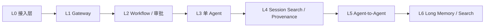
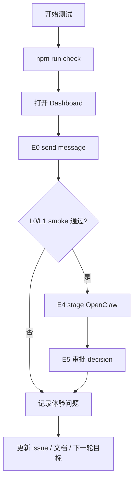

# 人类测试手册

## 总诊断

这份文档是 MyClaw 的本地人类测试手册，目标是把大方向、当前进度、你可以参与的阶段、测试步骤、反馈入口串成一个稳定流程。以后每一轮研发都应该先更新这里，再实现功能，避免 agent 自己随意推进。

## 大方向

MyClaw 的路线不是从“全能 agent”开始，而是从“可信信息交互”开始。



Review 观察：

- L0/L1 决定人、CLI、飞书、HTTP 能不能稳定交换信息。
- L2 决定高风险动作是否能暂停、审查和恢复。
- L3 以后才开始真正的 agent 能力。
- L4 必须早于 L5，否则多 agent 交接没有可审计来源。

## 当前进度

| 层 | 当前状态 | 你能否参与 | 当前入口 | 下一步 |
|---|---|---|---|---|
| L0 接入层 | partial | 可以 | E0，E2/E3 配置后 | 补 Feishu 配置化 smoke |
| L1 Gateway | partial | 可以 | E1，E3，E5 | 补 mutation audit 和 health strip |
| L2 Workflow / 审批 | partial | 可以 | E4，E5 | 把 approval 接到真实 tool action |
| L3 单 Agent | planned | 暂不能 | E6 占位 | 最小 run/resume/tool loop |
| L4 Session Search / Provenance | planned | 暂不能 | E8 占位 | run/step/tool result 可检索 |
| L5 Agent-to-Agent | planned | 暂不能 | E9 占位 | agent 分工、交接、互审 |
| L6 Long Memory / Search | planned | 暂不能 | E10 占位 | 长期记忆、来源、遗忘 |

## 你现在可以测什么

| 实验 | 层 | 推荐程度 | 最小命令链 | 成功信号 |
|---|---|---|---|---|
| E0 本地消息闭环 | L0 | 现在就测 | `npm run myclaw -- send --text "hello from human" --json` | 返回 ok envelope，记录 runId |
| E1 Dashboard | L1 | 现在就测 | `npm run myclaw -- dashboard --port 4321 --openclaw-source /Users/yanfenma/workspace/github/openclaw`；打开 `http://127.0.0.1:4321` | 能看到 Phase、L0-L6、Approvals、Runs |
| E4 OpenClaw stage | L2 | 现在就测 | `npm run myclaw -- migrate openclaw --source /Users/yanfenma/workspace/github/openclaw --stage --json` | stage 是 review-only，记录 stageId 和 approvalId |
| E5 审批队列 | L1/L2 | 现在就测 | `MYCLAW_GATEWAY_TOKEN=dev-token npm run myclaw -- gateway --port 4322 --openclaw-source /Users/yanfenma/workspace/github/openclaw`；POST `/api/openclaw-migration/stage`；GET `/api/approvals`；POST `/api/approvals/<approvalId>/decision` | pending 变 approved/rejected，event 有记录 |
| E7 工程约束 | 全局 | 现在就测 | `npm run check` | 生成物 up to date，结构红线通过 |
| E2/E3 Feishu | L0/L1 | 配置后测 | 设置 `MYCLAW_FEISHU_WEBHOOK_URL` 后发送 webhook；设置 verify/encrypt token 后 POST callback challenge | 群消息收到，callback challenge 通过 |

## 还不能测什么

| 实验 | 原因 | 开放前置条件 |
|---|---|---|
| E6 单 Agent | 还没有 agent runtime | L0/L1 smoke 稳定，L2 tool approval 可用 |
| E8 Session Search | 还没有可检索 run/step/source | run event schema 更稳定 |
| E9 Agent-to-Agent | 还没有 agent runtime 和 provenance | E6/E8 先完成 |
| E10 Long Memory | 还没有 memory store 和遗忘策略 | E8 先完成，记忆来源可解释 |

## 全流程测试路径



Review 观察：

- 每次测试先跑 `npm run check`，保证文档和代码不是 stale。
- Dashboard 是你观察状态的主入口，不只是装饰 UI。
- E4/E5 是后续 agent 写操作的安全前置。
- L0/L1 smoke 没过，不进入 L3 agent。
- 测试反馈必须回到文档或 issue，不能只留在对话里。

## 进入 L3 前的门禁

| 门禁 | 必须证据 | 状态 |
|---|---|---|
| E0 本地消息 | runId、JSON 输出、Dashboard run 可见 | 必须通过 |
| E1 Dashboard | 页面可打开，L0-L6 和 E0-E10 可见 | 必须通过 |
| E2 Feishu outbound | 飞书群消息截图或 result code | 配置后必须通过 |
| E3 Feishu callback | challenge 回显、签名错误被拒绝 | 配置后必须通过 |
| Gateway token | 无 token 拒绝，有 token 放行 | 必须通过 |
| Approval evidence | stageId、approvalId、decision event | 必须通过 |
| Mutation audit | 高风险 mutation 有 event 或 audit record | 下一轮补齐 |

## 反馈记录格式

每次你参与测试时，建议按这个格式记录：

```text
日期：
测试实验：E0/E1/E4/E5/E7/...
入口命令或 URL：
命令退出码：
runId：
stageId：
approvalId：
证据路径或截图：
预期结果：
实际结果：
卡住的位置：
owner：
处理状态：open/fixed/blocked
需要回填的文档：stage-status / human-testing-playbook / roadmap
issue 或 commit：
希望下一轮怎么改：
是否阻塞下一阶段：是/否
```

## 阶段推进规则

| 规则 | 说明 |
|---|---|
| 先 L0/L1 后 Agent | 接入和 gateway 没稳，不做 L3 agent |
| 先审批后写操作 | L2 没有真实 tool approval，不开放 agent 写操作 |
| 先 provenance 后 A2A | L4 没有来源追踪，不做 L5 agent-to-agent |
| 先可删后长期记忆 | L6 记忆必须支持来源解释和删除 |
| 每轮都可测试 | 每个 active/partial 层必须至少有一个可执行实验；planned 层必须写清开放前置条件 |

## 当前推荐下一轮

下一轮建议仍然留在 L0/L1，不直接做 agent：

1. Feishu webhook 配置化 smoke。
2. Gateway mutation audit。
3. Dashboard 顶部 health strip。
4. 保持 E0/E1/E4/E5/E7 作为回归测试。

## 本地文档入口

| 类型 | 路径 |
|---|---|
| Markdown | `docs/modules/human-testing-playbook.md` |
| HTML | `docs/rendered/modules/human-testing-playbook.html` |
| 全局索引 | `docs/index.html` |
